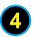
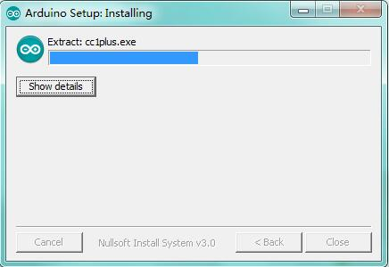
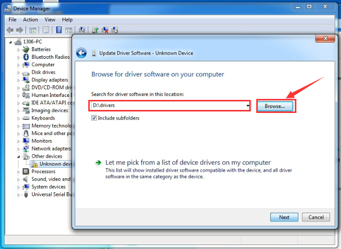
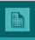
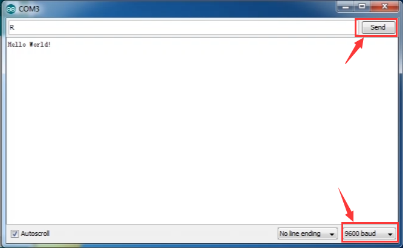

# **Keyestudio UNO with Pin Header Interfaces**

**Introduction:**

keyestudio UNO with pin headers has the same basic functions as [keyestudio UNO
R3 BOARD](http://wiki.keyestudio.com/index.php/Ks0001_keyestudio_UNO_R3_BOARD).
It is a microcontroller board based on the
[ATMEGA328P-AU](http://ww1.microchip.com/downloads/en/DeviceDoc/Atmel-7810-Automotive-Microcontrollers-ATmega328P_Datasheet.pdf),
which has the same function as ATMEGA328P(-PU), fully compatible with ARDUINO
UNO REV3.

It has 14 digital input/output pins (of which 6 can be used as PWM outputs), 6
analog inputs, a 16 MHz crystal oscillator, a USB connection, a power jack, 2
ICSP headers, and a reset button.

This UNO with pin headers makes the improvement based on keyestudio UNO R3
board.

It breaks out all the digital and analog pins in the form of 3PIN headers (G, V,
S).

S pins correspond to all 14 digital pins, 6 analog pins. G pins for ground. V
pins for VCC. You can control the voltage of VCC via a slide switch for 5V or
3.3V.

When switched to 5V, level on serial communication port is 5V, voltage of pins
is 5V. When switched to 3.3V, level on serial communication port is 3.3V,
voltage of pins is 3.3V.

It also breaks out two 4PIN headers for serial communication and IIC
communication. So it is more easier to connect external sensors and modules.

As for keyestudio UNO R3 board, its voltage-regulator chip is NSP1117. When
connect external power, output 5V, drive current is 1A.

But for this keyestudio UNO with headers, its voltage-regulator chip is
MP2307DN. When connect external power, output 5V, drive current is 2A.

It contains everything needed to support the microcontroller; simply connect it
to a computer with a USB cable or power it with a AC-to-DC adapter or battery to
get started.

**TECH SPECS:**

| **Microcontroller**             | ATMEGA328P-AU                                        |
|---------------------------------|------------------------------------------------------|
| **Operating Voltage**           | 5V                                                   |
| **Input Voltage (recommended)** | DC 7-12V                                             |
| **Digital I/O Pins**            | 14 (D0-D13)                                          |
| **PWM Digital I/O Pins**        | 6 (D3 D5 D6 D9 D10 D11)                              |
| **Analog Input Pins**           | 6 (A0-A5)                                            |
| **DC Current per I/O Pin**      | 20 mA                                                |
| **DC Current for 3.3V Pin**     | 50 mA                                                |
| **Flash Memory**                | 32 KB (ATmega328) of which 0.5 KB used by bootloader |
| **SRAM**                        | 2 KB                                                 |
| **EEPROM**                      | 1 KB                                                 |
| **Clock Speed**                 | 16 MHz                                               |
| **LED_BUILTIN**                 | D13                                                  |

**Dimensions:**

**Element and Interfaces:**

Here is an explanation of what every element and interface of the board does:

|    | **ICSP (In-Circuit Serial Programming) Header** ICSP is the AVR, an Arduino micro-program header consisting of MOSI, MISO, SCK, RESET, VCC, and GND. It is often called the SPI (serial peripheral interface) and can be considered an "extension" of the output. In fact, slave the output devices under the SPI bus host. When connecting to PC, program the firmware to ATMEGA328P-AU.                                                                                           |
|---------------------------------------------------|-------------------------------------------------------------------------------------------------------------------------------------------------------------------------------------------------------------------------------------------------------------------------------------------------------------------------------------------------------------------------------------------------------------------------------------------------------------------------------------|
|    | **Serial Communication Pin** Connect to serial communication.  4Pins (GND, VCC (3.3V or 5V controlled by slide switch), RX, TX)                                                                                                                                                                                                                                                                                                                                                     |
|    | **GND**  Ground pins                                                                                                                                                                                                                                                                                                                                                                                                                                                                |
|    | **V Pins (VCC)** Power the external sensors and modules. Select the voltage of 3.3V or 5V via a slide switch.                                                                                                                                                                                                                                                                                                                                                                       |
|    | **Digital I/O** It has 14 digital input/output pins, labeled D0 to D13 (of which 6 can be used as PWM outputs). These pins can be configured as digital input pin to read the logic value (0 or 1). Or used as digital output pin to drive different modules like LED, relay, etc. The pin D3, D5, D6, D9, D10, and D11 can be used to generate PWM.  For digital port, you can connect through female headers, or through pin headers (labeled S) of 2.54mm pitch.                 |
|    | **AREF**  For Analog reference. Sometimes used to set an external reference voltage (0-5V) as the upper limit of analog input pins.                                                                                                                                                                                                                                                                                                                                                 |
|    | **SDA** IIC communication pin                                                                                                                                                                                                                                                                                                                                                                                                                                                       |
|    | **SCL** IIC communication pin                                                                                                                                                                                                                                                                                                                                                                                                                                                       |
|    | **ICSP (In-Circuit Serial Programming) Header** ICSP is an AVR, an Arduino micro-program header consisting of MOSI, MISO, SCK, RESET, VCC, and GND. Connected to ATMEGA 16U2-MU. When connecting to PC, program the firmware to ATMEGA 16U2-MU.                                                                                                                                                                                                                                     |
|    | **Microcontroller**  Each control board has its own microcontroller. You can regard it as the brain of your board. Microcontrollers are usually from ATMEL. Before you load a new program on the Arduino IDE, you must know what IC is on your board. This information can be checked at the top of IC. The microcontroller used in this board is [ATMEGA328P-AU](http://ww1.microchip.com/downloads/en/DeviceDoc/Atmel-7810-Automotive-Microcontrollers-ATmega328P_Datasheet.pdf). |
|    | **D13 LED**  There is a built-in LED driven by digital pin 13. When the pin is HIGH value, the LED is on, when the pin is LOW, it's off.                                                                                                                                                                                                                                                                                                                                            |
|    | **TX LED** Onboard you can find the label: TX (transmit) When UNO board communicates via serial port, send the message, TX led flashes.                                                                                                                                                                                                                                                                                                                                             |
|    | **RX LED** Onboard you can find the label: RX(receive ) When UNO board communicates via serial port, receive the message, RX led flashes.                                                                                                                                                                                                                                                                                                                                           |
|    | **Power LED** LED on means that your circuit board is correctly powered on. Otherwise LED is off.                                                                                                                                                                                                                                                                                                                                                                                   |
|    | **USB Connection** You can power the board via USB connection. Or can upload the program to the board via USB port. Connect the board to PC using a USB cable via USB port.                                                                                                                                                                                                                                                                                                         |
|    | **ATMEGA 16U2-MU**  USB to serial chip, can convert the USB signal into serial port signal.                                                                                                                                                                                                                                                                                                                                                                                         |
|    | **Slide Switch** You can slide the switch to control the voltage of pin V (VCC), 3.3V or 5V.                                                                                                                                                                                                                                                                                                                                                                                        |
|    | **Voltage Regulator** To control the voltage provided to the UNO board, as well as to stabilize the DC voltage used by the processor and other components. Convert an external input DC7-12V voltage into DC 5V, then switch DC 5V to the processor and other components, output DC 5V, drive current is 2A.                                                                                                                                                                        |
|    | **DC Power Jack** The board can be supplied with an external power DC7-12V from the DC power jack.                                                                                                                                                                                                                                                                                                                                                                                  |
|    | **IOREF**  Used to configure the operating voltage of microcontrollers. Use it less.                                                                                                                                                                                                                                                                                                                                                                                                |
|    | **RESET Header**  Connect an external button to reset the board. The function is the same as reset button.                                                                                                                                                                                                                                                                                                                                                                          |
|    | **Pin 3V3 Output** Provides 3.3V voltage output                                                                                                                                                                                                                                                                                                                                                                                                                                     |
|    | **Pin 5V Output** Provides 5V voltage output                                                                                                                                                                                                                                                                                                                                                                                                                                        |
|    | **Vin**  You can supply an external voltage input DC7-12V through this pin to the board.                                                                                                                                                                                                                                                                                                                                                                                            |
|    | **Analog Pins** The UNO board has 6 analog inputs, labeled A0 through A5.  Can also used as digital pins, A0=D14, A1=D15, A2=D16, A3=D17, A4=D18, A5=D19. For analog port, you can connect through female headers, or through pin headers (labeled S) of 2.54mm pitch.                                                                                                                                                                                                              |
|    | **IIC Communication Pin** Connect to the IIC communication.  4Pins (GND, VCC (3.3V or 5V controlled by slide switch), SDA, SCL)                                                                                                                                                                                                                                                                                                                                                     |
|    | **RESET Button** You can reset your board to start the program from the initial status.                                                                                                                                                                                                                                                                                                                                                                                             |

****

# Specialized Functions of Some Pins:

-   **Serial communication:**  Digital pins 0 (RX) and 1 (TX).

-   **PWM Interfaces (Pulse-Width Modulation):** D3, D5, D6, D9, D10, D11

-   **External Interrupts:** D2 (interrupt 0) and D3 (interrupt 1). These pins
    can be configured to trigger an interrupt on a low value, a rising or
    falling edge, or a change in value.

-   **SPI communication:** D10 (SS), D11 (MOSI), D12 (MISO), D13 (SCK). These
    pins support SPI communication using the SPI library.

-   **IIC communication:**  A4 (SDA); A5(SCL)

** Detailed Test with Arduino Software:**

Step1 \| Download the Arduino IDE

When you get the UNO development board, first you should install the Arduino
software and driver.

We usually use the Windows software Arduino 1.5.6 version. You can download it
from the link below:

[https://www.arduino.cc/en/Main/OldSoftwareReleases\#1.5.x](https://www.arduino.cc/en/Main/OldSoftwareReleases#1.5.x)

Or you can browse the ARDUINO website to download the latest version from this
link, <https://www.arduino.cc>, pop up the following interface.

Then click the **SOFTWARE** on the browse bar, you will have two options ONLINE
TOOLS and DOWNLOADS.

Click **DOWNLOADS**, it will appear the latest software version of ARDUINO 1.8.5
shown as below.

In this software page, on the right side you can see the version of development
software for different operating systems. ARDUINO has a powerful compatibility.
You should download the software that is compatible with the operating system of
your computer.

We will take **WINDOWS system** as an example here. There are also two options
under Windows system, one is installed version, the other is non-installed
version.

For simple installed version, first click **Windows Installer**, you will get
the following page.

This way you just need to click JUST DOWNLOAD, then click the downloaded file to
install it.

For non-installed version, first click Windows ZIP file, you will also get the
pop-up interface as the above figure.

Click JUST DOWNLOAD, and when the ZIP file is downloaded well to your computer,
you can directly unzip the file and click the icon of ARDUINO software to start
it.

Step2 \|Installing Arduino (Windows):

Install Arduino with the exe. Installation package downloaded well.

Click *“I Agree”* to see the following interface.

Click *“Next”*. Pop up the interface below.

You can press Browse… to choose an installation path or directly type in the
directory you want. Then click “Install” to initiate installation.

Wait for the installing process, if appear the interface of Window Security,
just continue to click Install to finish the installation.

Step3 \|Installing Driver:

Next, we will introduce the driver installation of UNO development board. The
driver installation may have slight differences in different computer systems.
So in the following let’s move on to the driver installation in the WIN 7
system.

The Arduino folder contains both the Arduino program itself and the drivers that
allow the Arduino to be connected to your computer by a USB cable. Before we
launch the Arduino software, you are going to install the USB drivers.

Plug one end of your USB cable into the Arduino and the other into a USB socket
on your computer.

When you connect UNO board to your computer at the first time, right click the
icon of your *“Computer” —\>for “Properties”—\> click the “Device manager”*,
under “Other Devices”, you should see an icon for “Unknown device” with a little
yellow warning triangle next to it. This is your Arduino.

Then right-click on the device and select the top menu option (Update Driver
Software...) shown as the figure below.

It will then be prompted to either “Search Automatically for updated driver
software” or “Browse my computer for driver software”. Shown as below. In this
page, select “Browse my computer for driver software”.

After that, select the option to browse and navigate to the “drivers” folder of
Arduino installation.

Click “Next” and you may get a security warning, if so, allow the software to be
installed. Shown as below.

Installation completed, click “Close”.

Up to now, the driver is installed well. Then you can right click *“Computer”
—\>“Properties”—\>“Device manager”*, you should see the device shown below.

** Introduction for Arduino IDE Toolbar:**

Double-click the icon of Arduino software downloaded well, you will get the
interface shown below.

(Note: if the Arduino software loads in the wrong language, you can change it in
the preferences dialog. See [the environment
page](http://arduino.cc/en/Guide/Environment#languages) for details.)

The functions of each button on the Toolbar are listed below:
<http://wiki.keyestudio.com/index.php/File:IDE.png>

| ****  **Verify/Compile** | Check the code for errors                           |
|-------------------------------------------------------------------------|-----------------------------------------------------|
| ****  **Upload**         | Upload the current Sketch to the Arduino            |
| **** **New**             | Create a new blank Sketch                           |
| **** **Open**            | Show a list of Sketches                             |
| **** **Save**            | Save the current Sketch                             |
| **** **Serial Monitor**  | Display the serial data being sent from the Arduino |

 Step2\| Connect the board

Connect the board to your
computer using the USB cable. The red power LED should go on.

 Step3\| Select the Arduino Board

Open the Arduino IDE, you’ll need to click the “Tools”, then select the Board
that corresponds to your Arduino.

 Step4\| Select your serial port

Select the serial device of the Arduino board from the **Tools \| Serial Port
menu**. This is likely to be COM3 or higher (COM1and COM2 are usually reserved
for hardware serial ports). To find out, you can disconnect your Arduino board
and re-open the menu; the entry that disappears should be the Arduino board.
Reconnect the board and select that serial port.

Here you should select COM 3 as below.

**Note:** to avoid errors, the COM Port should keep the same as the Ports shown
on Device Manager.

 Step5\| Upload the Program

Below is an example program for displaying the Hello World!

Copy and paste the code to the Arduino environment IDE.

**///////////////////////////////////////////////////////////////////////////////////////////////**

    int val;

    int ledpin=13;

    void setup()

    {

    Serial.begin(9600);

    pinMode(ledpin,OUTPUT);

    }

    void loop()

    {

    val=Serial.read();

    if(val=='R')

    {

    digitalWrite(ledpin,HIGH);

    delay(500);

    digitalWrite(ledpin,LOW);

    delay(500);

    Serial.println("Hello World!");

    }

    }

**///////////////////////////////////////////////////////////////////////////////////////////////**

Then click verify button to check the errors. If compiling successfully, the
message "Done compiling." will appear in the status bar.

After that, click the “Upload” button to upload the code. Wait a few seconds -
you should see the RX and TX leds on the board flashing. If the upload is
successful, the message "Done uploading." will appear in the status bar.

Step6\| Open the Serial Monitor

After that, click the serial monitor button to open the serial monitor.

Then set the baud rate as 9600, enter an “R” and click Send, you should see the
RX led on the board blink once, and then D13 led blink once, finally "Hello
World!" is showed on the monitor, the TX led blink once.

For Extension:

****

Other Links:

You can download the datasheet from the link:

<https://drive.google.com/open?id=1otyBI7as3S5qBd9GZYyVwYdRMLF7qDnr>

Software Download:

<https://drive.google.com/open?id=12D-JkXdNm03Qt4dlPQr3RP6OmgXqpvHc>

You might also want to look at:

[the reference](http://arduino.cc/en/Reference/HomePage) for the Arduino
language;

 Troubleshooting:

If you have problems, please see the [troubleshooting
suggestions](http://arduino.cc/en/Guide/Troubleshooting).
