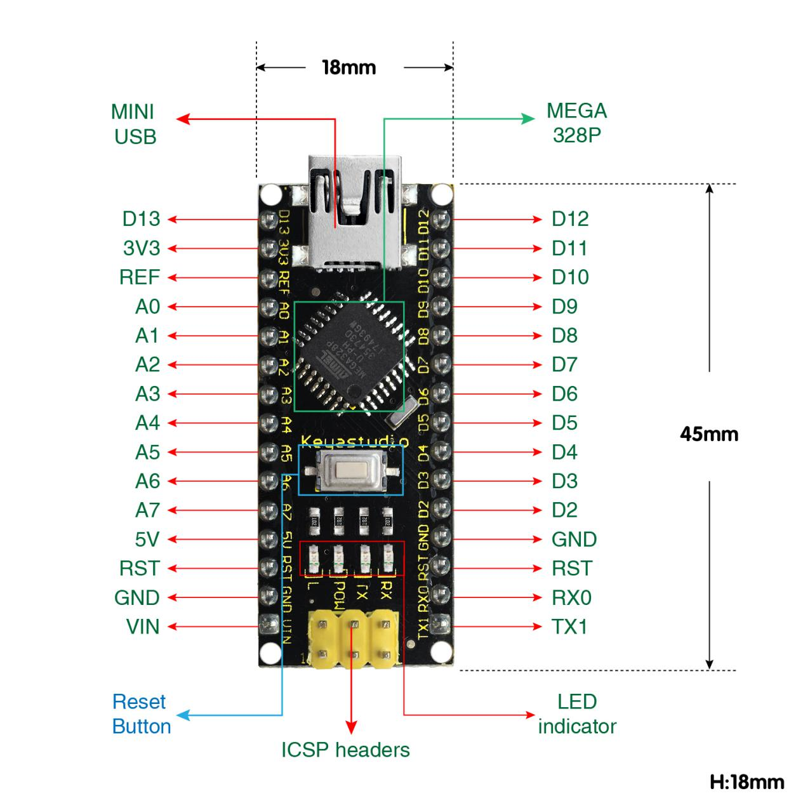
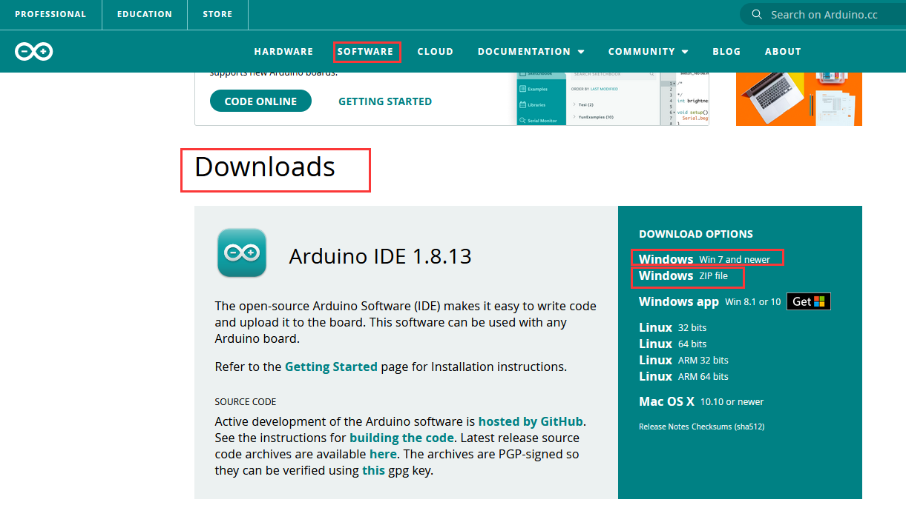
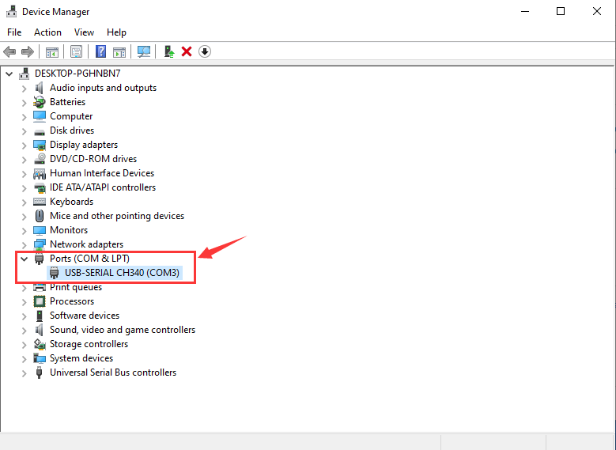

# **Keyestudio NANO CH340**

## Description

The processor core of Keyestudio Nano CH340 is ATMEGA328P-AU. It is as same as
the official Arduino Nano in addition to driver file and USB to serial chip
(CH340G).

It also has 14 digital input / output interfaces (6 of which can be used as PWM
output), 8 analog input interfaces, 1 16MHz crystal oscillator, 1 mini USB port,
1 ICSP interface, and a reset button.

The ICSP interface is used to program the Atmega328P-Au. We can supply power
with a USB cable, the port VIN GND (DC 7-12V) and GND

1.  **Specification**

Microcontroller: ATMEGA328P-AU

Operating Voltage: 5V

Input Voltage (recommended): DC 7-12V

Digital I/O Pins: 14 (D0-D13)

PWM Digital I/O Pins：6 (D3 D5 D6 D9 D10 D11)

Analog Input Pins: 8(A0-A7)

DC Current per I/O Pin: 40 mA

Flash Memory: 32 KB of which 2 KB used by bootloader

SRAM:2 KB

EEPROM: 1 KB

Clock Speed:16 MHz

LED_BUILTIN:D13

1.  **Pins**

| **1**  | **ICSP Header**                        | **ICSP (In-Circuit Serial Programming) Header** ICSP is the AVR, an micro-program header consisting of MOSI, MISO, SCK, RESET, VCC, and GND. It is often called the SPI (serial peripheral interface) and can be considered an "extension" of output. In fact, slave the output devices under the SPI bus host. When connecting to PC, program the firmware to ATMEGA328P-AU.                                                                                                                     |
|--------|----------------------------------------|---------------------------------------------------------------------------------------------------------------------------------------------------------------------------------------------------------------------------------------------------------------------------------------------------------------------------------------------------------------------------------------------------------------------------------------------------------------------------------------------------|
| **2**  | **LED indicator** **（RX）**           |  Onboard you can find the label: RX(receive ) When control board communicates via serial port, receive the message, RX led flashes.                                                                                                                                                                                                                                                                                                                                                               |
| **3**  | **LED indicator** **（TX）**           |  Onboard you can find the label: TX (transmit) When control board communicates via serial port, send the message, TX led flashes.                                                                                                                                                                                                                                                                                                                                                                 |
| **4**  | **LED indicator** **（POW）**          |  Power up the control board, LED on, otherwise LED off.                                                                                                                                                                                                                                                                                                                                                                                                                                           |
| **5**  | **LED indicator** **（L）**            |  There is a built-in LED driven by digital pin 13. When the pin is HIGH value, the LED is on, when the pin is LOW, it's off.                                                                                                                                                                                                                                                                                                                                                                      |
| **6**  | **RX0（D0）** **TX1（D1）** **D2-D13** | It has 14 digital input/output pins D0-D13 (of which 6 can be used as PWM outputs). These pins can be configured as digital input pin to read the logic value (0 or 1). Or used as digital output pin to drive different modules like LED, relay, etc.                                                                                                                                                                                                                                            |
| **7**  | **RST**                                | Reset pin: connect external button. The function is the same as RESET button.                                                                                                                                                                                                                                                                                                                                                                                                                     |
| **8**  | **MEGA 328P**                          |  Each board has its own microcontroller. You can regard it as the brain of your board. Microcontrollers are usually from ATMEL. Before you load a new program on the Arduino IDE, you must know what IC is on your board. This information can be checked at the top surface of IC. The board’s microcontroller is ATMEGA328P-AU.  More info. see the [datasheet](http://101.96.10.64/ww1.microchip.com/downloads/en/DeviceDoc/Atmel-42735-8-bit-AVR-Microcontroller-ATmega328-328P_Summary.pdf)  |
| **9**  |  **MINI USB**                          |  The board can be powered via Mini-B USB connection. Also upload the program to the board via USB port.                                                                                                                                                                                                                                                                                                                                                                                           |
| **10** | **3V3 pin**                            |  Provides 3.3V voltage output                                                                                                                                                                                                                                                                                                                                                                                                                                                                     |
| **11** | **REF**                                |  Reference external voltage (0-5 volts) for the analog input pins. Used with [analogReference()](https://www.arduino.cc/reference/en/language/functions/analog-io/analogreference/).                                                                                                                                                                                                                                                                                                              |
| **12** | **A0-A7**                              |  The Nano has 8 Analog Pins, labeled A0 through A7.                                                                                                                                                                                                                                                                                                                                                                                                                                               |
| **13** | **5V pin**                             |  Provides 5V voltage output                                                                                                                                                                                                                                                                                                                                                                                                                                                                       |
| **14** | **GND**                                |  Ground pin                                                                                                                                                                                                                                                                                                                                                                                                                                                                                       |
| **15** | **VIN**                                |  Input an external voltage DC7-12V to power the board.                                                                                                                                                                                                                                                                                                                                                                                                                                            |
| **16** | **Reset** **Button**                   |  Used to reset the control board                                                                                                                                                                                                                                                                                                                                                                                                                                                                  |
| **17** | **CH340G**                             |  USB-to-serial port chip, converting the USB signal into Serial port signal.                                                                                                                                                                                                                                                                                                                                                                                                                      |
| **18** | **AMS1117**                            |  Convert the external voltage input DC7-12V into DC5V, then transfer it to the processor and other elements.                                                                                                                                                                                                                                                                                                                                                                                      |

# 3. Specialized Functions of Some Pins:

-   **Serial communication:** 0 (RX) and 1 (TX). Used to receive (RX) and
    transmit (TX) TTL serial data.

-   **PWM (Pulse-Width Modulation):** D3, D5, D6, D9, D10, D11

-   **External Interrupts:** D2 (interrupt 0) and D3 (interrupt 1). These pins
    can be configured to trigger an interrupt on a low value, a rising or
    falling edge, or a change in value. See the
    [attachInterrupt()](https://www.arduino.cc/reference/en/language/functions/external-interrupts/attachinterrupt/)
    function for details.

-   **SPI communication:** D10 (SS), D11 (MOSI), D12 (MISO), D13 (SCK).

-   **IIC communication:**  A4 (SDA); A5(SCL)

# Windows System

## 4.1 Download the Arduino IDE

When getting this control board, we need to install Arduino IDE

Enter the website <https://www.arduino.cc/>，and click
\>

You can select the latest version-----1.8.13. Alternatively, the previous
release is your another choice.

In this project, we use 1.8.12 version.

Clickto enter the new page. As
shown below;

The **Windows installer** needs installing manually. Yet , the **Windows zip
file for non admin install**，a zip file of Arduino 1.8.12 version, can be
directly downloaded and installed.

Click icon to download Arduino
IDE.

## 4.2 Download Driver of CH340

<https://fs.keyestudio.com/CH340-WIN>

## 4.3 Install the Driver

For this part, we need to install the driver of Arduino IDE

First, let’s attach USB cable to computer. The driver can be installed
automatically if the PC system is Windows 10, however, you need to install the
driver manually if the PC system is other version.

The USB to serial chip of control board is CH340G, therefore, we will install
its driver(usb_ch341_3.1.2009.06).

Click Computer----- Properties----- Device Manager, as shown below:

Click and“Update Driver Program”

Jump into the following page and select“Browse my computer for driver software”.

Search the **usb_ch341_3.1.2009.06 folder**

After the driver is installed, you need to click **Close.**

<http://wiki.keyestudio.com/index.php/File:Driver_6.png>

Click Computer----- Properties----- Device Manager, as shown below.

**4.4 Arduino IDE Setting**

Clickicon to pen Arduino IDE.

When downloading the sketch to the board, you must select the correct name of
Arduino board that matches the board connected to your computer. As shown below;

Then select the correct COM port (you can see the corresponding COM port after
the driver is successfully installed).

A- Used to verify whether there is any compiling mistakes or not.

B- Used to upload the sketch to your Arduino board.

C- Used to create shortcut window of a new sketch.

D- Used to directly open an example sketch.

E- Used to save the sketch.

F- Used to send the serial data received from board to the serial monitor.

## 4.5 Setting IDE for New Bootloader

Arduino Nano board could burn new and old bootloader. New bootloader is only
compatible with 1.8.9 IDE and above. Yet the old one is compatible with all
versions.

## 4.6 Select Your Serial Port

Select the serial device of the Arduino board from the **Tools \| Serial Port
menu**. **Note:** to avoid errors, the COM Port should keep the same as the
Ports shown on Device Manager.

## 4.7 Hello World!

Copy the following code in the Arduino IDE.

int val;

int ledpin=13;

void setup()

{

Serial.begin(9600);

pinMode(ledpin,OUTPUT);

}

void loop()

{

val=Serial.read();

if(val=='R')

{

digitalWrite(ledpin,HIGH);

delay(500);

digitalWrite(ledpin,LOW);

delay(500);

Serial.println("Hello World!");

}

}

Then click verify button to check the errors. If compiling successfully, the
message "Done compiling." will appear in the status bar.

After that, click the “Upload” button to upload the code. If the upload is
successful, the message "Done uploading." will appear in the status bar.

Then click to open serial monitor
and set the baud rate to 9600, enter an “R” and click Send, that is, the
computer will send the character R. When NANO board receives it, you should see
the RX led on the board flash once, and then D13 led flash once; when keyestudio
NANO board sends "Hello World!" to the computer, finally you should see the
"Hello World!" is showed on the monitor, and TX led on the board flash once.

# MAC System

## 5.1 Install Arduino IDE on MAC System

The installation instruction is as same as the chapter 4.1, as shown below:

## 5.2 Download the CH340 driver

<https://fs.keyestudio.com/CH340-MAC>

## 5.3 How to Install the CH340 driver

Please refer to the following link:

<https://wiki.keyestudio.com/Download_CH340_Driver_on_MAC_System>

## 5.4 Setting Arduino IDE

The setting method is as same as the chapter 4.4 except from COM port, as shown
below:

# Shipping List

Keyestudio NANO ch340\*1pcs

30cm Blue mini USB\*1pcs

Resource:

# <https://fs.keyestudio.com/KS0173>
