# **Keyestudio Pro Mini**

**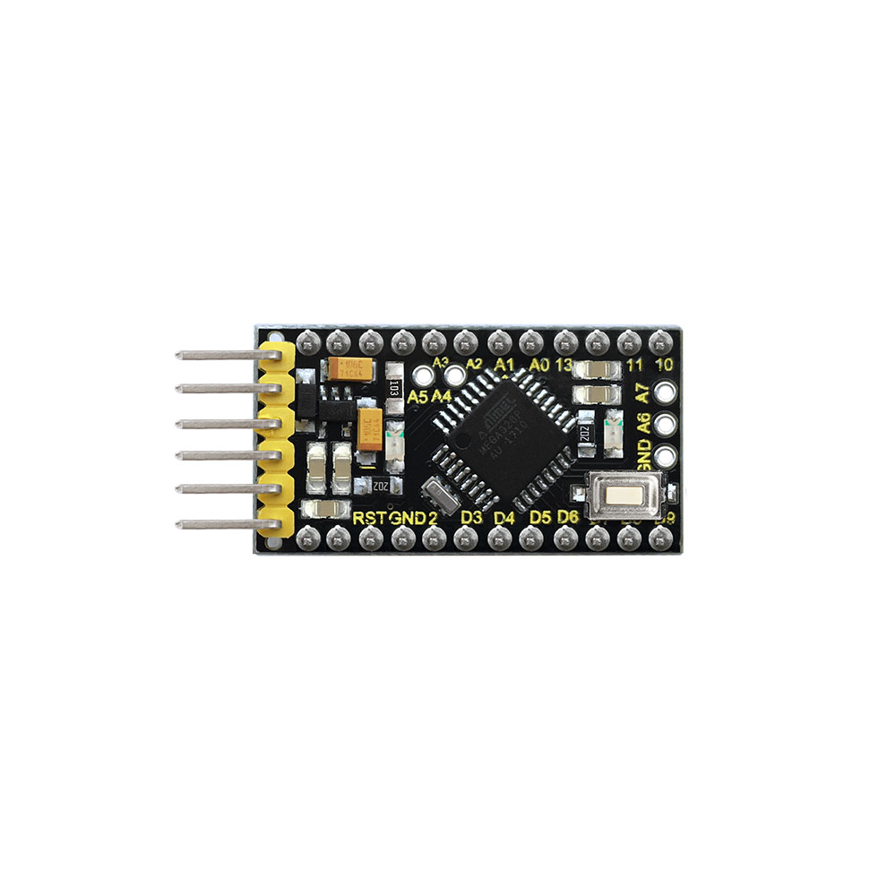**

 Introduction:

keyestudio Pro Mini is a small microcontroller board based on the ATmega328.
([datasheet](http://ww1.microchip.com/downloads/en/DeviceDoc/Atmel-8271-8-bit-AVR-Microcontroller-ATmega48A-48PA-88A-88PA-168A-168PA-328-328P_datasheet_Complete.pdf)),
intended for use on breadboards and when space is at a premium.

It has 14 digital input/output pins (of which 6 can be used as PWM outputs), 8
analog inputs, a 16 MHz crystal oscillator, and a reset button.

Note that the board is without an on-board USB to Serial connection. To program
the Pro Mini, you will need an external USB to Serial module.

The keyestudio pro mini can be powered via the pins 5V GND (DC 5V), or female
headers Vin GND (DC 7-9V).

 Features:

-   Using ATmega328P-AU from Atmel

-   14 digital input/output pins

-   8 analog input pins labeled A0 \~ A7

-   TTL level serial pins RX/TX;

-   6 PWM pins (D3, D5, D6, D9, D10, D11)

-   Support external DC 7-9V power supply

 TECH SPECS:

| **Microcontroller**             | ATmega328P-AU                                |
|---------------------------------|----------------------------------------------|
| **Operating Voltage**           | 5V                                           |
| **Input Voltage (recommended)** | DC7-9V                                       |
| **Digital I/O Pins**            | 14 (D0-D13)  (of which 6 provide PWM output) |
| **PWM Digital I/O Pins**        | 6 (D3, D5, D6, D9, D10, D11)                 |
| **Analog Input Pins**           | 8 (A0-A7)                                    |
| **DC Current per I/O Pin**      | 40 mA                                        |
| **Flash Memory**                | 32 KB of which 2 KB used by bootloader       |
| **SRAM**                        | 2 KB                                         |
| **EEPROM**                      | 1 KB                                         |
| **Clock Speed**                 | 16 MHz                                       |
| **LED_BUILTIN**                 | D13                                          |

 Technical Details:

-   Dimensions: 40mm x 18mm x 14mm

-   Weight: 4.1g

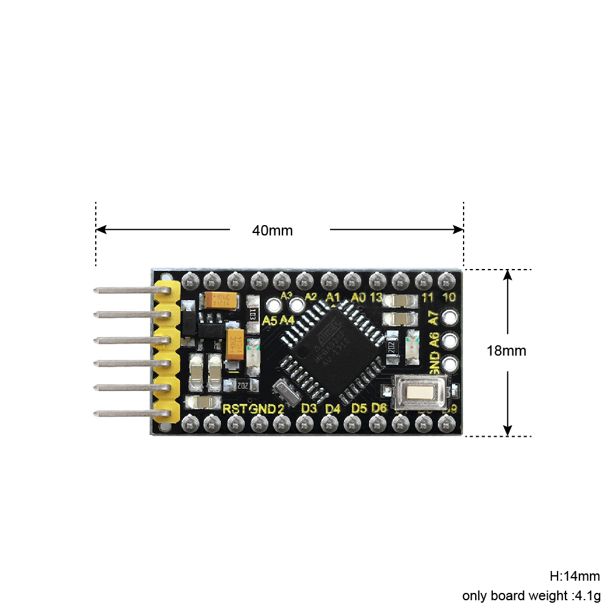

 Element and Interfaces:

Here is an explanation of what every element and interface of the board does:

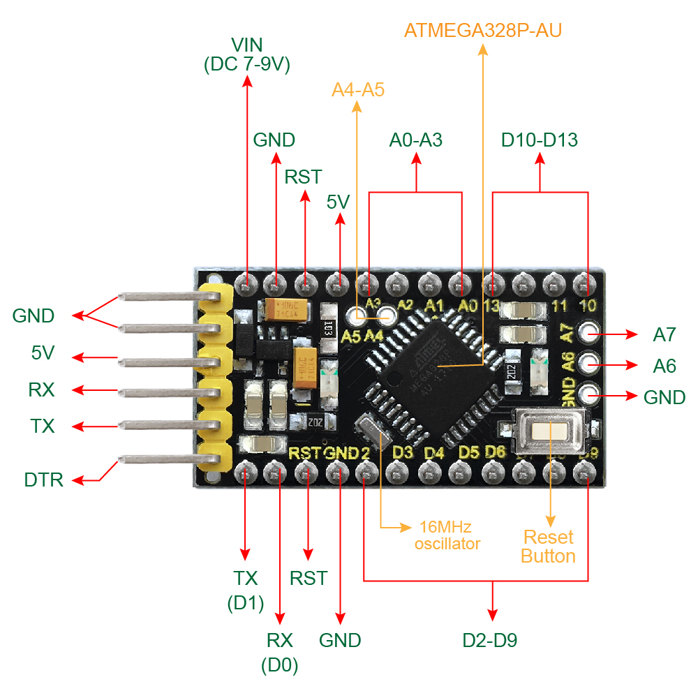

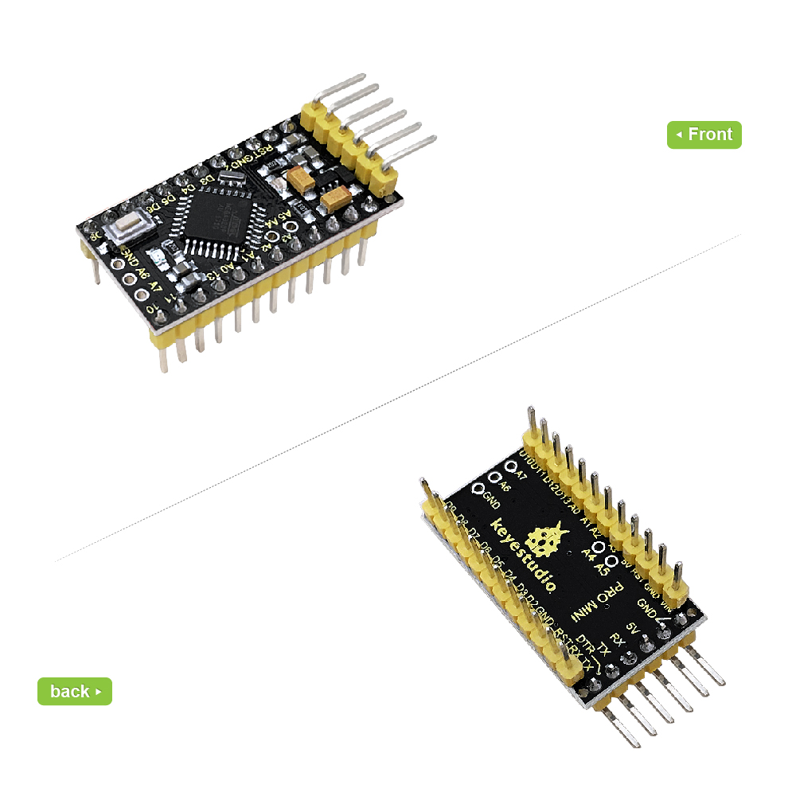

 Specialized Functions of Some Pins:

-   **Serial communication:** 0 (RX) and 1 (TX). Used to receive (RX) and
    transmit (TX) TTL serial data.

-   **PWM (Pulse-Width Modulation):** D3, D5, D6, D9, D10, D11

-   **External Interrupts:** D2 (interrupt 0) and D3 (interrupt 1).

-   **SPI communication:** D10 (SS), D11 (MOSI), D12 (MISO), D13 (SCK).

-   **IIC communication:**  A4 (SDA); A5(SCL)

 Detailed Using Methods are as follows:

 Step1\| Download the Arduino IDE

When you get the board, first you should install the Arduino software and
driver.

We usually use the Windows software Arduino 1.5.6 version. You can download it
from the link below:

[https://www.arduino.cc/en/Main/OldSoftwareReleases\#1.5.x](https://www.arduino.cc/en/Main/OldSoftwareReleases#1.5.x)

Or you can browse the ARDUINO website to download the latest version from this
link, <https://www.arduino.cc>, pop up the following interface.

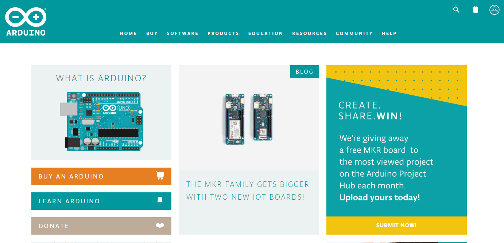

Then click the **SOFTWARE** on the browse bar, you will have two options ONLINE
TOOLS and DOWNLOADS.

Click **DOWNLOADS**, it will appear the latest software version of ARDUINO 1.8.5
shown as below.

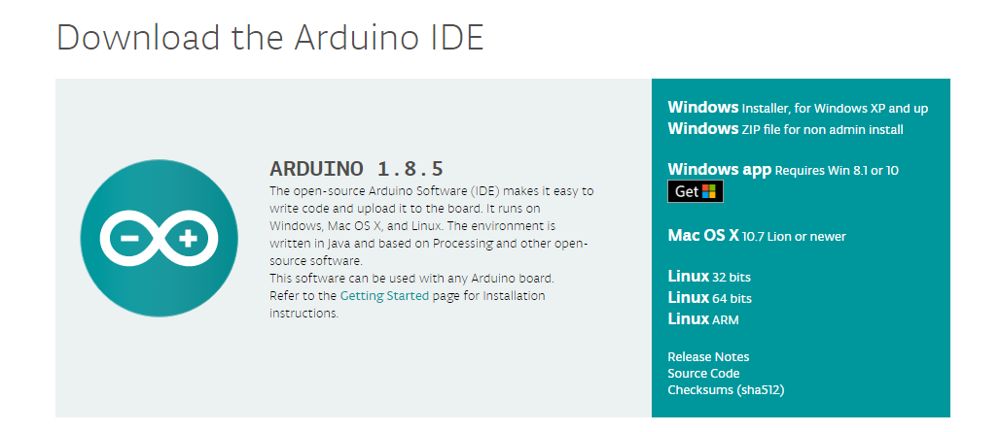

In this software page, on the right side you can see the version of development
software for different operating systems. ARDUINO has a powerful compatibility.
You should download the software that is compatible with the operating system of
your computer.

We will take **WINDOWS system** as an example here. There are also two options
under Windows system, one is installed version, the other is non-installed
version.

For simple installed version, first click **Windows Installer**, you will get
the following page.

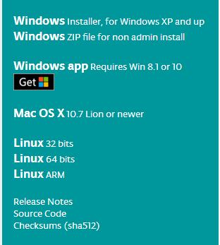

This way you just need to click JUST DOWNLOAD, then click the downloaded file to
install it.

For non-installed version, first click Windows ZIP file, you will also get the
pop-up interface as the above figure.

Click JUST DOWNLOAD, and when the ZIP file is downloaded well to your computer,
you can directly unzip the file and click the icon of ARDUINO software to start
it.

 Installing Arduino (Windows):

Install Arduino with the exe. Installation package downloaded well.

Click *“I Agree”* to see the following interface.

Click *“Next”*. Pop up the interface below.

You can press Browse… to choose an installation path or directly type in the
directory you want. Then click “Install” to initiate installation.

Wait for the installing process, if appear the interface of Window Security,
just continue to click Install to finish the installation.

 Introduction for Arduino IDE Toolbar:

Double-click the icon of Arduino software downloaded, you will get the interface
shown below.

(Note: if the Arduino software loads in the wrong language, you can change it in
the preferences dialog. See [the environment
page](http://arduino.cc/en/Guide/Environment#languages) for details.)

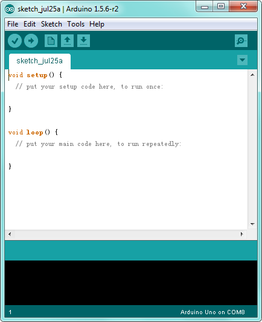

The functions of each button on the Toolbar are listed below:

<http://wiki.keyestudio.com/index.php/File:IDE.png>

| ****  **Verify/Compile** | Check the code for errors                           |
|-------------------------------------------------------------------------|-----------------------------------------------------|
| ****  **Upload**         | Upload the current Sketch to the Arduino            |
| **** **New**             | Create a new blank Sketch                           |
| **** **Open**            | Show a list of Sketches                             |
| **** **Save**            | Save the current Sketch                             |
| **** **Serial Monitor**  | Display the serial data being sent from the Arduino |

 Step2\| Connect a USB to Serial Module

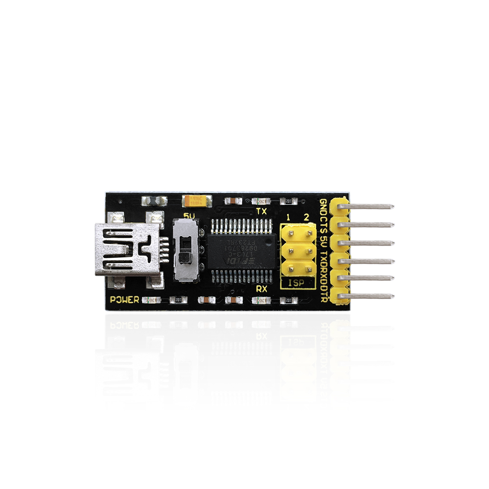To program the Pro Mini board,
you will need to connect an external USB to Serial module. Different USB to
Serial modules might have different driver installation. In the following, we
will introduce the use of pro mini with our [keyestudio FTDI Basic Program
Downloader](http://www.keyestudio.com/ks0277.html). See more details
[here](http://wiki.keyestudio.com/index.php/Ks0277_keyestudio_FTDI_Basic_Program_Downloader_USB_to_TTLFT232).

 Download the Driver Files

[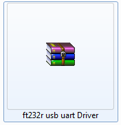](https://drive.google.com/open?id=1vj4Is2LokXf3GDGcnumnAPmaI39uPhQk)

You can download the driver file from the link below:

<https://drive.google.com/open?id=1vj4Is2LokXf3GDGcnumnAPmaI39uPhQk>

 Installing the Driver

The USB to serial port chip of this module is FT232RL. So you need to install
the [ft232r usb uart
driver](https://drive.google.com/open?id=1vj4Is2LokXf3GDGcnumnAPmaI39uPhQk). You
could click the driver file above to download it.

In different systems, the driver installation might be similar. Here we start to
install the driver on the Win7 system.

Plug one end of your USB cable into the module and the other into a USB socket
on your computer.

Then right click your “Computer” —\>for “Properties”—\> click “Device manager”,
under Other devices, you should see the “USB Serial Port”.

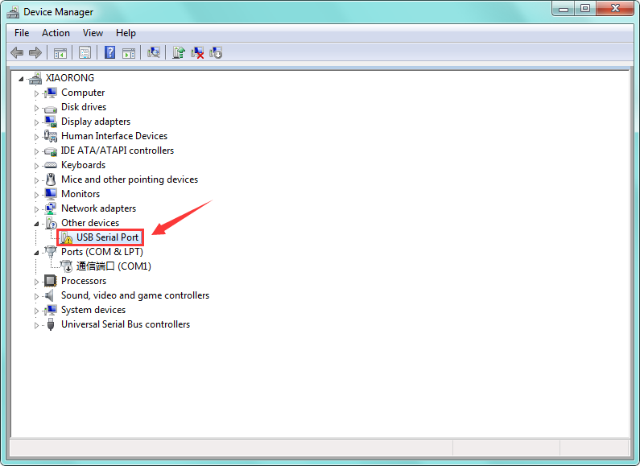

Then right-click on the USB Serial Port and select the top menu option (Update
Driver Software...) shown as the figure below.

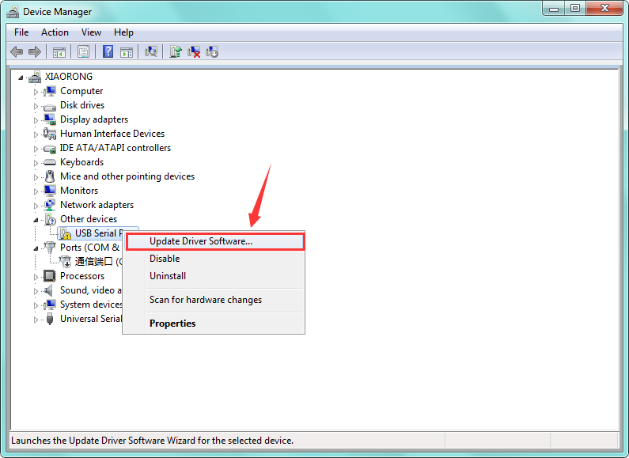  
<http://wiki.keyestudio.com/index.php/File:Driver_2.png>

Then it will be prompted to either “Search Automatically for updated driver
software” or “Browse my computer for driver software”. Shown as below. In this
page, select “Browse my computer for driver software”.

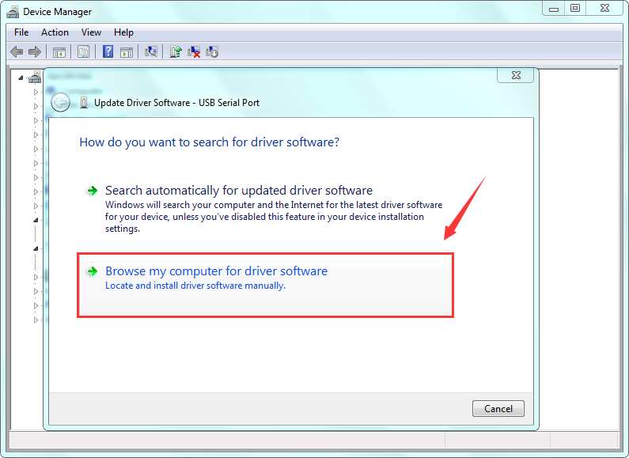

After that, select the option to browse and navigate to the “drivers” folder.

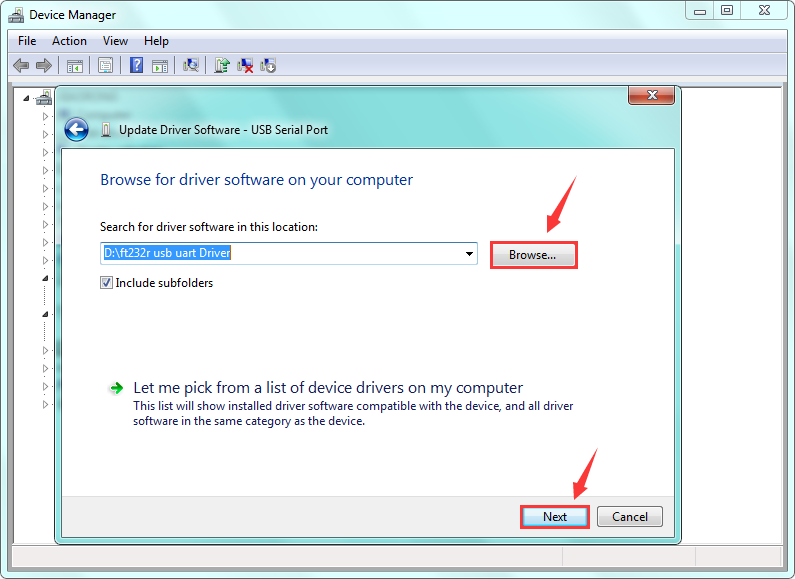

Once the driver has been installed, you will get a confirmation message.
Installation completed, click “Close”.
<http://wiki.keyestudio.com/index.php/File:Driver_6.png>

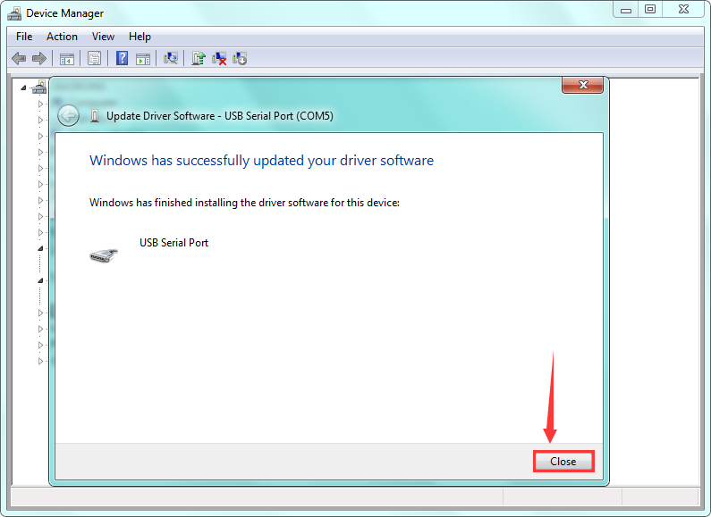

Up to now, the driver is installed well. Then you can right click “Computer”
—\>“Properties”—\>“Device manager”, you should see the device as the figure
shown below.

 Step3\| Hookup Guide

Driver installation completed, disconnect the module to computer, then connect
it to pro mini board using F-F jumper wires. Shown below. The slide switch on
the module is used to control the voltage for serial communication. Whether it
is set to 5V or 3.3V, it can be programmed with the Pro Mini.

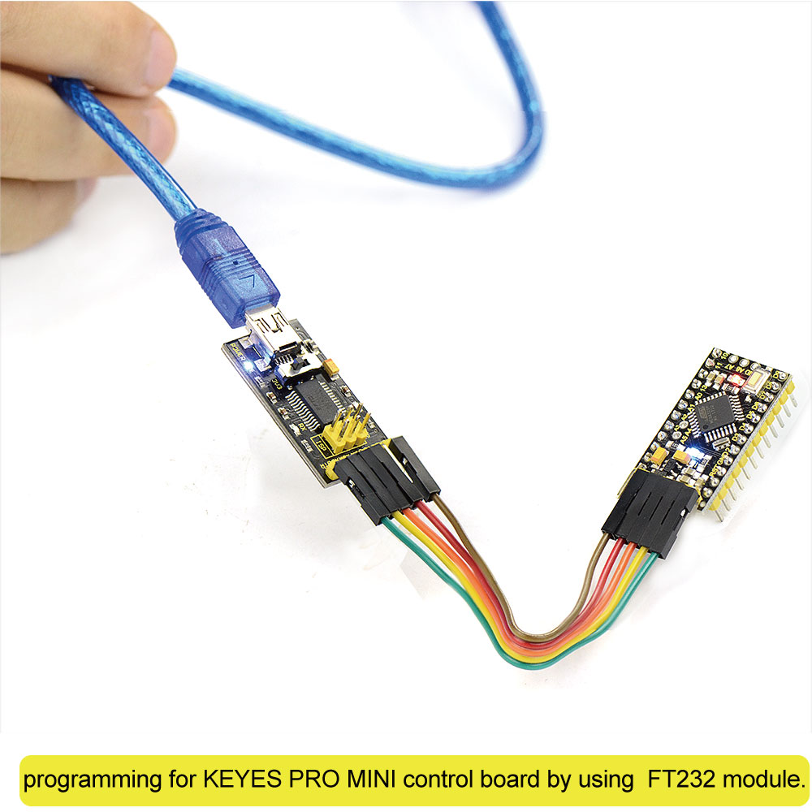

| FTDI Basic Program Downloader | keyestudio pro mini |
|-------------------------------|---------------------|
| GND                           | GND                 |
| 5V                            | 5V                  |
| TXD                           | RX                  |
| RXD                           | TX                  |
| DIR                           | DIR                 |

Connect well the module to pro mini board, then connect the pro mini board to
your computer with a mini USB cable.

 Step4\| Select the Arduino Board

Open the Arduino IDE, you’ll need to click the “Tools”, then select the Board
that corresponds to your Arduino.

**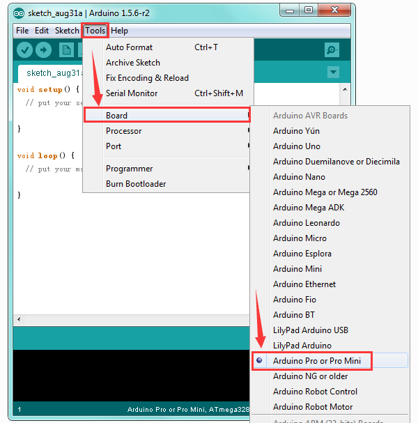**

 Step5\| Select your serial port

Select the serial device of the Arduino board from the **Tools \| Serial Port
menu**. **Note:** to avoid errors, the COM Port should keep the same as the
Ports shown on Device Manager.

**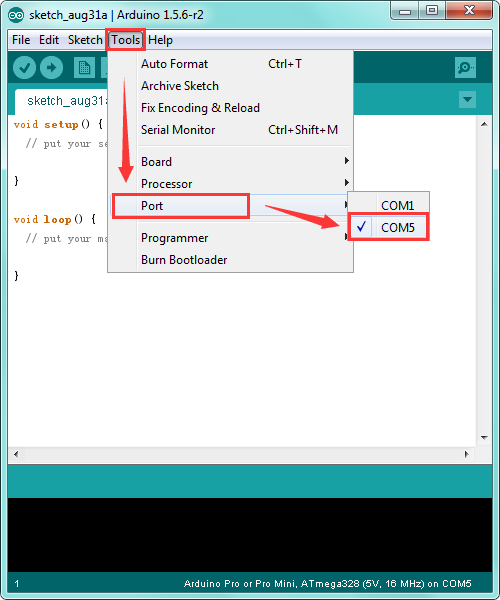**

 Step6\| Upload the Code

Below is an example code for displaying the Hello World!

Copy and paste the code to the Arduino environment IDE.

**///////////////////////////////////////////////////////////////////////////////////////////////**

int val;

int ledpin=13;

void setup()

{

Serial.begin(9600);

pinMode(ledpin,OUTPUT);

}

void loop()

{

val=Serial.read();

if(val=='R')

{

digitalWrite(ledpin,HIGH);

delay(500);

digitalWrite(ledpin,LOW);

delay(500);

Serial.println("Hello World!");

}

}

**///////////////////////////////////////////////////////////////////////////////////////////////**

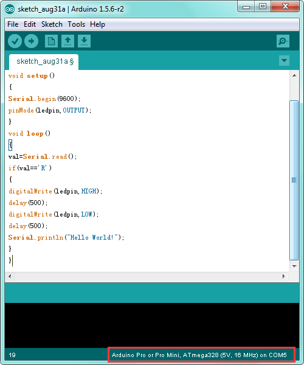

Then click verify button to check the errors. If compiling successfully, the
message "Done compiling." will appear in the status bar.

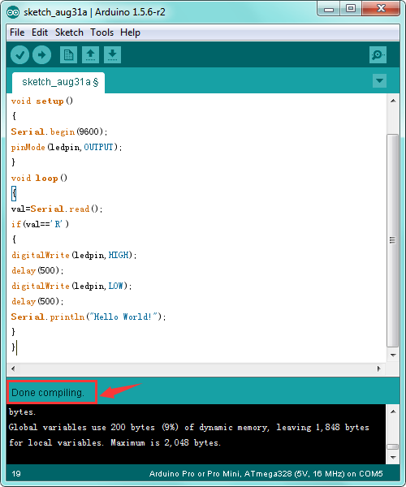

After that, click the “Upload” button to upload the code. If the upload is
successful, the message "Done uploading." will appear in the status bar.

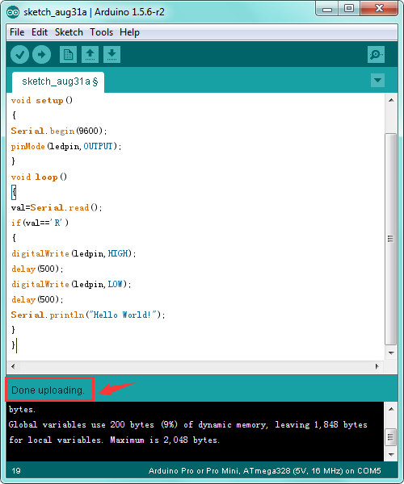

 Step7\| Open the Serial Monitor

After that, click the button to open the serial monitor.

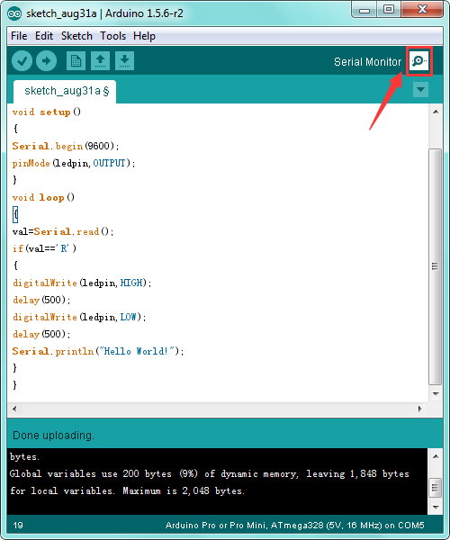

Then set the baud rate to 9600, enter an “R” and click Send, that is, the
computer will send the character R. When pro mini board receives it, you should
see the D13 led flash once. "Hello World!" is sent to the computer, so that you
should see the "Hello World!" is showed on the monitor.

**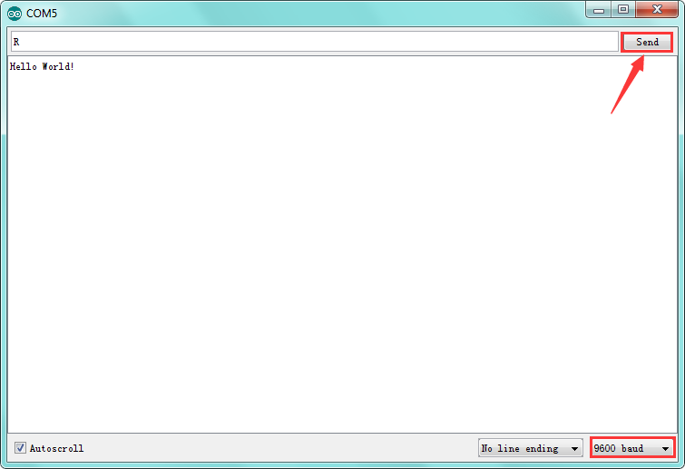**

 Resource Links:

Download code and libraries:

<https://fs.keyestudio.com/KS0247>

You might also want to look at:

[the reference](http://arduino.cc/en/Reference/HomePage) for the Arduino
language;

Download ARDUINO Software:

[https://www.arduino.cc/en/Main/OldSoftwareReleases\#1.5.x](https://www.arduino.cc/en/Main/OldSoftwareReleases#1.5.x)

 Troubleshooting:

If you have problems, please see the [troubleshooting
suggestions](http://arduino.cc/en/Guide/Troubleshooting).
