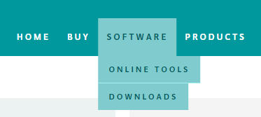
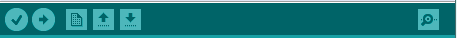
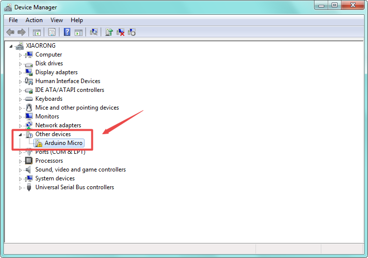
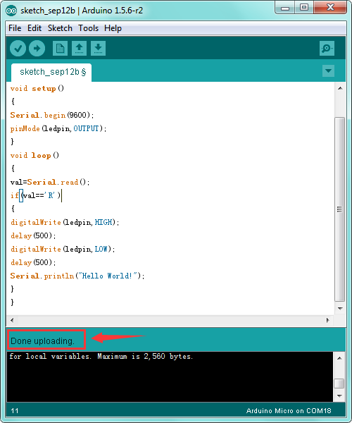

# **Keyestudio PRO MICRO Development Board**

****

## Introduction:

keyestudio PRO MICRO is a microcontroller board based on the ATMEGA32U4-MU. It
is an easy-to-use open source hardware.

It has 18 digital input/output pins (of which 5 can be used as PWM outputs), 9
analog inputs, a 16 MHz crystal oscillator, and a micro USB connection.

It contains everything needed to support the microcontroller; simply connect it
to a computer with a USB cable to get started.

The keyestudio PRO MICRO can be powered via the micro USB connection, or via the
interface RAW GND (DC 7-9V).

Note that the operating voltage of PRO MICRO is 3.3V.

The PRO MICRO differs from other Arduino boards using separate USB-Serial chip
in that the ATMEGA32U4-MU has built-in USB communication, eliminating the need
for a secondary processor.

It is easy to integrate this Micro in everyday objects to make them interactive.

To facilitate the physical design, the board is not welded with pin headers, so
you can solder the pin headers by yourself. And the package includes 2pcs of
yellow 1\*12 2.54 straight pins and 1m black micro USB cable.

# TECH SPECS:

| **Microcontroller**             | ATMEGA32U4-MU                      |
|---------------------------------|------------------------------------|
| **RAW**                         | DC 7-9V                            |
| **VCC**                         | 3.3V at 500mA                      |
| **Operating Voltage**           | 3.3V                               |
| **Digital I/O Pins**            | 18 (of which 5 provide PWM output) |
| **Analog Input Pins**           | 9                                  |
| **Maximum current for chip**    | 200mA                              |
| **Maximum current per pin**     | 40mA                               |
| **Recommended current per pin** |  20mA                              |
| **Atmel AVR**                   | 8-bit                              |
| **Flash Memory**                | 32 KB                              |
| **SRAM**                        | 2.5 KB                             |
| **EEPROM**                      | 1 KB                               |
| **ADC**                         | 10-bit                             |
| **PWM**                         | 8-bit                              |

# Details:

-   PCB Dimensions: 35mm\*18mm\*2mm

-   Weight: 2.6g

# Element and Interfaces:

Here is an explanation of what every element and interface of the board does:

# Specialized Functions of Some Pins:

| **Digital I/O pins**             |  RX (D0)、TX (D1)、D2-D10、D14-D16、A0-A3(D18-D21)                                                                                                                                                                                                                                                                                                                  |
|----------------------------------|---------------------------------------------------------------------------------------------------------------------------------------------------------------------------------------------------------------------------------------------------------------------------------------------------------------------------------------------------------------------|
| **Analog Inputs**                |  A0-A3, A6-A10 (on digital pins 4, 6, 8, 9, and 10). That is, D4 (A6)、D6 (A7)、D8 (A8)、D9 (A9)、D10 (A10).                                                                                                                                                                                                                                                        |
| **PWM (Pulse-Width Modulation)** |  D3, D5, D6, D9 and D10. Provide 8-bit PWM output with the [analogWrite()](https://www.arduino.cc/en/Reference/AnalogWrite) function.                                                                                                                                                                                                                               |
| **External**  **Interrupts**     |  D3 (interrupt 0); D2 (interrupt 1); D0 (interrupt 2), D1 (interrupt 3) and D7 (interrupt 4).  These pins can be configured to trigger an interrupt on a low value, a rising or falling edge, or a change in value. See the [attachInterrupt()](https://www.arduino.cc/reference/en/language/functions/external-interrupts/attachinterrupt/) function for details.  |
| **Serial communication**         |  D0 (RX) and D1 (TX).                                                                                                                                                                                                                                                                                                                                               |
| **SPI communication**            |  D14 (MISO); D15 (SCLK); D16 (MOSI)                                                                                                                                                                                                                                                                                                                                 |
| **I2C** **communication**        |  D2 (SDA) and D3 (SCL)                                                                                                                                                                                                                                                                                                                                              |
| **RAM**                          |  Connect the external power DC 7-9V                                                                                                                                                                                                                                                                                                                                 |

# Detailed Use with ARDUINO Software as follows:

## Step1\| Download the Arduino IDE

When you get the board, first you should install the Arduino software and
driver.

We usually use the Windows software Arduino 1.5.6 version. You can download it
from the link below:

[https://www.arduino.cc/en/Main/OldSoftwareReleases\#1.5.x](https://www.arduino.cc/en/Main/OldSoftwareReleases#1.5.x)

Or you can browse the ARDUINO website to download the latest version from this
link, <https://www.arduino.cc>, pop up the following interface.

Then click the **SOFTWARE** on the browse bar, you will have two options ONLINE
TOOLS and DOWNLOADS.

Click **DOWNLOADS**, it will appear the latest software version of ARDUINO 1.8.5
shown as below.

In this software page, on the right side you can see the version of development
software for different operating systems. ARDUINO has a powerful compatibility.
You should download the software that is compatible with the operating system of
your computer.

We will take **WINDOWS system** as an example here. There are also two options
under Windows system, one is installed version, the other is non-installed
version.

For simple installed version, first click **Windows Installer**, you will get
the following page.

This way you just need to click JUST DOWNLOAD, then click the downloaded file to
install it.

For non-installed version, first click Windows ZIP file, you will also get the
pop-up interface as the above figure.

Click JUST DOWNLOAD, and when the ZIP file is downloaded well to your computer,
you can directly unzip the file and click the icon of ARDUINO software to start
it.

**Installing Arduino (Windows):**

Install Arduino with the exe. Installation package downloaded well.

Click *“I Agree”* to see the following interface.

Click *“Next”*. Pop up the interface below.

You can press Browse… to choose an installation path or directly type in the
directory you want. Then click “Install” to initiate installation.

Wait for the installing process, if appear the interface of Window Security,
just continue to click Install to finish the installation.

**Introduction for Arduino IDE Toolbar:**

Double-click the icon of Arduino software downloaded, you will get the interface
shown below.

(Note: if the Arduino software loads in the wrong language, you can change it in
the preferences dialog. See [the environment
page](http://arduino.cc/en/Guide/Environment#languages) for details.)

The functions of each button on the Toolbar are listed below:

<http://wiki.keyestudio.com/index.php/File:IDE.png>

| ****  **Verify/Compile** | Check the code for errors                           |
|-------------------------------------------------------------------------|-----------------------------------------------------|
| ****  **Upload**         | Upload the current Sketch to the Arduino            |
| **** **New**             | Create a new blank Sketch                           |
| **** **Open**            | Show a list of Sketches                             |
| **** **Save**            | Save the current Sketch                             |
| **** **Serial Monitor**  | Display the serial data being sent from the Arduino |

## Step2\| Installing the Driver

Installed well the Arduino, the next step is to install the driver. The Arduino
folder contains both the Arduino program itself and the drivers that allow the
Arduino to be connected to your computer with a USB cable.

In different systems, the driver installation is similar. Here we start to
install the driver on the Win7 system.

Plug one end of your USB cable into the keyestudio PRO MICRO and the other into
a USB socket on your computer.

When you connect the board to your computer at the first time, right click your
“Computer” —\>for “Properties”—\> click the “Device manager”, under Other
devices, you should see the “Arduino Micro”.

<http://wiki.keyestudio.com/index.php/File:Driver_2.png>

Then right-click on the Arduino
Micro and select the top menu option (Update Driver Software...) shown as the
figure below.

Then it will be prompted to either “Search Automatically for updated driver
software” or “Browse my computer for driver software”. Shown as below. In this
page, select “Browse my computer for driver software”.

After that, select the option to browse and navigate to the “drivers” folder.

Once the software has been installed, you will get a confirmation message.
Installation completed, click “Close”.
<http://wiki.keyestudio.com/index.php/File:Driver_6.png>

Up to now, the driver is installed well. Then you can right click “Computer”
—\>“Properties”—\>“Device manager”, you should see the device as the figure
shown below.

## Step3\| Connect the board

Connect the Pro Micro board to your computer using the USB cable. The power LED
should go on.

## Step4\| Select the Arduino Board

Open the Arduino IDE, you’ll need to click the “Tools”, then select the Board
that corresponds to your Arduino.

## 

## Step5\| Select your serial port

Select the serial device of the Arduino board from the **Tools \| Serial Port
menu**. **Note:** to avoid errors, the COM Port should keep the same as the
Ports shown on Device Manager.

****

## Step6\| Upload the Code

Below is an example code for displaying the Hello World!

Copy and paste the code to the Arduino environment IDE.

**///////////////////////////////////////////////////////////////////////////////////////////////**

int val;

int ledpin=13;

void setup()

{

Serial.begin(9600);

pinMode(ledpin,OUTPUT);

}

void loop()

{

val=Serial.read();

if(val=='R')

{

digitalWrite(ledpin,HIGH);

delay(500);

digitalWrite(ledpin,LOW);

delay(500);

Serial.println("Hello World!");

}

}

**///////////////////////////////////////////////////////////////////////////////////////////////**

Then click verify button to check the errors. If compiling successfully, the
message "Done compiling." will appear in the status bar.

After that, click the “Upload” button to upload the code. If the upload is
successful, the message "Done uploading." will appear in the status bar.

## Step7\| Open the Serial Monitor

After that, click the button to open the serial monitor.

Then set the baud rate to 9600, enter an “R” and click Send, that is, the
computer will send the character R. When the board receives it, you should see
the RX led on the board flash once, and then D13 led flash once; when keyestudio
PRO MICRO successfully sends "Hello World!" to the computer, you should see the
"Hello World!" is showed on the monitor, and TX led on the PRO MICRO board flash
once.

****

# Package Includes:

-   keyestudio PRO MICRO\* 1pcs

-   Black micro USB cable 1m \* 1pcs

-   Yellow Pin headers \* 2pcs

# Resource Links:

Download test code and driver:

<https://fs.keyestudio.com/KS0249>

You might also want to look at:

[the reference](http://arduino.cc/en/Reference/HomePage) for the Arduino
language;

Download ARDUINO Software:

[https://www.arduino.cc/en/Main/OldSoftwareReleases\#1.5.x](https://www.arduino.cc/en/Main/OldSoftwareReleases#1.5.x)

# Troubleshooting:

If you have problems, please see the [troubleshooting
suggestions](http://arduino.cc/en/Guide/Troubleshooting).
