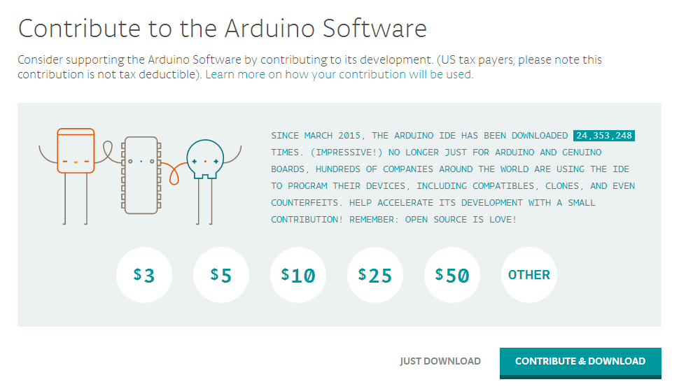
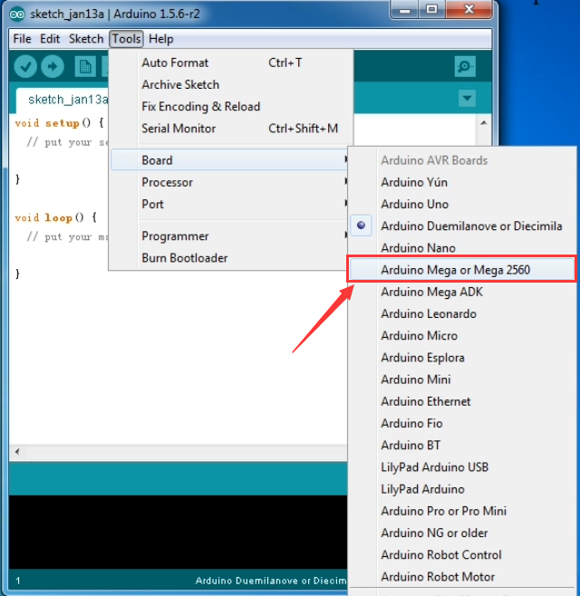

#  **KS0342 Keyestudio MEGA Compatible advanced development board**

 Introduction:

Keyestudio MEGA compatible board Advanced is a microcontroller board based on
the
[ATMEGA2560-16AU](http://ww1.microchip.com/downloads/en/DeviceDoc/Atmel-2549-8-bit-AVR-Microcontroller-ATmega640-1280-1281-2560-2561_datasheet.pdf)
, fully compatible with [Keyestudio MEGA R3
board](http://wiki.keyestudio.com/index.php/Ks0002_keyestudio_Mega_2560_R3_Development_Board)
and ARDUINO MEGA REV3.

It has 54 digital input/output pins (of which 15 can be used as PWM outputs), 16
analog inputs, 4 UARTs (hardware serial ports), a 16 MHz crystal oscillator, a
USB connection, a power jack, 2 ICSP headers, and a reset button.

It contains everything needed to support the microcontroller. With its
bootloader, program can be downloaded directly with USB and you don’t need to
use other external programmer.

Just simply connect it to a computer with a USB cable or power it via an
external DC power jack (DC 7-12V) or via female headers Vin /GND (DC 7-12V) to
get started.

**Note:** the most important difference between keyestudio MEGA compatible board
Advanced and keyestudio MEGA R3 board is the voltage regulator chip used in the
board.

The voltage regulator chip used in keyestudio MEGA R3 board is NSP1117. When
connect the external power, output 5V, the drive current is 1A.

However, keyestudio MEGA compatible board Advanced features the
voltage-regulator chip MP2307DN. When connect the external power, output 5V, the
drive current can be 2A.

The MEGA is designed for more complex projects. With 54 digital I/O pins, 16
analog inputs and a larger space for your sketch, it is the recommended board
for 3D printers and robotics projects. This gives your projects plenty of room
and opportunities.

|                                        | keyestudio MEGA compatible board Advanced  | keyestudio MEGA R3 board |
|----------------------------------------|--------------------------------------------|--------------------------|
| **voltage-regulator chip**             | MP2307DN                                   | NSP1117                  |
| **Power Output**                       | 5V                                         | 5V                       |
| **Drive Current** **(external power)** | 2A                                         | 1A                       |
| **Drive Current** **(USB power)**      | 0.5A                                       | 0.5A                     |

**keyestudio MEGA R3 board:**

**keyestudio MEGA compatible board Advanced:**

 TECH SPECS:

| **Microcontroller**             | ATMEGA2560-16AU                          |
|---------------------------------|------------------------------------------|
| **Operating Voltage**           | 5V                                       |
| **Input Voltage (recommended)** | DC 7-12V                                 |
| **Digital I/O Pins**            | 54 (D0-D53)                              |
| **PWM Digital I/O Pins**        | 15 (D2-D13; D44-D46)                     |
| **Analog Input Pins**           | 16 (A0-A15)                              |
| **DC Current per I/O Pin**      | 20 mA                                    |
| **DC Current for 3.3V Pin**     | 50 mA                                    |
| **Flash Memory**                |  256 KB of which 8 KB used by bootloader |
| **SRAM**                        | 8 KB                                     |
| **EEPROM**                      | 4 KB                                     |
| **Clock Speed**                 | 16 MHz                                   |
| **LED_BUILTIN**                 | D13                                      |

 Details:

-   Dimensions: 108mm x 53.5mm x 15mm

-   Weight: 33.6g

**Element and Pin Interfaces:**

Here is an explanation of what every element and interface of the board does:

|    | **Digital I/O** Arduino MEGA has 54 digital input/output pins (of which 15 can be used as PWM outputs). These pins can be configured as digital input pin to read the logic value (0 or 1). Or used as digital output pin to drive different modules like LED, relay, etc.  Using [pinMode()](https://www.arduino.cc/reference/en/language/functions/digital-io/pinmode/), [digitalWrite()](https://www.arduino.cc/reference/en/language/functions/digital-io/digitalwrite/), and [digitalRead()](https://www.arduino.cc/reference/en/language/functions/digital-io/digitalread/) functions. |
|---------------------------------------------------|----------------------------------------------------------------------------------------------------------------------------------------------------------------------------------------------------------------------------------------------------------------------------------------------------------------------------------------------------------------------------------------------------------------------------------------------------------------------------------------------------------------------------------------------------------------------------------------------|
|    | **GND**  Ground pins                                                                                                                                                                                                                                                                                                                                                                                                                                                                                                                                                                         |
|    | **AREF**  Reference voltage (0-5V) for analog inputs. Used with [analogReference()](https://www.arduino.cc/reference/en/language/functions/analog-io/analogreference/). Configures the reference voltage used for analog input (i.e. the value used as the top of the input range).                                                                                                                                                                                                                                                                                                          |
|    | **SDA** IIC communication pin                                                                                                                                                                                                                                                                                                                                                                                                                                                                                                                                                                |
|    | **SCL** IIC communication pin                                                                                                                                                                                                                                                                                                                                                                                                                                                                                                                                                                |
|    | **ICSP (In-Circuit Serial Programming) Header** the AVR, an Arduino micro-program header consisting of MOSI, MISO, SCK, RESET, VCC, and GND. Connected to the ATMEGA16U2-MU. When connecting to PC, program the firmware to ATMEGA16U2-MU.                                                                                                                                                                                                                                                                                                                                                   |
|    | **USB Connection** Arduino board can be powered via USB connector.  All you needed to do is connecting the USB port to PC using a USB cable.                                                                                                                                                                                                                                                                                                                                                                                                                                                 |
|    | **D13 LED**  There is a built-in LED driven by digital pin 13. When the pin is HIGH value, the LED is on, when the pin is LOW, it's off.                                                                                                                                                                                                                                                                                                                                                                                                                                                     |
|    | **ATMEGA 16U2-MU**  USB to serial chip, can convert the USB signal into serial port signal.                                                                                                                                                                                                                                                                                                                                                                                                                                                                                                  |
|    | **TX LED** Onboard you can find the label: TX (transmit) When Arduino board communicates via serial port, send the message, TX led flashes.                                                                                                                                                                                                                                                                                                                                                                                                                                                  |
|    | **RX LED** Onboard you can find the label: RX(receive ) When Arduino board communicates via serial port, receive the message, RX led flashes.                                                                                                                                                                                                                                                                                                                                                                                                                                                |
|    | **Crystal Oscillator** How does Arduino calculate time? by using a crystal oscillator. The number printed on the top of the Arduino crystal is 16.000H9H. It tells us that the frequency is 16,000,000 Hertz or 16MHz.                                                                                                                                                                                                                                                                                                                                                                       |
|    | **Voltage Regulator** Convert an external input DC7-12V voltage into DC 5V, then switch DC 5V to the processor and other components. Output DC 5V, the drive current is 2A.                                                                                                                                                                                                                                                                                                                                                                                                                  |
|    | **DC Power Jack** Arduino board can be supplied with an external power DC7-12V from the DC power jack.                                                                                                                                                                                                                                                                                                                                                                                                                                                                                       |
|    | **IOREF**  This pin on the board provides the voltage reference with which the microcontroller operates. A properly configured shield can read the IOREF pin voltage and select the appropriate power source or enable voltage translators on the outputs for working with the 5V or 3.3V.                                                                                                                                                                                                                                                                                                   |
|    | **RESET Header**  Connect an external button to reset the board. The function is the same as reset button.                                                                                                                                                                                                                                                                                                                                                                                                                                                                                   |
|    | **Power Pin 3V3** Provides 3.3V voltage output                                                                                                                                                                                                                                                                                                                                                                                                                                                                                                                                               |
|    | **Power Pin 5V** Provides 5V voltage output                                                                                                                                                                                                                                                                                                                                                                                                                                                                                                                                                  |
|    | **Vin**  You can supply an external power input DC7-12V through this pin to Arduino board.                                                                                                                                                                                                                                                                                                                                                                                                                                                                                                   |
|    | **Analog Pins** Onboard has 16 analog inputs, labeled A0 to A15.                                                                                                                                                                                                                                                                                                                                                                                                                                                                                                                             |
|    | **RESET Button** You can reset your Arduino board, for example, start the program from the initial status. You can use the RESET button.                                                                                                                                                                                                                                                                                                                                                                                                                                                     |
|    | **ICSP (In-Circuit Serial Programming) Header** the AVR, an Arduino micro-program header consisting of MOSI, MISO, SCK, RESET, VCC, and GND.  It is often called the SPI (serial peripheral interface) and can be considered an "extension" of the output. In fact, slave the output devices to the SPI bus host. When connecting to PC, program the firmware to ATMEGA2560-16AU.                                                                                                                                                                                                            |
|    | **Microcontroller**  Each Arduino board has its own microcontroller. You can regard it as the brain of your board. The main IC (integrated circuit) on the Arduino is slightly different from the panel pair. Microcontrollers are usually from ATMEL. Before you load a new program on the Arduino IDE, you must know what IC is on your board. This information can be checked at the top of IC.                                                                                                                                                                                           |
|    | **Power LED Indicator** Powering the Arduino, LED on means that your circuit board is correctly powered on. If LED is off, connection is wrong.                                                                                                                                                                                                                                                                                                                                                                                                                                              |

 Specialized Functions of Some Pins:

-   **Serial Communication:** D0 (RX0) and D1 (TX1); Serial 1: D19 (RX1) and D18
    (TX1); Serial 2: D17 (RX2) and D16 (TX2); Serial 3: D15 (RX3) and D14 (TX3).

    Used to receive (RX) and transmit (TX) TTL serial data. Pins 0 and 1 are
    also connected to the corresponding pins of the ATmega16U2 USB-to-TTL Serial
    chip.

-   **PWM Pins (Pulse-Width Modulation):** D2 to D13, and D44 to D46.

Provide 8-bit PWM output with the
[analogWrite()](https://www.arduino.cc/reference/en/language/functions/analog-io/analogwrite/)
function.

-   **External Interrupts:** D2 (interrupt 0), D3 (interrupt 1), D18 (interrupt
    5), D19 (interrupt 4), D20 (interrupt 3), and D21 (interrupt 2).

    These pins can be configured to trigger an interrupt on a low level, a
    rising or falling edge, or a change in level. See the
    [attachInterrupt()](https://www.arduino.cc/reference/en/language/functions/external-interrupts/attachinterrupt/)
    function for details.

-   **SPI communication:** D53 (SS), D52 (SCK), D51 (MOSI), D50 (MISO).

    These pins support SPI communication using the[SPI
    library](https://www.arduino.cc/en/Reference/SPI). The SPI pins are also
    broken out on the ICSP header, which is physically compatible with the
    Arduino Uno.

-   **IIC communication:** D20 (SDA); D21 (SCL). Support TWI communication using
    the [Wire library](https://www.arduino.cc/en/Reference/Wire).

 Tips:

-   Automatic (Software) Reset:

    Rather than requiring a physical press of the reset button before an upload,
    the MEGA board is designed in a way that allows it to be reset by software
    running on a connected computer.

-   The MEGA board contains a trace that can be cut to disable the auto-reset.
    The pads on either side of the trace can be soldered together to re-enable
    it. It's labeled "RESET-EN". You may also be able to disable the auto-reset
    by connecting a 110 ohm resistor from 5V to the reset line; see [this forum
    thread](http://forum.arduino.cc/index.php/topic,22974.0.html) for details.

 Detailed Use with ARDUINO Software as follows:

 Step1\| Download the Arduino environment (IDE)

When you get the MEGA development board, first you should install the Arduino
software and driver.

We usually use the Windows software Arduino 1.5.6 version. You can download it
from the link below:

[https://www.arduino.cc/en/Main/OldSoftwareReleases\1.5.x](https://www.arduino.cc/en/Main/OldSoftwareReleases1.5.x)

Or you can browse the ARDUINO website to download the latest version from this
link, <https://www.arduino.cc>, pop up the following interface.

Then click the **SOFTWARE** on the browse bar, you will have two options ONLINE
TOOLS and DOWNLOADS.

Click **DOWNLOADS**, it will appear the latest software version of ARDUINO 1.8.5
shown as below.

In this software page, on the right side you can see the version of development
software for different operating systems. ARDUINO has a powerful compatibility.
You should download the software that is compatible with the operating system of
your computer.

We will take **WINDOWS system** as an example here. There are also two options
under Windows system, one is installed version, the other is non-installed
version.

For simple installed version, first click **Windows Installer**, you will get
the following page.

This way you just need to click JUST DOWNLOAD, then click the downloaded file to
install it.

For non-installed version, first click Windows ZIP file, you will also get the
pop-up interface as the above figure.

Click JUST DOWNLOAD, and when the ZIP file is downloaded well to your computer,
you can directly unzip the file and click the icon of ARDUINO software to start
it.

**Installing Arduino (Windows):**

Install Arduino with the exe. Installation package downloaded well.

Click *“I Agree”* to see the following interface.

Click *“Next”*. Pop up the interface below.

You can press Browse… to choose an installation path or directly type in the
directory you want. Then click “Install” to initiate installation.

Wait for the installing process, if appear the interface of Window Security,
just continue to click Install to finish the installation.

**Installing Driver:**

Next, we will introduce the driver installation of MEGA development board. The
driver installation may have slight differences in different computer systems.
So in the following let’s move on to the driver installation in the WIN 7
system.

The Arduino folder contains both the Arduino program itself and the drivers that
allow the Arduino to be connected to your computer by a USB cable. Before we
launch the Arduino software, you are going to install the USB drivers.

Plug one end of your USB cable into the Arduino and the other into a USB socket
on your computer.

When you connect MEGA board to your computer at the first time, right click the
icon of your *“Computer” —\>for “Properties”—\> click the “Device manager”*,
under “Other Devices”, you should see an icon for “Unknown device” with a little
yellow warning triangle next to it. This is your Arduino.

Then right-click on the device and select the top menu option (Update Driver
Software...) shown as the figure below.

It will then be prompted to either “Search Automatically for updated driver
software” or “Browse my computer for driver software”. Shown as below. In this
page, select “Browse my computer for driver software”.

After that, select the option to browse and navigate to the “drivers” folder of
Arduino installation.

Click “Next” and you may get a security warning, if so, allow the software to be
installed. Shown as below.

Installation completed, click “Close”.

Up to now, the driver is installed well. Then you can right click *“Computer”
—\>“Properties”—\>“Device manager”*, you should see the device shown below.

**Introduction for Arduino IDE Toolbar:**

Double-click the icon of Arduino software downloaded well, you will get the
interface shown below.

(Note: if the Arduino software loads in the wrong language, you can change it in
the preferences dialog. See [the environment
page](http://arduino.cc/en/Guide/Environmentlanguages) for details.)

The functions of each button on the Toolbar are listed below:
<http://wiki.keyestudio.com/index.php/File:IDE.png>

| ****  **Verify/Compile** | Check the code for errors                           |
|-------------------------------------------------------------------------|-----------------------------------------------------|
| ****  **Upload**         | Upload the current Sketch to the Arduino            |
| **** **New**             | Create a new blank Sketch                           |
| **** **Open**            | Show a list of Sketches                             |
| **** **Save**            | Save the current Sketch                             |
| **** **Serial Monitor**  | Display the serial data being sent from the Arduino |

 Step2\| Connect the board

Connect the MEGA board to your computer using the USB cable. The power LED
should go on.

 Step3\| Select the Arduino Board

Open the Arduino IDE, you’ll need to click the “Tools”, then select the Board
that corresponds to your Arduino.

 Step4\| Select your serial port

Select the serial device of the Arduino board from the **Tools \| Serial Port
menu**. This is likely to be COM3 or higher (COM1and COM2 are usually reserved
for hardware serial ports). To find out, you can disconnect your Arduino board
and re-open the menu; the entry that disappears should be the Arduino board.
Reconnect the board and select that serial port.

**Note:** to avoid errors, the COM Port should keep the same as the Ports shown
on Device Manager.

 Step5\| Upload the Program

Below is an example program for displaying the Hello World!

Copy and paste the code to the Arduino environment IDE.

**///////////////////////////////////////////////////////////////////////////////////////////////**

int val;//define variable val

int ledpin=13;// define digital pin13

void setup()

{

Serial.begin(9600);// set the baud rate at 9600. When connected to a specific
device, (e.g. bluetooth), the baud rate needs to be the same with the device.

pinMode(ledpin,OUTPUT);// initialize digital pin 13 as output. When using I/O
ports on an Arduino, this kind of set up is always needed.

}

void loop()

{

val=Serial.read();// read the instruction or character from PC to Arduino, and
assign them to Val.

if(val=='R')// determine if the instruction or character received is an “R”.

{ // if it’s “R”,

digitalWrite(ledpin,HIGH);// set the LED on digital pin 13 on.

delay(500);

digitalWrite(ledpin,LOW);// set the LED on digital pin 13 off.

delay(500);

Serial.println("Hello World!");// display“Hello World！”.

}

}

**///////////////////////////////////////////////////////////////////////////////////////////////**

Then click verify button to check the errors. If compiling successfully, the
message "Done compiling." will appear in the status bar.

After that, click the “Upload” button to upload the code. Wait a few seconds -
you should see the RX and TX leds on the board flashing. If the upload is
successful, the message "Done uploading." will appear in the status bar.

 Step6\| Open the Serial Monitor

After that, click the serial monitor button to open the serial monitor.

Then set the baud rate as 9600, enter an “R” and click Send, you should see the
TX led on the board blink once, and then D13 led blink once, finally "Hello
World!" is showed on the monitor, the RX led blink once.

 Package Included:

-   Keyestudio MEGA Advanced board \* 1pcs

-   USB cable \* 1pcs

****

 Other Links:

You might also want to look at:

[the examples](http://arduino.cc/en/Tutorial/HomePage) for using various sensors
and actuators;

[the reference](http://arduino.cc/en/Reference/HomePage) for the Arduino
language;

You can download the datasheet from the link:

<https://drive.google.com/open?id=1EdtG7by2aCPR55Q5uYlwcwk_e5cWnh2M>

Software Download:

<https://drive.google.com/open?id=12D-JkXdNm03Qt4dlPQr3RP6OmgXqpvHc>

 Troubleshooting:

If you have problems, please see the [troubleshooting
suggestions](http://arduino.cc/en/Guide/Troubleshooting).
