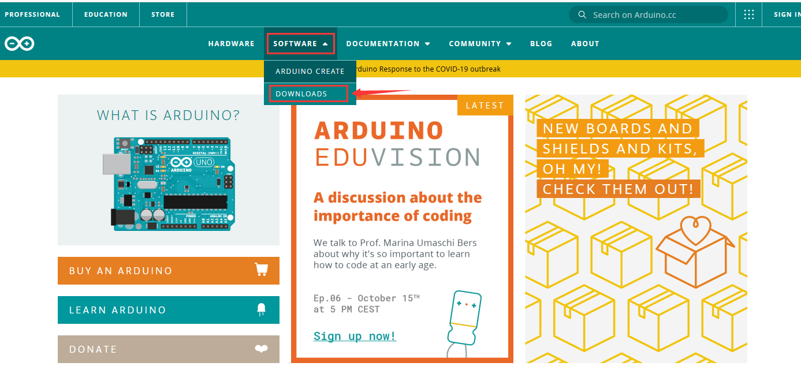

# **Keyestudio PLUS Control Board**
****

## **1.Description**

Doing experiments with electronic products, we often program on the Arduino IDE
development environment with Arduino series microcontrollers.

Keyestudio PLUS control board is fully compatible with Arduino IDE development
environment. It is as same as the Arduino UNO R3 board. Moreover, some
improvements we made highly strengthen its function(as shown below). In order to
wire efficiently, we equip it with a 1m USB cable with type-c interface for you.

****

## **2.Specification**

Microcontroller：ATMEGA328P-AU

USB to serial chip: CP2102

Working voltage: 5V or 3.3V (DIP switch control)

External power: DC 6-15V (recommend 9V)

Digital I / O pins: 14 (D0-D13)

PWM channel: 6 (D3 D5 D6 D9 D10 D11)

Analog input channel (ADC): 8 (A0-A7)

Each I / O Port of DC output capability : 20 mA

Output capability of 3.3V port: 50 mA

Flash Memory: 32 KB (of which 0.5 KB is used by the bootloader)

SRAM: 2 KB (ATMEGA328P-AU)

EEPROM: 1 KB (ATMEGA328P-AU)

Clock speed: 16MHz

On-board LED pin: D13

## **3.Interfaces**

## **4.Specialized Functions of Some Pins:**

Serial communication interface: D0 is RX, D1 is TX

PWM interface (pulse width modulation): D3 D5 D6 D9 D10 D11

External interrupt interface: D2 (interrupt 0) and D3 (interrupt 1)

SPI communication interface: D10 is SS, D11 is MOSI, D12 is MISO, D13 is SCK

IIC communication port: A4 is SDA, A5 is SCL

## **5. Install Arduino IDE and Driver**

**5.1 Download the Arduino IDE**

When getting this control board, we need to install Arduino IDE.

Enter the website
<https://www.arduino.cc/>，clickand

Download the version you want and the latest one is available for downloading
too.

Alternatively, you could select previous release.

In this project, we use 1.8.12 version

Click to view the below page

Click  to download an installer
of Arduino 1.8.12 version，which needs to be installed manually. When you
tap，a zip file of Arduino 1.8.12
version will be directly downloaded, and you only need to unzip it to finish the
installation.

Click icon to download Arduino
IDE.

**5.2 Installing Driver**

Let’s install the driver of keyestudio PLUS control board . The USB-TTL chip on
PLUS board adopts CP2102 serial chip. The driver program of CP2102 is included
in Arduino 1.8 version and above, which is convenient to operate. Plugged in
USB, the computer can recognize the hardware and automatically install the
driver of CP2102.

**Note: If the version of Arduino IDE you download is below 1.8, you need to
download the driver of CP2102.**

**Download the driver of CP2102:**

**https://fs.keyestudio.com/CP2102-WIN**

If install unsuccessfully, or you intend to install manually, open the device
manager of computer. Right click Computer----- Properties----- Device Manager.

There is a yellow exclamation mark on the page, which implies an unsuccessful
installation of the driver of CP2102 . Then please double click the hardware and
update the driver.

Click “OK” to enter the following page, click “browse my computer for updated
driver software”, and find the installed or downloaded ARDUINO software. As
shown below:

There is a DRIVERS folder in Arduino software installed
package（）, open driver folder
and you can see the driver of CP210X series chips.

Open device manager, we will find the yellow exclamation mark disappear. The
driver of CP2102 is installed successfully.

**5.3 Arduino IDE Setting**

Clickicon，open Arduino IDE.

To avoid the errors when uploading the program to the board, you need to select
the correct Arduino board that matches the board connected to your computer.

Then come back to the Arduino software, you should click Tools→Board, to select
the board. (as shown below)

Then select the correct COM port (you can see the corresponding COM port after
the driver is successfully installed)

Before uploading the program to the board, let’s demonstrate the function of
each symbol in the Arduino IDE toolbar.

A- Used to verify whether there is any compiling mistakes or not.

B- Used to upload the sketch to your Arduino board.

C- Used to create shortcut window of a new sketch.

D- Used to directly open an example sketch.

E- Used to save the sketch.

F- Used to send the serial data received from board to the serial monitor.

**5.4 Start First Program**

Open the file to select Example, and choose BLINK from BASIC, as shown below:

Set board and COM port, the corresponding board and COM port are shown on the
lower right of IDE.

Clickto start compiling the
program, check errors.

Clickto upload the program,
upload successfully.

Upload the program successfully, the onboard LED lights on for 1s, lights off
for 1s. Congratulation, you finish the first program.

## 6. MAC System

 6.1 Install Arduino IDE on MAC System

The installation instruction is as same as the chapter 5.1, as shown below:

 6.2 Download the Driver of CP2102

https://fs.keyestudio.com/CP2102-MAC

 6.3 How to Install the Driver of CP2102

The following link is for your reference:

<https://wiki.keyestudio.com/How_to_Install_the_Driver_of_CP2102_on_MAC_System>

 6.4 Arduino IDE Setting

The setting method is as same as that in the chapter 5.3 except from COM port,
as shown below.

**Resource:**

[**https://fs.keyestudio.com/KS0486**](https://fs.keyestudio.com/KS0486)

# 
