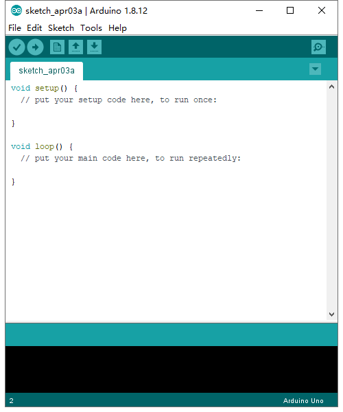

# **Keyestudio V4.0 Development Board**

****

## Description

The processor core of Keyestudio V4.0 development board is ATMEGA328P-PU , fully
compatible with ARDUINO UNO REV3.  
It has 14 digital input/output pins(of which 6 can be used as PWM outputs), 6
analog inputs, a 16 MHz crystal oscillator, a USB connection, a power jack, an
ICSP header, and a reset button.

What’s more, you can burn the firmware for ATMEGA328P-PU through the built-in
ICSP port. The firmware of this chip is burnt well before delivery. Therefore,
you don’t need to burn the firmware.

The power can be supplied through USB wire, DC head and Vin GND pins.

##  **Specification**

Microcontroller: ATMEGA328P-PU

USB to serial chip：CP2102

Operating Voltage: 5V

Input Voltage (recommended):DC 7-12V

Digital I/O Pins: 14 (D0-13)

PWM Digital I/O Pins：6 (D3 D5 D6 D9 D10 D11)

Analog Input Pins: 6(A0-A5)

DC Current per I/O Pin: 20 mA

DC Current for 3.3V Pin: 50 mA

Flash Memory: 32 KB (ATMEGA328P-PU) of which 0.5 KB used by bootloader

SRAM:2 KB (ATMEGA328P-PU)

EEPROM: 1 KB (ATMEGA328P-PU)

Clock Speed:16 MHz

LED_BUILTIN:D13

##  **Pins and Parts Introduction**

| 1  | **ICSP (In-Circuit Serial Programming) Header** | the AVR, an Arduino micro-program header consisting of MOSI, MISO, SCK, RESET, VCC, and GND. It is often called the SPI (serial peripheral interface) and can be considered an "extension" of the output. In fact, slave the output devices to the SPI bus host. When connecting to PC, program the firmware to ATMEGA328P-PU.                                                                                                                                                                                                                                            |
|----|-------------------------------------------------|---------------------------------------------------------------------------------------------------------------------------------------------------------------------------------------------------------------------------------------------------------------------------------------------------------------------------------------------------------------------------------------------------------------------------------------------------------------------------------------------------------------------------------------------------------------------------|
| 2  | **Power LED Indicator**                         | Powering the Arduino, LED on means that your circuit board is correctly powered on. If LED is off, connection is wrong.                                                                                                                                                                                                                                                                                                                                                                                                                                                   |
| 3  | **Digital I/O**                                 | Arduino MEGA has 14 digital input/output pins (of which 6 can be used as PWM outputs).These pins can be configured as digital input pin to read the logic value (0 or 1). Or used as digital output pin to drive different modules like LED, relay, etc. Using [pinMode()](https://www.arduino.cc/reference/en/language/functions/digital-io/pinmode/), [digitalWrite()](https://www.arduino.cc/reference/en/language/functions/digital-io/digitalwrite/), and [digitalRead()](https://www.arduino.cc/reference/en/language/functions/digital-io/digitalread/) functions. |
| 4  | **GND**                                         | GND                                                                                                                                                                                                                                                                                                                                                                                                                                                                                                                                                                       |
| 5  | **AREF**                                        | Reference voltage (0-5V) for analog inputs. Used with [analogReference()](https://www.arduino.cc/reference/en/language/functions/analog-io/analogreference/). Configures the reference voltage used for analog input (i.e. the value used as the top of the input range).                                                                                                                                                                                                                                                                                                 |
| 6  | **SDA**                                         | IIC communication pin                                                                                                                                                                                                                                                                                                                                                                                                                                                                                                                                                     |
| 7  | **SCL**                                         | IIC communication pin                                                                                                                                                                                                                                                                                                                                                                                                                                                                                                                                                     |
| 8  | **RESET Button**                                | You can reset your Arduino board,                                                                                                                                                                                                                                                                                                                                                                                                                                                                                                                                         |
| 9  | **D13 LED**                                     | There is a built-in LED driven by digital pin 13. When the pin is HIGH value, the LED is on, when the pin is LOW, it's off.                                                                                                                                                                                                                                                                                                                                                                                                                                               |
| 10 | **USB Connection**                              | Arduino board can be powered via USB connector. All you needed to do is connecting the USB port to PC using a USB cable.                                                                                                                                                                                                                                                                                                                                                                                                                                                  |
| 11 | **CP2102**                                      | USB serial chip, translate the USB signal of computer into serial signal                                                                                                                                                                                                                                                                                                                                                                                                                                                                                                  |
| 12 | **TX LED**                                      | Onboard you can find the label: TX (transmit) When Arduino board communicates via serial port, send the message, TX led flashes.                                                                                                                                                                                                                                                                                                                                                                                                                                          |
| 13 | **RX LED**                                      | Onboard you can find the label: RX(receive ) When Arduino board communicates via serial port, receive the message, RX led flashes.                                                                                                                                                                                                                                                                                                                                                                                                                                        |
| 14 | **Crystal Oscillator**                          | How does Arduino calculate time? by using a crystal oscillator. The number printed on the top of the Arduino crystal is 16.000H9H. It tells us that the frequency is 16,000,000 Hertz or 16MHz.                                                                                                                                                                                                                                                                                                                                                                           |
| 15 | **Voltage Regulator**                           | To control the voltage provided to the Arduino board, as well as to stabilize the DC voltage used by the processor and other components. Convert an external input DC7-12V voltage into DC 5V, then switch DC 5V to the processor and other components.                                                                                                                                                                                                                                                                                                                   |
| 16 | **DC Power Jack**                               | Arduino board can be supplied with an external power DC7-12V from the DC power jack.                                                                                                                                                                                                                                                                                                                                                                                                                                                                                      |
| 17 | **Microcontroller**                             | Each Arduino board has its own microcontroller. You can regard it as the brain of your board. The main IC (integrated circuit) on the Arduino is slightly different from the panel pair. Microcontrollers are usually from ATMEL. Before you load a new program on the Arduino IDE, you must know what IC is on your board. This information can be checked at the top of IC.                                                                                                                                                                                             |
| 18 | **IOREF**                                       | This pin on the board provides the voltage reference with which the microcontroller operates. A properly configured shield can read the IOREF pin voltage and select the appropriate power source or enable voltage translators on the outputs for working with the 5V or 3.3V.                                                                                                                                                                                                                                                                                           |
| 19 | **RESET Header**                                | Connect an external button to reset the board. The function is the same as reset button.                                                                                                                                                                                                                                                                                                                                                                                                                                                                                  |
| 20 | **Power Pin 3V3**                               | A 3.3 volt supply generated by the on-board regulator. Maximum current draw is 50 mA.                                                                                                                                                                                                                                                                                                                                                                                                                                                                                     |
| 21 | **Power Pin 5V**                                | Provides 5V output voltage                                                                                                                                                                                                                                                                                                                                                                                                                                                                                                                                                |
| 22 | **Vin**                                         | You can supply an external power input DC7-12V through this pin to Arduino board.                                                                                                                                                                                                                                                                                                                                                                                                                                                                                         |
| 23 | **Analog Pins**                                 | Onboard has 6 analog inputs, labeled A0 to A5.                                                                                                                                                                                                                                                                                                                                                                                                                                                                                                                            |

## **4. Specialized Functions of Some Pins:**

**Serial Communication:** D0 (RX) and D1 (TX)

**PWM Pins (Pulse-Width Modulation):** D3 D5 D6 D9 D10 D11

**External Interrupts:** D2 (interrupt 0), D3 (interrupt 1)

**SPI communication:** D10 (SS), D13 (SCK), D11 (MOSI), D12 (MISO).

These pins support SPI communication using the[SPI
library](https://www.arduino.cc/en/Reference/SPI). The SPI pins are also broken
out on the ICSP header, which is physically compatible with the Arduino Uno.

**IIC communication: A**4 (SDA); A5 (SCL).

## **5. Windows System**

**5.1 Download the Arduino IDE**

When getting this control board, we need to install Arduino IDE

Enter the website <https://www.arduino.cc/>，and
click\>

You can select the latest version-----1.8.13. Alternatively, the previous
release is your another choice.

In this project, we use 1.8.12 version

Click to view the below page

The **Windows installer** needs installing manually. Yet , the **Windows zip
file for non admin install**，a zip file of Arduino 1.8.12 version, can be
directly downloaded and installed.

Click icon to download Arduino
IDE.

**5.2 Installing Driver**

Let’s install the driver of Keyestudio V4.0 development board. The USB-TTL chip
on V4.0 development board adopts CP2102 serial chip.

Its driver files are included in the Arduino 1.8 version and above. Therefore,
when the board is attached to the computer, the computer can recognize the
driver of CP2102 automatically.

**Note: If the version of Arduino IDE you download is below 1.8, you need to
download the driver of CP2102.**

**Download the driver of CP2102:**

**https://fs.keyestudio.com/CP2102-WIN**

If it is installed unsuccessfully, you need to install it manually.

Click Computer----- Properties----- Device Manager, as shown below:

There is a yellow exclamation mark on the page, which implies the installation
of the driver of CP2102 has failed.

Click “OK” to enter the following page and click “browse my computer for updated
driver software”.

Click “Browse”, then search the driver of CP2102 and click “Next”,

There is a DRIVERS folder in Arduino software installed
package（）, open driver folder
and check the driver of CP210X series chips.

When opening the device manager, we will find the yellow exclamation mark
disappear. The driver of CP2102 is installed successfully.

**5.3Arduino IDE Setting**

Clickicon，open Arduino IDE.

When downloading the sketch to the board, you must select the correct name of
Arduino board that matches the board connected to your computer. As shown below;

Then select the correct COM port (you can see the corresponding COM port after
the driver is successfully installed)

A- Used to verify whether there is any compiling mistakes or not.  
B- Used to upload the sketch to your Arduino board.  
C- Used to create shortcut window of a new sketch.  
D- Used to directly open an example sketch.  
E- Used to save the sketch.  
F- Used to send the serial data received from board to the serial monitor.

**5.4 Start first program**

Open the file to select **Example**, and click **BASIC**\>**BLINK**, as shown
below:

Set board and COM port, the corresponding board and COM port are shown on the
lower right of IDE.

Clickto start compiling the
program, check errors.

Clickto upload the program.

After the code is uploaded, the onboard LED will blink. Congratulation, you have
finished the first program.

## **6.MAC System**
6.1 Install Arduino IDE on MAC System

The installation instruction is as same as the chapter 5.1, as shown below:

 6.2 Download the Driver of CP2102

https://fs.keyestudio.com/CP2102-MAC

 6.3 How to Install the Driver of CP2102

The following link is for your reference:

<https://wiki.keyestudio.com/How_to_Install_the_Driver_of_CP2102_on_MAC_System>

 6.4 Arduino IDE Setting

The setting method is as same as the chapter 5.3 except from COM port, as shown
below.

## Resources:

<https://fs.keyestudio.com/KS0497>
