 # **KS0498 Keyestudio MEGA 2560 development board**

**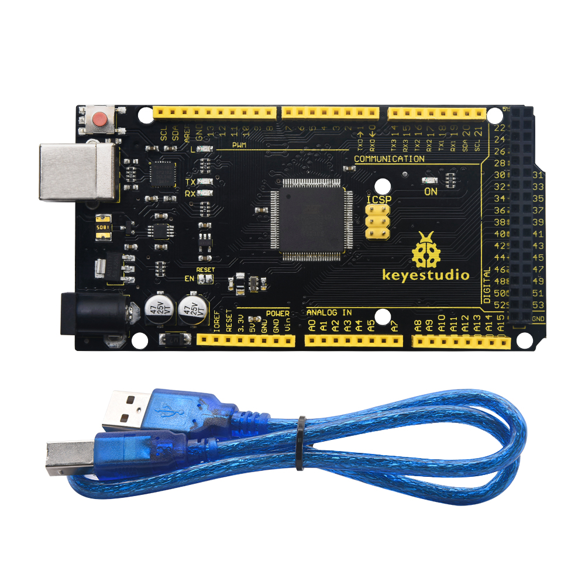**

 **1. Description**

The processor core of Keyestudio MEGA R3 development board is the
[ATMEGA2560-16AU](http://ww1.microchip.com/downloads/en/DeviceDoc/Atmel-2549-8-bit-AVR-Microcontroller-ATmega640-1280-1281-2560-2561_datasheet.pdf)
, fully compatible with ARDUINO MEGA R3.  
It has 54 digital input/output pins (of which 15 can be used as PWM outputs), 16
analog inputs, 4 UARTs (hardware serial ports), a 16 MHz crystal oscillator, a
USB connection, a power jack, 1 ICSP header, and a reset button.   
What’s more, you can burn the firmware for ATMEGA2560-16AU through the built-in
ICSP port. The firmware of this chip is burnt well before delivery. Therefore,
you don’t need to burn the firmware.

The power can be supplied through USB wire, DC head and Vin GND pins.

 **2.Specification**

Microcontroller: ATMEGA2560-16AU

USB serial chip：CP2102

Operating Voltage: 5V

Input Voltage (recommended):DC 7-12V

Digital I/O Pins: 54 (D0-D53)

PWM Digital I/O Pins：15(D2-D13 D44-D46)

Analog Input Pins: 16(A0-A15)

DC Current per I/O Pin: 20 mA

DC Current for 3.3V Pin: 50 mA

Flash Memory: 256 KB of which 8 KB used by bootloader

SRAM: 8 KB

EEPROM: 4 KB

Clock Speed: 16 MHz

LED_BUILTIN:D13

 **3.Pins and Parts Introduction:**

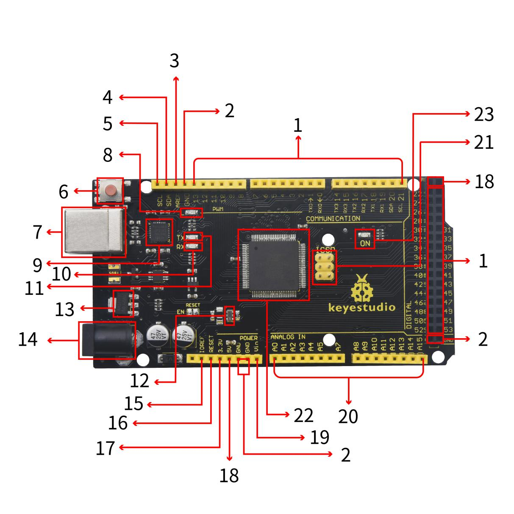

| 1  | **Digital I/O**                                 | Arduino MEGA has 54 digital input/output pins (of which 15 can be used as PWM outputs). These pins can be configured as digital input pin to read the logic value (0 or 1). Or used as digital output pin to drive different modules like LED, relay, etc. Using [pinMode()](https://www.arduino.cc/reference/en/language/functions/digital-io/pinmode/), [digitalWrite()](https://www.arduino.cc/reference/en/language/functions/digital-io/digitalwrite/), and [digitalRead()](https://www.arduino.cc/reference/en/language/functions/digital-io/digitalread/) functions. |
|----|-------------------------------------------------|-----------------------------------------------------------------------------------------------------------------------------------------------------------------------------------------------------------------------------------------------------------------------------------------------------------------------------------------------------------------------------------------------------------------------------------------------------------------------------------------------------------------------------------------------------------------------------|
| 2  | **GND**                                         | GND                                                                                                                                                                                                                                                                                                                                                                                                                                                                                                                                                                         |
| 3  | **AREF**                                        | Reference voltage (0-5V) for analog inputs. Used with [analogReference()](https://www.arduino.cc/reference/en/language/functions/analog-io/analogreference/). Configures the reference voltage used for analog input (i.e. the value used as the top of the input range).                                                                                                                                                                                                                                                                                                   |
| 4  | **SDA**                                         | IIC communication pin                                                                                                                                                                                                                                                                                                                                                                                                                                                                                                                                                       |
| 5  | **SCL**                                         | IIC communication pin                                                                                                                                                                                                                                                                                                                                                                                                                                                                                                                                                       |
| 6  | **RESET Button**                                | You can reset your Arduino board,                                                                                                                                                                                                                                                                                                                                                                                                                                                                                                                                           |
| 7  | **USB Connection**                              | Arduino board can be powered via USB connector. All you needed to do is connecting the USB port to PC using a USB cable.                                                                                                                                                                                                                                                                                                                                                                                                                                                    |
| 8  | **D13 LED**                                     | There is a built-in LED driven by digital pin 13. When the pin is HIGH value, the LED is on, when the pin is LOW, it's off.                                                                                                                                                                                                                                                                                                                                                                                                                                                 |
| 9  | **CP2102**                                      | USB serial chip, translate the USB signal of computer into serial signal                                                                                                                                                                                                                                                                                                                                                                                                                                                                                                    |
| 10 | **TX LED**                                      | Onboard you can find the label: TX (transmit) When Arduino board communicates via serial port, send the message, TX led flashes.                                                                                                                                                                                                                                                                                                                                                                                                                                            |
| 11 | **RX LED**                                      | Onboard you can find the label: RX(receive ) When Arduino board communicates via serial port, receive the message, RX led flashes.                                                                                                                                                                                                                                                                                                                                                                                                                                          |
| 12 | **Crystal Oscillator**                          | How does Arduino calculate time? by using a crystal oscillator. The number printed on the top of the Arduino crystal is 16.000H9H. It tells us that the frequency is 16,000,000 Hertz or 16MHz.                                                                                                                                                                                                                                                                                                                                                                             |
| 13 | **Voltage Regulator**                           | To control the voltage provided to the Arduino board, as well as to stabilize the DC voltage used by the processor and other components. Convert an external input DC7-12V voltage into DC 5V, then switch DC 5V to the processor and other components.                                                                                                                                                                                                                                                                                                                     |
| 14 | **DC Power Jack**                               |  Arduino board can be supplied with an external power DC7-12V from the DC power jack.                                                                                                                                                                                                                                                                                                                                                                                                                                                                                       |
| 15 | **IOREF**                                       | This pin on the board provides the voltage reference with which the microcontroller operates. A properly configured shield can read the IOREF pin voltage and select the appropriate power source or enable voltage translators on the outputs for working with the 5V or 3.3V.                                                                                                                                                                                                                                                                                             |
| 16 | **RESET Header**                                | Connect an external button to reset the board. The function is the same as reset button.                                                                                                                                                                                                                                                                                                                                                                                                                                                                                    |
| 17 | **Power Pin 3V3**                               | A 3.3 volt supply generated by the on-board regulator. Maximum current draw is 50 mA.                                                                                                                                                                                                                                                                                                                                                                                                                                                                                       |
| 18 | **Power Pin 5V**                                | Provides 5V output voltage                                                                                                                                                                                                                                                                                                                                                                                                                                                                                                                                                  |
| 19 | **Vin**                                         | You can supply an external power input DC7-12V through this pin to Arduino board.                                                                                                                                                                                                                                                                                                                                                                                                                                                                                           |
| 20 | **Analog Pins**                                 | Onboard has 16 analog inputs, labeled A0 to A15.                                                                                                                                                                                                                                                                                                                                                                                                                                                                                                                            |
| 21 | **ICSP (In-Circuit Serial Programming) Header** | the AVR, an Arduino micro-program header consisting of MOSI, MISO, SCK, RESET, VCC, and GND. It is often called the SPI (serial peripheral interface) and can be considered an "extension" of the output. In fact, slave the output devices to the SPI bus host. When connecting to PC, program the firmware to ATMEGA2560-16AU.                                                                                                                                                                                                                                            |
| 22 | **Microcontroller**                             | Each Arduino board has its own microcontroller. You can regard it as the brain of your board. The main IC (integrated circuit) on the Arduino is slightly different from the panel pair. Microcontrollers are usually from ATMEL. Before you load a new program on the Arduino IDE, you must know what IC is on your board. This information can be checked at the top of IC.                                                                                                                                                                                               |
| 23 | **Power LED Indicator**                         | Powering the Arduino, LED on means that your circuit board is correctly powered on. If LED is off, connection is wrong.                                                                                                                                                                                                                                                                                                                                                                                                                                                     |

 **4.Specialized Functions of Some Pins:**

-   **Serial Communication:** D0 (RX0) and D1 (TX1); Serial 1: D19 (RX1) and D18
    (TX1); Serial 2: D17 (RX2) and D16 (TX2); Serial 3: D15 (RX3) and D14 (TX3).

    Used to receive (RX) and transmit (TX) TTL serial data. Pins 0 and 1 are
    also connected to the corresponding pins of the CP2102 USB-to-TTL Serial
    chip.

-   **PWM Pins (Pulse-Width Modulation):** D2 to D13, and D44 to D46.

Provide 8-bit PWM output with the analogWrite() function.

-   **External Interrupts:** D2 (interrupt 0), D3 (interrupt 1), D18 (interrupt
    5), D19 (interrupt 4), D20 (interrupt 3), and D21 (interrupt 2).

    These pins can be configured to trigger an interrupt on a low level, a
    rising or falling edge, or a change in level. See the attachInterrupt()
    function for details.

-   **SPI communication:** D53 (SS), D52 (SCK), D51 (MOSI), D50 (MISO).

    These pins support SPI communication using the[SPI
    library](https://www.arduino.cc/en/Reference/SPI). The SPI pins are also
    broken out on the ICSP header, which is physically compatible with the
    Arduino Uno.

-   **IIC communication:** D20 (SDA); D21 (SCL). Support TWI communication using
    the [Wire library](https://www.arduino.cc/en/Reference/Wire).

**4. Windows System**

 4.1 Download Arduino IDE

When getting this control board, we need to install Arduino IDE

Enter the website <https://www.arduino.cc/>，and
click\>

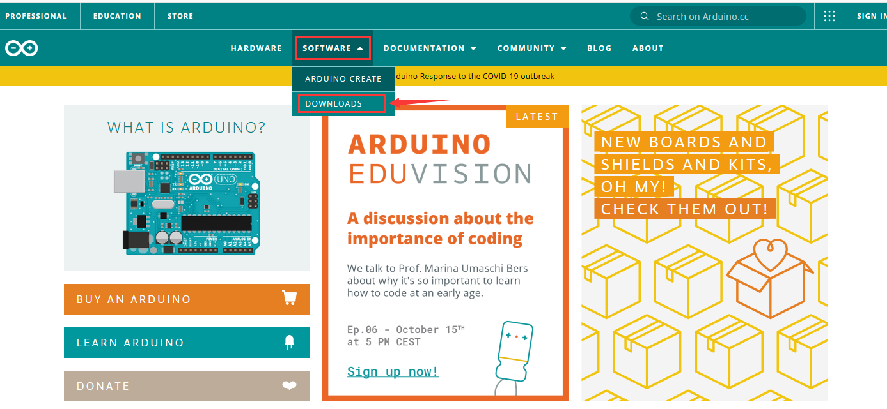

You can select the latest version-----1.8.13. Alternatively, the previous
release is your another choice.

In this project, we use 1.8.12 version

Click to view the below page

The **Windows installer** needs installing manually. Yet , the **Windows zip
file for non admin install**，a zip file of Arduino 1.8.12 version, can be
directly downloaded and installed.

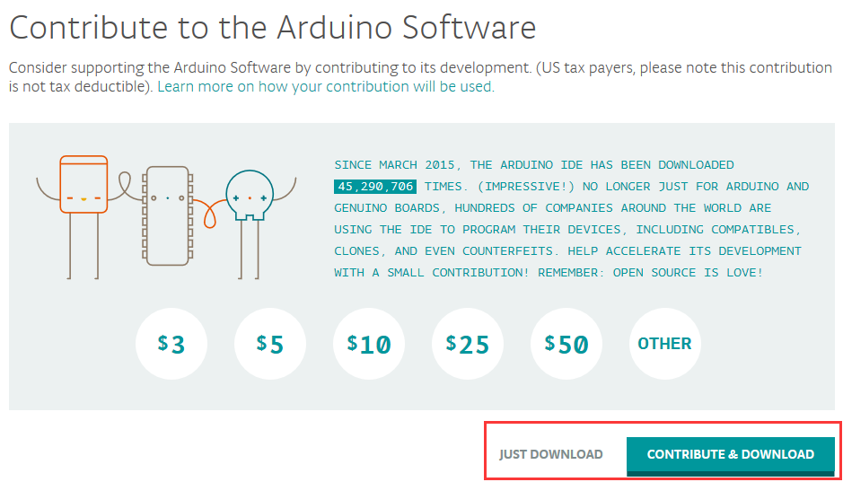

Click icon to download Arduino
IDE.

**4.2 Installing Driver**

Let’s install the driver of MEGA R3 Development Board. The USB-TTL chip of 2560
R3 board adopts CP2102 serial chip.

Its driver files are included in the Arduino 1.8 version and above.

When the board is attached to the computer, the computer can recognize the
driver of CP2102 automatically.

**Note: If the version of Arduino IDE you download is below 1.8, you need to
download the driver of CP2102.**

**Download the driver of CP2102:**

**https://fs.keyestudio.com/CP2102-WIN**

If it is installed unsuccessfully, you need to install it manually.

Click Computer----- Properties----- Device Manager, as shown below:

There is a yellow exclamation mark on the page, which implies the failed
installation of the driver of CP2102.

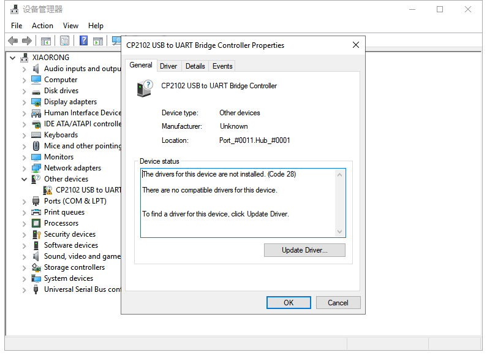

Click “OK” to enter the following page and click “browse my computer for updated
driver software”.

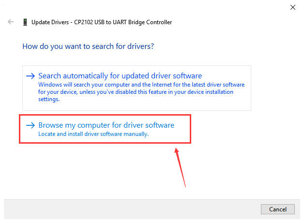

Click “Browse”, then search the driver of CP2102 and click “Next”,

There is a DRIVERS folder in Arduino software installed
package（）. Open driver folder
and check the driver of CP210X series chips.

When opening the device manager, we will find the yellow exclamation mark
disappear. The driver of CP2102 is installed successfully.

**4.3 Arduino IDE Setting**

Clickicon t open Arduino IDE.

When downloading the sketch to the board, you must select the correct name of
Arduino board that matches the board connected to your computer. As shown below;

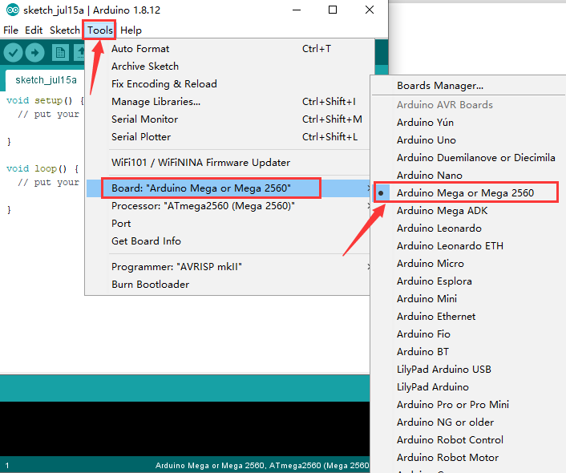

Then select the correct COM port (you can see the corresponding COM port after
the driver is successfully installed)

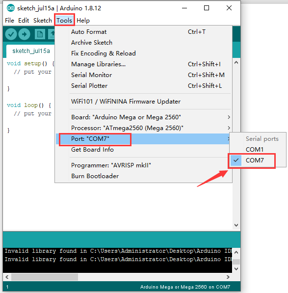

A- Used to verify whether there is any compiling mistakes or not.  
B- Used to upload the sketch to your Arduino board.  
C- Used to create shortcut window of a new sketch.  
D- Used to directly open an example sketch.  
E- Used to save the sketch.  
F- Used to send the serial data received from board to the serial monitor.

**4.4 Start a Program**

Open the file to select **Example**, and click **BASIC**\>**BLINK**, as shown
below:

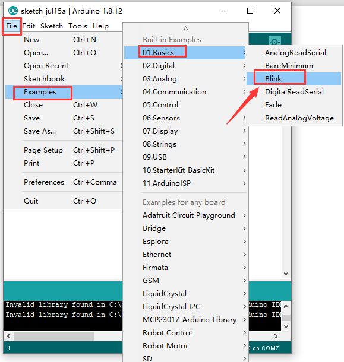

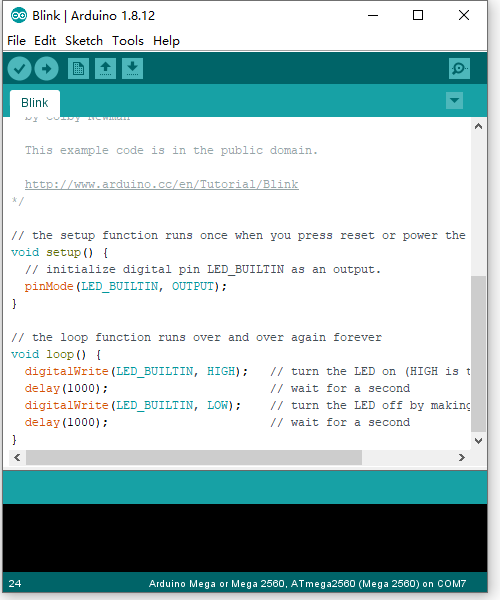

Set board and COM port, the corresponding board and COM port are shown on the
lower right of IDE.

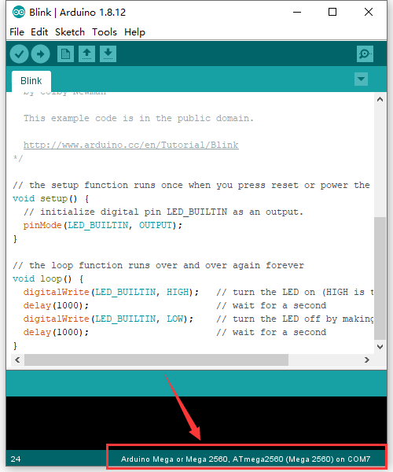

Clickto start compiling the
program, and check errors.

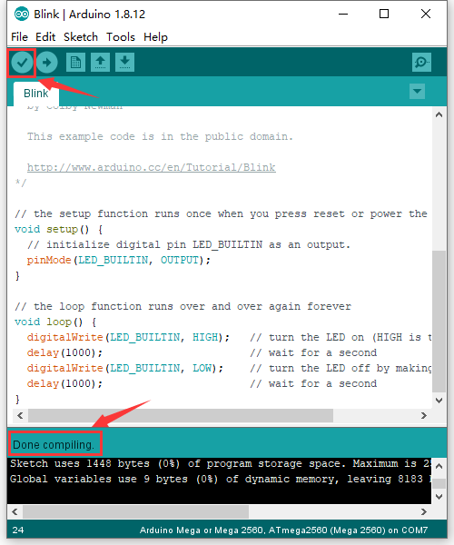

Clickto upload the program

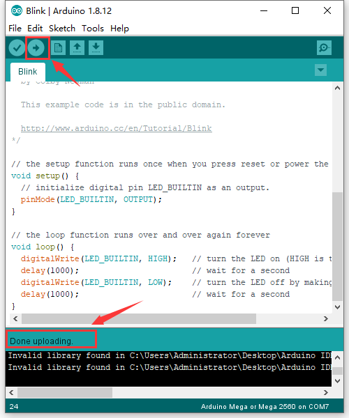

After the code is uploaded, the onboard LED will blink.

 MAC System

 5.1 Install Arduino IDE on MAC System

The installation instruction is as same as that in the chapter 4.1, as shown
below:

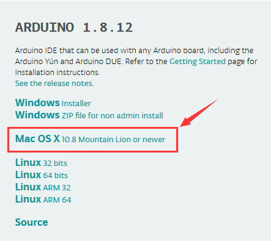

 5.2 Download the Driver of CP2102

https://fs.keyestudio.com/CP2102-MAC

 5.3 How to Install the Driver of CP2102

<https://wiki.keyestudio.com/How_to_Install_the_Driver_of_CP2102_on_MAC_System>

 5.4 Arduino IDE Setting

The setting method is as same as the chapter 4.3 except from COM port, as shown
below.

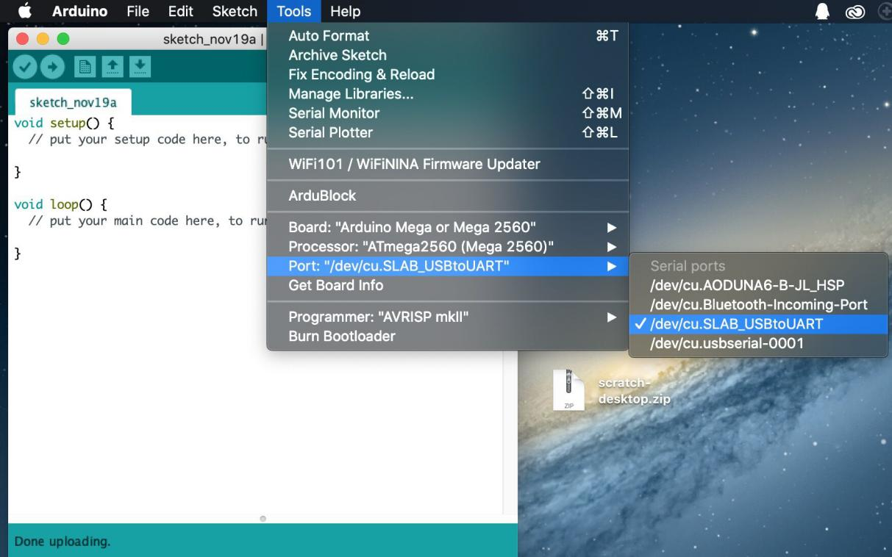

 Resources

<https://fs.keyestudio.com/KS0498>

 
