**KS0499 Keyestudio Mega Plus development board**

1.  **Description**

KEYESTUIDO Mega plus Board, whose processor core is ATMEGA2560-16AU, is fully
compatible with ARDUINO Mega REV3.

USB to TTL chip adopts more economic and stable CP2012.

This plus board consists of 54-channel digital input and output ports, of which
15 pins are served as PWM output, 16 analog inputs, 4 serial communication
ports, one 16MHz crystal oscillator, 1 USB port, 1 power socket, 1 ICSP
interface and 1 reset button.

1.  **Specification**

-   Microcontroller: ATMEGA2560-16AU

-   USB to TTL chip：CP2102

-   Operating Voltage: 5V

-   Input Voltage (recommended):DC 7-12V

-   Digital I/O Pins: 54 (D0-D53)

-   PWM Digital I/O Pins：15(D2-D13 D44-D46)

-   Analog Input Pins: 16(A0-A15)

-   DC Current per I/O Pin: 20 mA

-   DC Current for 3.3V Pin: 50 mA

-   Flash Memory: 256 KB of which 8 KB used by bootloader

-   SRAM: 8 KB

-   EEPROM: 4 KB

-   Clock Speed: 16 MHz

-   LED_BUILTIN:D13

 Interfaces Description

 Special Interfaces Description

Serial communication interface(4 channel): Serial（D0 =RX0, D1 =TX0）,
Serial1（D19 is RX1, D18 is TX1)

Serial2 （D17 is RX2, D16 equals to TX2）, Serial3（D15 is RX3, D14 is TX3), D0
and D1 are connected to ATMEGA16U2-MU

PWM port（Pulse width modulation): D2-D13 and D44-D46

External interrupt pins：D2（interrupt 0), D3(interrupt 1), D21（interrupt 2),
D20 (interrupt 3), D19(interrupt 4）and D18（interrupt 5）

SPI communication interface：D53 stands for SS, D51 is MOSI, D50 is MISO, D52
equals to SCK

IIC communication interface：D20 represents SDA, D21 is SCL

 Install Arduino IDE and Driver

 5.1 Installing Arduino IDE

We firstly navigate the ARDUINO official website: <https://www.arduino.cc/>,
click “SOFTWARE”----”DOWNLOADS”, we’ll see the following page.

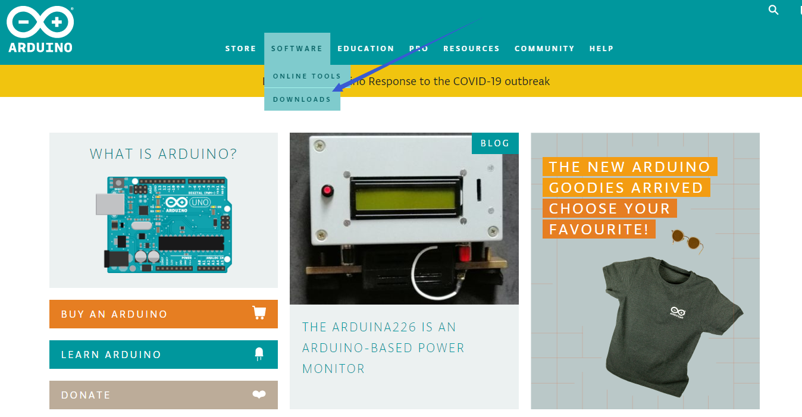

There are many versions for Arduino software but you only need to download the
version suitable for your system. Here, we take WINDOWS system as an example to
introduce how to download and install Arduino IDE.

 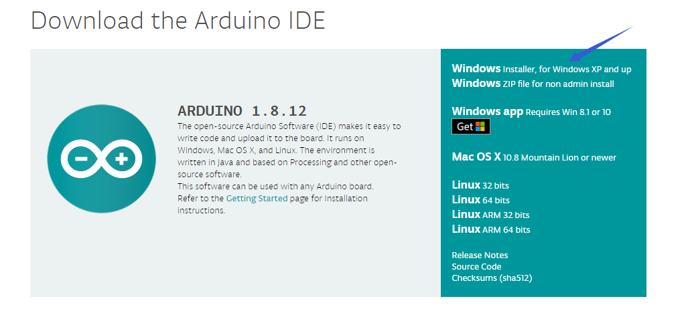

There are two versions for your choice, one is an installer which can be
directly downloaded in computer and the other is zip file which requires you to
unzip and install it.

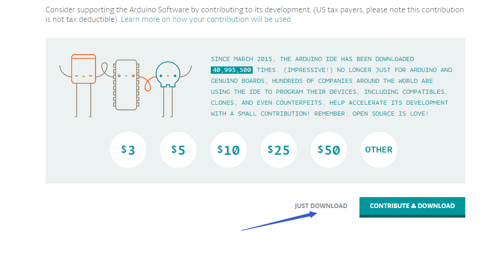

Just click“JUST DOWNLOAD”.

 5.2 Installing Driver

The downloading process is finished. Now, let’s install the driver of KEYESTUDIO
PLUS control board. Its chip is CP2102 serial chip. In general, the driver of
CP2102 serial chip is included in ARDUINO version 1.8 and above. The driver will
be recognized and installed as long as you connect board to computer with USB.

Some system can’t install automatically driver but you could install it by hand.
Open the device manager of computer and you will see a yellow exclamation mark
which means the driver of CP2102 isn’t installed successfully.

Double-click the“Cp2102 USB to UART Bridge Controller”and a window pops up,
click“update driver”, as shown below:

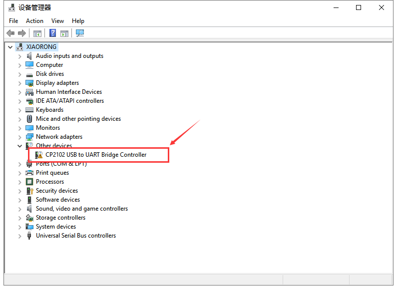

Click“Browse my computer for driver software” to find out the ARDUINO software
to be installed.

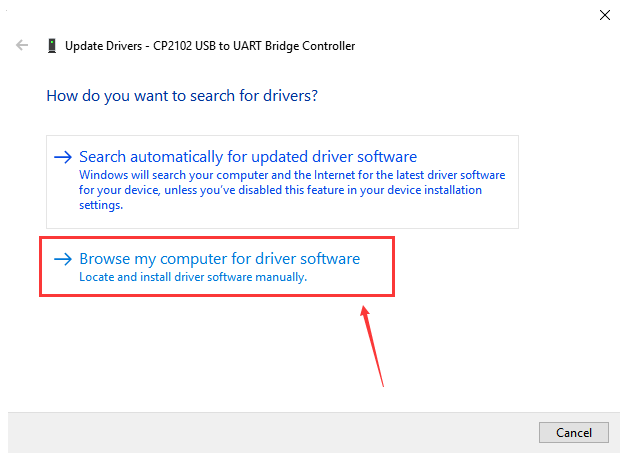

There is a **DRIVERS** folder inside, enter it and the driver of CP210X series
chip is shown.

Choose the folder to be installed, click“Next”, the driver of CP2010 is
installed successfully.

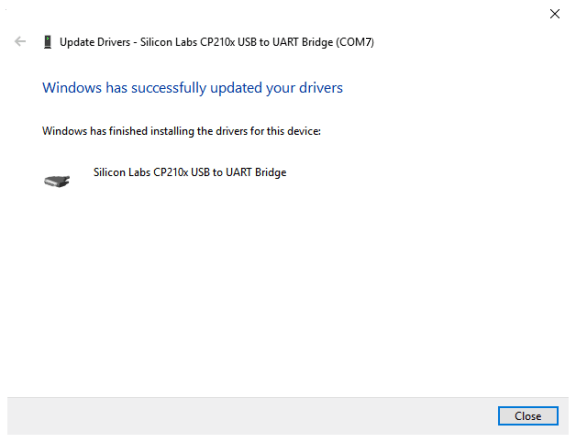

Up to now. Then you can right click“Computer”—\>“Properties”

—\>“Device manager”, you will see the device as the figure shown below.

The driver is installed successfully and the yellow exclamation mark is gone.

 5.3 Arduino IDE Setting

Clickicon and open Arduino IDE.

To avoid the errors when uploading the program to the board, you need to select
the correct Arduino board that matches the board connected to your computer.

Then come back to the Arduino software, you should click Tools→Board, select the
board. (as shown below)

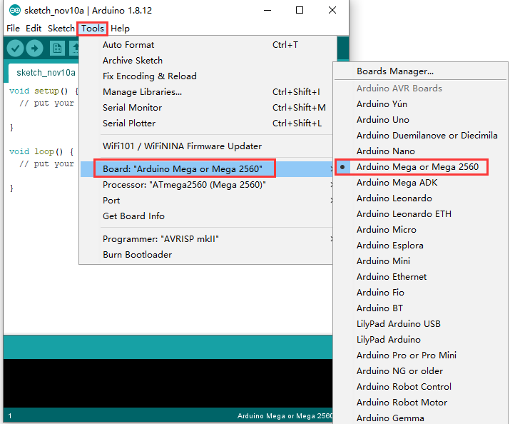

Then select the correct COM port (you can see the corresponding COM port after
the driver is successfully installed)

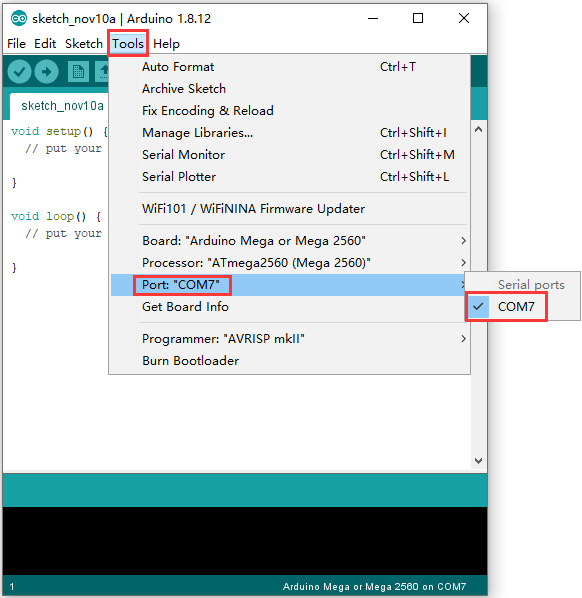

Before uploading the program to the board, let’s demonstrate the function of
each symbol in the Arduino IDE toolbar.

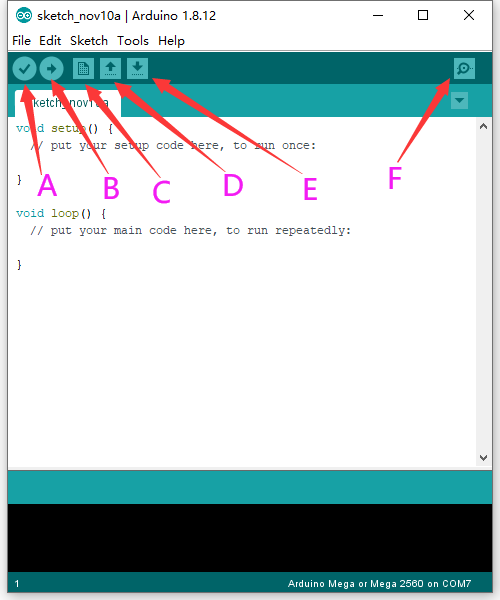

1.  Used to verify whether there is any compiling mistakes or not.  
    B- Used to upload the sketch to your Arduino board.  
    C- Used to create shortcut window of a new sketch.  
    D- Used to directly open an example sketch.  
    E- Used to save the sketch.  
    F- Used to send the serial data received from board to the serial monitor.

 5.4 Start Your First Program

Open file to choose Examples—\>BASIC—\>BLINK

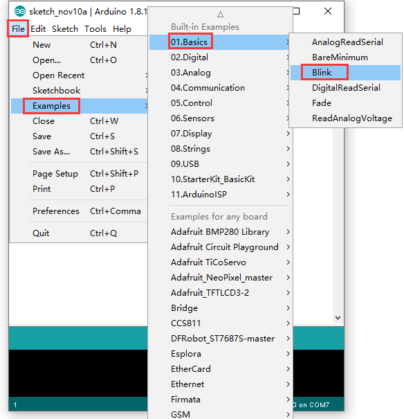

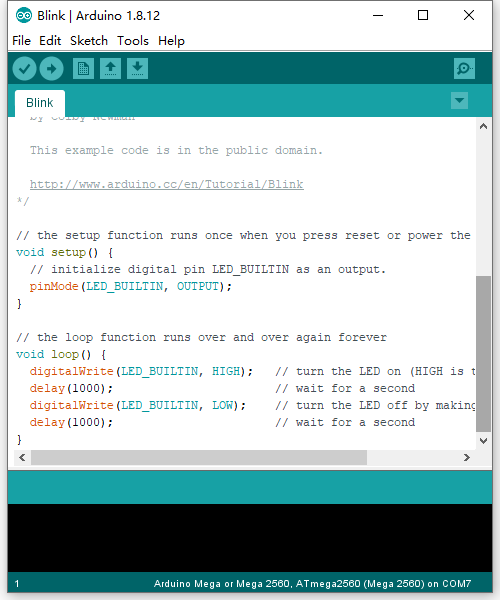

Set board and COM port, the bottom right corner of the IDE displays the
corresponding board and COM port.

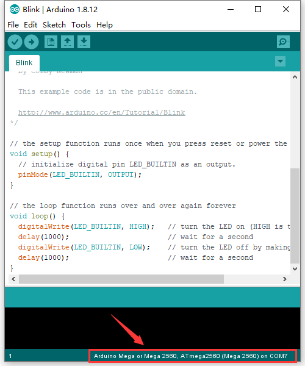

Clickicon to start compiling the
program, and check errors.

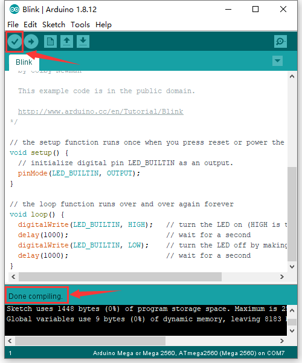

Clickicon to start upload the
program, upload successfully.

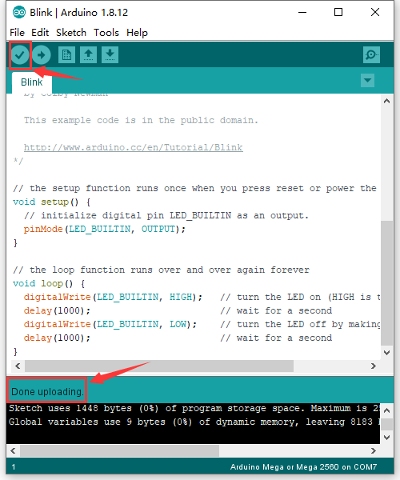

The program is uploaded successfully, LED of board lights on for 1s, and lights
off for 1s.
