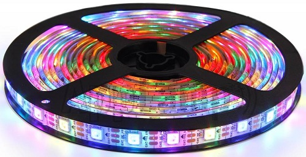

**Keyestudio Max Development Board**

**1.Introduction:**

Keyestudio Max development board is an Arduino uno-compatible board, which
isbased on ATmega328P MCU, and with a cp2102 Chip as a UART-to-USB converter.MAX
development board integrates three LEDs, two 6812RGB LEDs, two button switches,
a buzzer, a microphone sensor, a light sensor, and an 8\*16 dot matrix.

Using the onboard hardware, you can start 20 project courses. If you are a
beginner, a MAX board is enough!

MAX can also be connected to all arduino sensors and modules, and it is also
compatible with all Arduino shield boards.

Now, use MAX to enter the magical world of ARDUINO!

**2.Max development board Pinout**

Max has 14 digital input/output pins (of which 6 can be used as PWM outputs), 6
analog inputs, a 16 MHz quartz crystal, a USB connection, a power jack, 2 ICSP
headers and a reset button.

It contains everything needed to support the microcontroller; simply connect it
to a computer with a USB cable or power it via an external DC power jack (DC
7-12V) or via female headers Vin/ GND(DC 7-12V) to get started.

|  Microcontroller            | ATmega328P-PU                                            |
|-----------------------------|----------------------------------------------------------|
| Operating Voltage           | 5V                                                       |
| Input Voltage (recommended) | DC7-12V                                                  |
| Digital I/O Pins            | 14 (D0-D13)  (of which 6 provide PWM output)             |
| PWM Digital I/O Pins        | 6 (D3, D5, D6, D9, D10, D11)                             |
| Analog Input Pins           | 6 (A0-A5)                                                |
| DC Current per I/O Pin      | 20 mA                                                    |
| DC Current for 3.3V Pin     | 50 mA                                                    |
| Flash Memory                | 32 KB (ATmega328P-PU) of which 0.5 KB used by bootloader |
| SRAM                        | 2 KB (ATmega328P-PU)                                     |
| EEPROM                      | 1 KB (ATmega328P-PU)                                     |
| Clock Speed                 | 16 MHz                                                   |
| LED_BUILTIN                 | D13                                                      |

**3.Max development board onboard interface**

red LED: D8

yellow LED: D10

green LED: D13

6812 RGB LED: D4

two button switches: D2, D3

buzzer: D9

microphone sensor: A7

light sensor: A6

8\*16 dot matrix：A4,A5 (I2C interface)

4-digit DIP switch: on right, D2, D3, A4, A5, these onboard components interface
is connected. on left, these interface is disconnected,

They are connected to the corresponding interface on the max board pin header.

**4. Install Arduino software and Driver**

**（1）Installing Arduino IDE**

When we get max control board, we need to download Arduino IDE and driver
firstly.You could download Arduino IDE from the official website:

<https://www.arduino.cc/>, click the **SOFTWARE** on the browse bar, click
“DOWNLOADS” to enter download page, as shown below:

There are various versions Of IDE for Arduino, just download a version that
compatible with your system, here we will show you how to download and install
the windows version Arduino IDE.

There are two versions of IDE for WINDOWS system. You can choose between the
Installer (.exe) and the Zip packages. We suggest you use the first one that
installs directly everything you need to use the Arduino Software (IDE),
including the drivers. With the Zip package you need to install the drivers
manually. The Zip file is also useful if you want to create a portable
installation.

You just need to click JUST DOWNLOAD.

**(2) Installing Max board Driver**

Let’s install the driver of Keyestudio Max board. The USB-TTL chip on Max board
adopts CP2102 serial chip. The driver program of this chip is included in
Arduino 1.8 version and above, which is convenient.

When you attach USB port to computer, the driver of CP2102 can be installed.

If the driver is installed unsuccessfully, you need to install it manually.

Open the device manager of computer. Right click Computer----- Properties-----
Device Manager.

There is a yellow exclamation mark on the page, which implies the failure
installation of the driver of CP2102.

Operate as follows；

Click “OK” to enter the following page and click “browse my computer for updated
driver software”.

Click “Browse”, then search the driver of CP2102 and click “Next”,

There is a DRIVERS folder in Arduino software installed
package（）, open driver folder
and check the driver of CP210X series chips.

**（3）Arduino IDE Setting**

Clickicon，and open Arduino IDE.

When downloading the sketch to the board, you must select the correct name of
Arduino board that matches the board connected to your computer. As shown below;

Then select the correct COM port (you can see the corresponding COM port after
the driver is successfully installed)

A- Used to verify whether there is any compiling mistakes or not.  
B- Used to upload the sketch to your Arduino board.  
C- Used to create shortcut window of a new sketch.  
D- Used to directly open an example sketch.  
E- Used to save the sketch.  
F- Used to send the serial data received from board to the serial monitor.

**（4）Start First Program**

Open the file to select Example, choose BLINK from BASIC, as shown below:

Set board and COM port, the corresponding board and COM port are shown on the
lower right of IDE.

Clickto start compiling the
program, and check errors.

Clickto upload the program

Upload the program successfully, the onboard LED lights on for 1s, lights off
for 1s. Congratulation, you finish the first program.

**5. Max development board Project**

**Project 1 : Hello world**

  **Project instruction:**

As the beginning of all programming languages, Hello world occupies an
unchangeable position, so the first project of our Arduino tutorial starts with
hello world.

The "Hello, world" program refers to a computer program that outputs the string
"Hello, world" on the computer screen.

In this project, the computer is the Max control board and the screen is the
serial monitor. This project only needs one development board and one USB cable.

1.  **Tips:**

After connecting the Max development board, open the Arduino IDE and ensure two
points:

1\. Select the correct development board version in Tools\>Board (Max development
board is compatible with Arduino UNO, so choose Arduino UNO for the board model
in the software)

2\. In Tools\>Port, select the serial port where the Max development board is
located.

1.  **Project code:**

/\*

keyestudio Max Development Board

Project 1

hello world

http://www.keyestudio.com

\*/

int val;//define variable val

void setup()

{

Serial.begin(9600);//Set the baud rate to 9600, which must be consistent with
the software settings.

}

void loop()

{

val=Serial.read();//Read the instructions or characters sent by the PC to the
Arduino and assign them to val

if(val=='h')//Judging whether the received command or character is "h".

{//If the received is "h"

Serial.println("Hello World!");//Display "Hello World!"

}}

//\*\*\*\*\*\*\*\*\*\*\*\*\*\*\*\*\*\*\*\*\*\*\*\*\*\*\*\*\*\*\*\*\*\*\*\*\*\*\*\*\*\*\*\*\*\*\*\*\*\*\*\*\*\*\*\*\*

1.  **Project results**

Open the Arduino IDE, copy and paste the code in the IDE, click Verify to
compile, and check the program for errors. At this time, the code has not been
uploaded to the Max board.

Click upload, you can see the TX and RX LEDs on the Max board flash a few times,
and the IDE prompts Done uploading.

Upload the code to the development board, when enter "h" in the Serial Monitor,
it will display "Hello, world!".

**Project 2: LED blink**

1.  **Project instruction**

The next step is to start a very classic project-blink.This project is to light
up an LED and control the delay time.It is an entry-level project for Arduino
beginners.

In this example, the LED we use is an LED onboard MAX,As shown in the picture
below, it is directly connected to the D13 pin.

1.  **Project Principle：**

LED is a type of semiconductor called "Light Emitting Diode "which is an
electronic device made of semiconductor materials (silicon, selenium, germanium,
etc.). It is dubbed indicator, digital and word display in circuit and device.

1.  **Project circuit：**

1.  **Project code：**

/\*

keyestudio Max Development Board

Project 2

Blink

http://www.keyestudio.com

\*/

// the setup function runs once when you press reset or power the board

void setup() {

// initialize digital pin 13 as an output.

pinMode(13, OUTPUT);

}

// the loop function runs over and over again forever

void loop() {

digitalWrite(13, HIGH); // turn the LED on (HIGH is the voltage level)

delay(1000); // wait for a second

digitalWrite(13, LOW); // turn the LED off by making the voltage LOW

delay(1000); // wait for a second

}//\*\*\*\*\*\*\*\*\*\*\*\*\*\*\*\*\*\*\*\*\*\*\*\*\*\*\*\*\*\*\*\*\*\*\*\*\*\*\*\*\*\*\*\*\*\*\*\*\*\*\*\*\*\*\*\*\*

When the upload is successful, it will prompt "Done uploading". After everything
is successful, you can see the LED of D13 is on for one second and off for one
second.

1.  **Code description：**

setup()：function is the basic function of the Arduino program and must be
included. It will only be executed once when the program is running. It is
commonly used to define pins and declare variables.

loop(): loop function is also a necessary function of the Arduino program. Its
function is to run after setup() is executed once, and it keeps repeating.

digitalWrite(13, HIGH)： Set the output voltage of the pin to high or low. Here
D13 is high level, so that the LED can light up.

delay(1000)：The delay function is a delay function, the value here is 1000, the
unit is milliseconds (ms), 1000ms is 1 second.

What if you want to make the LED flash faster? Yes, you only need to modify the
delay. Decrease the value, it means that the waiting time is shorter, that is,
the flashing is faster. or, the flash is slower.

**Project 3: SOS light**

1.  Project instruction

SOS is a Morse code distress signal (▄▄▄▄▄▄▄▄▄▄▄▄▄▄▄▄▄▄▄▄▄▄▄▄▄▄), used
internationally, that was originally established for maritime use. In formal
notation SOS is written with an overscore line, to indicate that the Morse code
equivalents for the individual letters of "SOS" are transmitted as an unbroken
sequence of three dots / three dashes / three dots, with no spaces between the
letters.[1] In International Morse Code three dots form the letter "S" and three
dashes make the letter "O", so "S O S" became a common way to remember the order
of the dots and dashes. (IWB, VZE, 3B, and V7 form equivalent sequences, but
traditionally SOS is the easiest to remember.)

  **Project Principle：**

We could produce a letter through LED on and off state, long and short flash
respectively represent dot and dash.

Through Morse code table,“S”is represented by three dots, therefore, we replace
three dots with short flash, dash symbolizes letter“O”, replace threw dashes
with long flash.

  **Project circuit：**

  **Project code：**

    /\*

    keyestudio Max Development Board

    Project 3

    s o s

    http://www.keyestudio.com

    \*/

    int ledPin = 10;

    void setup() {

    pinMode(ledPin, OUTPUT);

    }

    void loop() {

    // stand for“ S”with three quick flash

    for(int x=0;x\<3;x++){

    digitalWrite(ledPin,HIGH); //set LED on

    delay(150); //delay in 150ms

    digitalWrite(ledPin,LOW); //set LED off

    delay(100); //delay 100ms

    }

    // time gap to produce next letter

    delay(100);

    //stand for“ O”with three short flash

    for(int x=0;x\<3;x++){

    digitalWrite(ledPin,HIGH); //set LED on

    delay(400); //delay in 400ms

    digitalWrite(ledPin,LOW); //set LED off

    delay(100); //delay in 100ms

    }

    // time gap to produce next letter

    delay(100);

    // stand for“ S”with three quick flash

    for(int x=0;x\<3;x++){

    digitalWrite(ledPin,HIGH); //set LED on

    delay(150); //delay in 150ms

    digitalWrite(ledPin,LOW); //set LED off

    delay(100); //delay in 100ms

    }

    // wait 5s before repeating S.0.S signal

    delay(5000);

    }

Upload code to Arduino, we will view LED flash S.O.S signal and wait for 5s and
flash again. Plug external power in Arduino, and place them in a waterproof box,
then S.O.S signal can be sent.  
S.O.S signal is usually applied in maritime use and mountain-climbing

**Project 4: Breathing LED**

  **Project instruction**

We have learned how to control LED on and off, besides, the light intensity of
LED can be controlled by program. The pins marked with“\~”on Arduino board
indicate they have PWM function. In this project, we will control LED brightness
through PWM to simulate breathing effect.

  **Project Principle：**

PWM is a means of controlling the analog output via digital means. Digital
control is used to generate square waves with different duty cycles (a signal
that constantly switches between high and low levels) to control the analog
output.In general, the input voltage of port are 0V and 5V. What if the 3V is
required? Or what if switch among 1V, 3V and 3.5V? We can’t change resistor
constantly. For this situation, we need to control by PWM.

In the above figure, the green line represents a period, and value of
analogWrite() corresponds to a percentage which is called Duty Cycle as well.
Duty cycle implies that high-level duration is divided by low-level duration in
a cycle. From top to bottom, the duty cycle of first square wave is 0% and its
corresponding value is 0. The LED brightness is lowest, that is, turn off. The
more time high level lasts, the brighter the LED. Therefore, the last duty cycle
is 100%, which correspond to 255, LED is brightest. 25% means darker.

PWM mostly is used for adjusting the LED brightness or rotation speed of motor.

  **Project circuit：**

  **Project code：**

    /\*

    keyestudio Max Development Board

    Project 4

    Breathing LED

    http://www.keyestudio.com

    \*/

    int ledPin = 10;

    int value;

    void setup() {

    pinMode(ledPin,OUTPUT);

    }

    void loop()

    {

    for (value = 0 ; value \< 255; value=value+1)

    {

    analogWrite(ledPin, value);

    delay(5);

    }

    for (value = 255; value \>0; value=value-1)

    {

    analogWrite(ledPin, value);

    delay(5);

    }

    }

Upload test code successfully, LED gradually becomes brighter then darker, like
human breath, rather than turn on and off imKS0500/mediately.

  **Code description：**

Function analogWrite()。

We know that digital port only has two state of 0 and 1. So how to send an
analog value to a digital value? Here,this function is needed. Let’s observe the
Arduino board and find 6 pins marked“\~”which can output PWM signals.

The formula as follows：

analogWrite(pin,value)

analogWrite() is used to write an analog value from 0\~255 for PWM port, so the
value is in the range of 0\~255. Attention that you only write the digital pins
with PWM function, such as pin 3, 5, 6, 9, 10, 11.

**Project 5: Traffic light**

1.  Project instruction

In the previous program, we have done the LED blinking experiment with one LED.
Now, it’s time to up the stakes to do a bit more complicated experiment-traffic
light. Actually, these two experiments are similar. While in this traffic light
experiment, we use three LEDs with different colors rather than an LED.

1.  Project Principle：

Max board imitates traffic light by controlling flashing time of LED through
program.

1.  Project circuit：

1.  Project code：

/\*

keyestudio Max Development Board

Project 5

Traffic light

http://www.keyestudio.com

\*/

int redled =8; // initialize digital pin 8.

int greenled =10; // initialize digital pin 10.

int yellowled =13; // initialize digital pin 13.

void setup()

{

pinMode(redled, OUTPUT);// set the pin with red LED as“output”

pinMode(yellowled, OUTPUT); // set the pin with yellow LED as“output”

pinMode(greenled, OUTPUT); // set the pin with green LED as“output”

}

void loop()

{

digitalWrite(greenled, HIGH);//// turn on green LED

delay(5000);// wait 5 seconds

digitalWrite(greenled, LOW); // turn off green LED

for(int i=0;i\<3;i++)// blinks for 3 times

{

delay(500);// wait 0.5 second

digitalWrite(yellowled, HIGH);// turn on yellow LED

delay(500);// wait 0.5 second

digitalWrite(yellowled, LOW);// turn off yellow LED

}

delay(500);// wait 0.5 second

digitalWrite(redled, HIGH);// turn on red LED

delay(5000);// wait 5 second

digitalWrite(redled, LOW);// turn off red LED

}

**Project 6: LED Chasing Effect**

1.  **Project instruction**

Flow light is commonly viewed in our daily life, such as on building,
advertisement board and so on.

We will show you how to make a flow light in this part.

1.  **Project circuit：**

1.  **Project code：**

/\*

keyestudio Max Development Board

Project 6

LED Chasing Effect

http://www.keyestudio.com

\*/

int redled = 8;

int greenled = 10;

int yellowled =13;

void setup(){

pinMode(redled, OUTPUT);

pinMode(greenled, OUTPUT);

pinMode(yellowled, OUTPUT);

}

void loop()

{

digitalWrite(redled, HIGH);//turn on red light

delay(100);//delay in 0.1s

digitalWrite(redled, LOW); //turn off red light

delay(100);//delay in 1s

digitalWrite(greenled, HIGH);//turn on green light

delay(100);//delay in 0.1s

digitalWrite(greenled, LOW);//turn off green light

delay(100);//delay in 0.1s

digitalWrite(yellowled, HIGH);//turn on yellow light

delay(100);//delay in 0.1s

digitalWrite(yellowled, LOW);//turn off yellow light

delay(100);//delay in 0.1s

}

**Project 7: Play Music**

1.  **project instruction**

We can use Arduino to make many interactive works. The most commonly used one is
acoustic-optic display. All the previous experiment has something to do with
LED. However, the circuit in this experiment can produce sound. Normally, the
experiment is done with a buzzer but not a speaker while buzzer is more simpler
and easier to use.

The buzzer we introduced here is a passive buzzer. It cannot be actuated by
itself, but by external pulse frequencies. Different frequency produces
different sound. We can use Arduino to code the melody of a song, which is quite
fun and simple.

1.  **Project Principle：**

Passive buzzer is an integrated electronic buzzer without vibration source
inside. It must be driven by 2K-5K square wave instead of direct current
signals. There is little difference between the two buzzers, but when the pins
of the two buzzers are placed up, the passive buzzer comes with green circuit
board, and the one sealed with vinyl is an active buzzer.

1.  **Project circuit：**

1.  **Project code：**

/\*

keyestudio Max Development Board

Project 7

Play Music

http://www.keyestudio.com

\*/

int tonepin=9;// set pin9 connecting buzzer

void setup()

{

pinMode(tonepin,OUTPUT);//set IO port to output

}

void loop()

{

unsigned char i,j;

while(1)

{

for(i=0;i\<80;i++)//output a sound with frequency

{

digitalWrite(tonepin,HIGH);//emit a sound

delay(1);//delay in 1ms

digitalWrite(tonepin,LOW);//don’t emit a sound

delay(1);//delay 1 ms

}

for(i=0;i\<100;i++)// output another sound with frequency, 100 controls
frequency and can be adjusted also by yourselves

{

digitalWrite(tonepin,HIGH);

delay(2);

digitalWrite(tonepin,LOW);

delay(2);

}

}

}

Seen from the above code, 80 and 100 in the for statement effects frequency, and
delay controls time, alike beats in music.

**Project 8: WS2812 RGB LED**

1.  **project instruction**

In this project, we will take a look at an interesting product called the
WS2812B Addressable LEDs. They are individually addressable RGB LEDs and are
also called by different names like NeoPixel by Adafruit, for example. In this
tutorial, we will learn about the WS2812B LEDs, its internal structure and
construction and also how to control individually addressable LEDs using
Arduino.

1.  **Project Principle：**

The WS2812B Addressable LED Strip is an intelligent light source that contains a
control IC and an RGB LED in a same package, usually in SMD 5050 form factor.
The following image shows a strip of WS2812B LEDs.

At first glance, it looks like a regular LED strip. But upon a closer
inspection, you can find the WS2812B LED Control IC integrated into the SMD 5050
RGB LED Package. The following blown up image shows the same.

Individual WS2812B LED Block has four pins namely VDD, VSS (GND), DIN and simple
function description of the pins.

| **Pin** | **Function**               |
|---------|----------------------------|
| VDD     | Power Supply for LED       |
| VSS     | Ground                     |
| DIN     | Control Data Signal Input  |
| DOUT    | Control Data Signal Output |

The power supply for the WS2812B IC is also supplied through the VDD Pin.

DOUT. The functions of these pins are very simple and the following table gives
a

**WS2812B LED Application Circuit**

To understand how the WS2812B LEDs can be individually controlled, the following
application circuit will be useful. All the WS2812B LEDs are connected in a
cascade manner where the DO of the first LED is connected to the DIN of the
second LED and so on.

But the first LED has to receive data through its DIN pin from a Microcontroller
like Arduino. The following image shows the typical application circuit block
diagram.

The data transfer protocol used by the WS2812B LEDs is NRZ Mode. The first DIN
Port of the WS2812B LED array receives data from the microcontroller. The data
for individual pixel is of 24-bit that consists of individual Red, Green and
Blue LED control data of 8-bits each. The order of data must be GRB and the
composition of the 24-bit data is shown below. Note that HIGH bit data is sent
first.

Once the first WS2812B Block receives the first 24-bit data, the data is sent to
its internal latch for further decoding. The remaining data is reshaped by its
signal reshaping and amplification circuit and is passed to the next pixel in
the cascade through the DO pin.

1.  **Project circuit：**

1.  **Project code：**

/\*

keyestudio Max Development Board

Project 8

WS2812 RGB LED

http://www.keyestudio.com

\*/

\#include \<Adafruit_NeoPixel.h\>

\#ifdef \__AVR_\_

\#include \<avr/power.h\>

\#endif

\#define PIN 4

// Parameter 1 = number of pixels in strip

// Parameter 2 = Arduino pin number (most are valid)

// Parameter 3 = pixel type flags, add together as needed:

// NEO_KHZ800 800 KHz bitstream (most NeoPixel products w/WS2812 LEDs)

// NEO_KHZ400 400 KHz (classic 'v1' (not v2) FLORA pixels, WS2811 drivers)

// NEO_GRB Pixels are wired for GRB bitstream (most NeoPixel products)

// NEO_RGB Pixels are wired for RGB bitstream (v1 FLORA pixels, not v2)

Adafruit_NeoPixel strip = Adafruit_NeoPixel(2, PIN, NEO_GRB + NEO_KHZ800);

// IMPORTANT: To reduce NeoPixel burnout risk, add 1000 uF capacitor across

// pixel power leads, add 300 - 500 Ohm resistor on first pixel's data input

// and minimize distance between Arduino and first pixel. Avoid connecting

// on a live circuit...if you must, connect GND first.

void setup() {

// This is for Trinket 5V 16MHz, you can remove these three lines if you are not
using a Trinket

\#if defined (__AVR_ATtiny85__)

if (F_CPU == 16000000) clock_prescale_set(clock_div_1);

\#endif

// End of trinket special code

strip.begin();

strip.show(); // Initialize all pixels to 'off'

}

void loop() {

// Some example procedures showing how to display to the pixels:

colorWipe(strip.Color(255, 0, 0), 50); // Red

colorWipe(strip.Color(0, 255, 0), 50); // Green

colorWipe(strip.Color(0, 0, 255), 50); // Blue

// Send a theater pixel chase in...

theaterChase(strip.Color(127, 127, 127), 50); // White

theaterChase(strip.Color(127, 0, 0), 50); // Red

theaterChase(strip.Color(0, 0, 127), 50); // Blue

rainbow(20);

rainbowCycle(20);

theaterChaseRainbow(50);

}

// Fill the dots one after the other with a color

void colorWipe(uint32_t c, uint8_t wait) {

for(uint16_t i=0; i\<strip.numPixels(); i++) {

strip.setPixelColor(i, c);

strip.show();

delay(wait);

}

}

void rainbow(uint8_t wait) {

uint16_t i, j;

for(j=0; j\<256; j++) {

for(i=0; i\<strip.numPixels(); i++) {

strip.setPixelColor(i, Wheel((i+j) & 255));

}

strip.show();

delay(wait);

}

}

// Slightly different, this makes the rainbow equally distributed throughout

void rainbowCycle(uint8_t wait) {

uint16_t i, j;

for(j=0; j\<256\*5; j++) { // 5 cycles of all colors on wheel

for(i=0; i\< strip.numPixels(); i++) {

strip.setPixelColor(i, Wheel(((i \* 256 / strip.numPixels()) + j) & 255));

}

strip.show();

delay(wait);

}

}

//Theatre-style crawling lights.

void theaterChase(uint32_t c, uint8_t wait) {

for (int j=0; j\<10; j++) { //do 10 cycles of chasing

for (int q=0; q \< 3; q++) {

for (int i=0; i \< strip.numPixels(); i=i+3) {

strip.setPixelColor(i+q, c); //turn every third pixel on

}

strip.show();

delay(wait);

for (int i=0; i \< strip.numPixels(); i=i+3) {

strip.setPixelColor(i+q, 0); //turn every third pixel off

}

}

}

}

//Theatre-style crawling lights with rainbow effect

void theaterChaseRainbow(uint8_t wait) {

for (int j=0; j \< 256; j++) { // cycle all 256 colors in the wheel

for (int q=0; q \< 3; q++) {

for (int i=0; i \< strip.numPixels(); i=i+3) {

strip.setPixelColor(i+q, Wheel( (i+j) % 255)); //turn every third pixel on

}

strip.show();

delay(wait);

for (int i=0; i \< strip.numPixels(); i=i+3) {

strip.setPixelColor(i+q, 0); //turn every third pixel off

}

}

}

}

// Input a value 0 to 255 to get a color value.

// The colours are a transition r - g - b - back to r.

uint32_t Wheel(byte WheelPos) {

WheelPos = 255 - WheelPos;

if(WheelPos \< 85) {

return strip.Color(255 - WheelPos \* 3, 0, WheelPos \* 3);

}

if(WheelPos \< 170) {

WheelPos -= 85;

return strip.Color(0, WheelPos \* 3, 255 - WheelPos \* 3);

}

WheelPos -= 170;

return strip.Color(WheelPos \* 3, 255 - WheelPos \* 3, 0);

}

**Project 9: To make a lamp**

1.  **Project instruction**

In previous lessons, we have known the output function of Arduino. In this
experiment, we will make you have better understanding of I/O function through
an LED experiment.

1.  **Project principle：**

The push button switch is usually used to turn on and off the control circuit,
and it is a kind of control switch appliance that is widely used.

The push button switch can complete basic controls such as start, stop, forward
and reverse rotation, speed change and interlock. Usually each push button
switch has two pairs of contacts. Each pair of contacts consists of a NO contact
and a NC contact. When the button is pressed, the two pairs of contacts act
simultaneously, the NC contact is disconnected, and the NO contact is closed.

1.  **Project circuit：**

1.  **Project code：**

/\*

keyestudio Max Development Board

Project 9

To make a lamp

http://www.keyestudio.com

\*/

int ledpin1=13;//define digital 13

int ledpin2=10;////define digital 10

int buttonpin1=2;//define digital 2

int buttonpin2=3;//define digital 3

int val1;//define variable val1

int val2;//define variable val2

void setup()

{

pinMode(ledpin1,OUTPUT);//define LED pin1 to output

pinMode(ledpin2,OUTPUT);//define LED pin2 to output

pinMode(buttonpin1,INPUT);//define button pin1 to input

pinMode(buttonpin2,INPUT);//define button pin2 to input

}

void loop()

{

val1=digitalRead(buttonpin1);//read the level of digital 2 and set to val

val2=digitalRead(buttonpin2);//read the level of digital 3 and set to val

if(val1==HIGH)//detect if the button is pressed, LED on when pressed

{

digitalWrite(ledpin1,LOW);

}

else

{

digitalWrite(ledpin1,HIGH);

}

if(val2==HIGH)//detect if the button is pressed, LED on when pressed

{

digitalWrite(ledpin2,LOW);

}

else

{

digitalWrite(ledpin2,HIGH);}

}

**5. Project results:**

This principle is applied widely in all kinds of circuit and household
appliances, such as push switch and indicator.

**Project 10: To make a night light**

1.  **Project instruction**

A photoresistor, relies on light to work. In the dark environment, it has high
resistance. The stronger the light intensity is, the smaller its value
is,thereby, we could check the light intensity through reading its resistance
value.

We will make a photo-sensitive light which will adjust its light intensity with
the ambient environment.

1.  **Project Principle：**

Photoresistor , a kind of special electronic component, can transfer light
signals into electronic signals. It contains special light-conductive material
and is sealed with plastic and glass packaging. As the light is irradiated on
this kind of photo-conductive material, its the resistance value will get small
rapidly.

The photoresistor has a very high resistance in a dark environment. The stronger
the light, the lower the resistance value. As the resistance value at both ends
decreases, the Vout voltage increases (the value read from the analog port also
increases, and the value of the analog port 0\~1023 corresponds to the voltage
value of 0\~5V).  
Why does the voltage decrease? Then we need to explain through physics
knowledge-the principle of partial pressure. Let us look at a typical voltage
divider circuit and see how it works.

Input voltage Vin(5V) connected to two resistors, only measures the voltage of
Vout on resistor R1. Its voltage is less than input voltage,

The formula of the voltage of Vout is as follows

R1 represents 10k resistor, R2 is photoresistor. When R2 is in the dark
environment, its value gets larger but Vout’s value is close to 0v. Once there
is light, the value of R2 will get smaller and the value of Vout increases
instead.

Judged from the above formula, R1 should be in 1k\~10k, otherwise, the value of
Vout is not apparent.

1.  Project circuit：

1.  **Project code：**

/\*

keyestudio Max Development Board

Project10

To make a night light

http://www.keyestudio.com

\*/

int LED = 13; // set LED to pin 13

int val = 0; //set analog pin 0 to read the voltage value of photosensitive
diode

void setup(){

pinMode(LED,OUTPUT); // set LED to output

Serial.begin(9600); // set serial baud rate to 9600

}

void loop(){

val = analogRead(A6); // read the voltage value 0\~1023

Serial.println(val); // check the change of voltage value in serial

if(val\>300)

{ // once exceed the set value, LED will be off

digitalWrite(LED,LOW);

}else

{ // otherwise, LED is on

digitalWrite(LED,HIGH);

}

delay(10); //delay in 10ms

}

1.  **Project results:**

After wiring up hardware, open Arduino IDE to input code and LED will be on.

Turn on flashlight and point at photoresistor, LED is off. Once you move
flashlight away, LED will be on again.

Project expansion:

For the test code, we read analog value of photoresistive diode through analog
port.

Once the light is irradiated, the analog value read decreases. As the analog
value is more than 300, LED will be off, on the contrary, the analog is less
than and equivalent to 300, LED on

**Project 11: Voice-activated**

1.  Project instruction

Akin to a microphone, sound sensor can receive sound waves and show the
vibration image of sound but not to measure the intensity of noise.

It has a built-in condenser electret microphone that is sensitive to sound.

The sound waves vibrate the electret film in the microphone, which causes the
change of capacitance, and generates a correspondingly changed tiny voltage.
This voltage is then converted into a 0-5V voltage, received by the data
collector after A/D conversion, and sent to Arduino UNO.

1.  Project Principle：

-   Use 5v DC power supply (working voltage 3.3V-5V)

-   With analog output AO, real-time microphone voltage signal output

-   High sensitivity, electret condenser microphone (ECM) sensor

-   Can detect the sound intensity of ambient environment.

Note: This sensor can only identify the presence or absence of sound (according
to the principle of vibration) and cannot identify the size of the sound or the
sound of a specific frequency.

1.  Project circuit：

1.  Project code：

/\*

keyestudio Max Development Board

Project11

Voice-activated

http://www.keyestudio.com

\*/

const int SOUND_PIN = A7;

const int LED_PIN = 13;

void setup() {

pinMode(LED_PIN, OUTPUT);

Serial.begin(9600);

}

void loop() {

// read A7 analog signal

int value = analogRead(SOUND_PIN);

// output signal value

Serial.println(value);

if(value \> 5){

// more than threshold, pin 13 is high level and LED on digitalWrite(LED_PIN,
HIGH);

delay(100);

}else{

// less than threshold, pin 13 is low level and LED off

digitalWrite(LED_PIN, LOW);

delay(100);

}

}

**Project 12: 8\*16 dot matrix-turn on a led**

1.  **Project instruction**

The 8\*16 dot matrix integrated on the MAX board uses I2C communication. As long
as 2 signal pins, up to 128 LEDs can be controlled, and interesting displays
such as numbers, characters, and graphics can be displayed.  
The 8\*16 dot matrix is also great for making scrolling displays or small video
displays. In our example, we set it up so words flow from one matrix to the
other. Can be used for advertising display.  
The 8\*16 dot matrix uses a HT16K33 driver chip that does all the heavy lifting
for you. This chip has a built in clock so they multiplex the display. Through a
simple I2C interface, you can control the chip work and drive 8\*16 Dot matrix
screen.  
Now we are about to start many 8\*16 dot matrix projects, let’s first turn on a
light on the dot matrix.

1.  **Project circuit：**

1.  **Project Principle：**

<http://www.google.com/about>

The display principle of 8\*16 dot matrix is very simple. The single-chip
microcomputer can drive 8\*16 dot matrix through HT16K33 chip according to above
circuit diagram. The arrangement of the dot matrix is as follows: 8 LED lights
in the horizontal direction and 16 LED lights in the vertical direction. The
total number of lights is 128. In order to quickly find the position of the
light, we number the horizontal lights from 0-7, and the vertical lights from
0-15.

How to turn on a LED on dot matrix?

According to above picture, the coordinate of red point is（2,3）, and we put
coordinate value in the following code.

1.  **Project code：**

/\*

keyestudio Max Development Board

Project 12

8\*16 dot matrix-turn on a led

http://www.keyestudio.com

\*/

\#include \<Wire.h\>

\#include "Keyestudio_LEDBackpack.h"

\#include "Keyestudio_GFX.h"

Keyestudio_8x16matrix matrix = Keyestudio_8x16matrix();

void setup()

{

matrix.begin(0x70); // pass in the address

}

void loop()

{

matrix.clear(); // clear display

matrix.drawPixel(2, 3, LED_ON);

matrix.writeDisplay(); // write the changes we just made to the display

}

**Project 13: 8\*16 dot matrix-turn on one line**

1.  **project instruction**

In previous program, we light up a coordinate point.

In this project, we will light up a row of LEDs.

1.  **Project Principle：**

To light a row of LEDs, we need to make use of function matrix.drawLine.

Lighting up the start and terminal point on a row of LEDs indicates all LEDs on
this row are on, therefore, we need to decide the start and terminal point of
this row of LEDs

Seeing from the above picture, the start point locates (5,0) and the end one
is（5,15). Next, we place the value in the below code

1.  **Project circuit：**

1.  **Project code：**

/\*

keyestudio Max Development Board

Project 13

8\*16 dot matrix-turn on one line

http://www.keyestudio.com

\*/

\#include \<Wire.h\>

\#include "Keyestudio_LEDBackpack.h"

\#include "Keyestudio_GFX.h"

Keyestudio_8x16matrix matrix = Keyestudio_8x16matrix();

void setup()

{

matrix.begin(0x70); // pass in the address

}

void loop()

{

matrix.clear();

matrix.drawLine(5,0, 5,15, LED_ON);

matrix.writeDisplay(); // write the changes we just made to the display

}

**Project 14: 8\*16 dot matrix-draw a rectangle**

1.  **Project instruction**

I believe that you get more interested in our programs. In this part, we will
display a rectangle on 8\*16 dot matrix.

1.  **Project Principle：**

So, how to show a rectangle? We need use a function matrix.fillRect, which
implies that you have to make sure a point on dot matrix so as to draw a square
or rectangle, as shown below:

For example, we will draw a rectangle 4 in width and length in 12 from the
point（2.2). What we need to do is put the value of width and length behind the
point（2.2). Therefore, we get the code（2，2，4,12).

If display a square with 4 in width and length, its code are supposed to be
(2，2， 4,4）.

1.  **Project circuit：**

1.  **Project code：**

/\*

keyestudio Max Development Board

Project 14

8\*16 dot matrix-turn on a rectangle

http://www.keyestudio.com

\*/

\#include \<Wire.h\>

\#include "Keyestudio_LEDBackpack.h"

\#include "Keyestudio_GFX.h"

Keyestudio_8x16matrix matrix = Keyestudio_8x16matrix();

void setup()

{

matrix.begin(0x70); // pass in the address

}

void loop()

{

matrix.clear();

matrix.fillRect(2,2, 4,12, LED_ON);

matrix.writeDisplay(); // write the changes we just made to the display

}

**Project 15: 8\*16 dot matrix-produce a circle**

1.  **Project instruction**

In this program, we will generate a circle on 8\*16 dot matrix.

1.  **Project Principle：**

To show a circle with a radius of 3, we could use a function matrix.drawCircle.
Select a central point to decide its coordinate and check radius value, as shown
below:

The coordinate of center point of circle is（3,8), its radius is 3. We could put
value（3,8, 3, ）in the following code. If we want to draw a circle with a
constant center point and a radius of 2, we just need to change the value behind
coordinate of center point into 2.

1.  **Project circuit：**

1.  **Project code：**

/\*

keyestudio Max Development Board

Project 15

8\*16 dot matrix-turn on a circle

http://www.keyestudio.com

\*/

\#include \<Wire.h\>

\#include "Keyestudio_LEDBackpack.h"

\#include "Keyestudio_GFX.h"

Keyestudio_8x16matrix matrix = Keyestudio_8x16matrix();

void setup()

{

matrix.begin(0x70); // pass in the address

}

void loop() {

matrix.clear();

matrix.drawCircle(3,8, 3, LED_ON);

matrix.writeDisplay(); // write the changes we just made to the display

delay(500);

}

**Project 16: 8\*16 dot matrix-display text and**

**numbers**

1.  **Project instruction**

In this project, we will make 8\*16 dot matrix produce some numbers and texts,
like advertisement board at bus station.

1.  **Project Principle：**

This program is pretty easy. We only need to confirm the coordinate of texts and
numbers. Let’s conduct an experiment to illustrate.

We set the display area to start from number 3 on horizontal coordinate and
number zero on vertical coordinate, as shown below

We add the texts to be shown in the code matrix.print after getting the
coordinate of text.

Note: numbers can be shown directly, but texts need adding double quotes.

1.  **Project code：**

/\*

keyestudio Max Development Board

Project 16

8\*16 dot matrix-display text and numbers

http://www.keyestudio.com

\*/

\#include \<Wire.h\>

\#include "Keyestudio_LEDBackpack.h"

\#include "Keyestudio_GFX.h"

Keyestudio_8x16matrix matrix = Keyestudio_8x16matrix();

void setup()

{

matrix.begin(0x70); // pass in the address

}

void loop() {

matrix.setTextSize(1);// set size of text

matrix.setTextWrap(false); // we dont want text to wrap so it scrolls nicely

matrix.setTextColor(LED_ON);

matrix.setRotation(1);// show rotation

matrix.clear();

matrix.setCursor(3,0);//set the coordinate of text

matrix.print("OK"); //show OK

matrix.writeDisplay();

delay(1000);

}

**Project 17: 8\*16 dot matrix-display images**

1.  **Project instruction**

A large number of display devices, like cellphone, computer screen and
advertisement board, are made of tiny light-emitting unit. The 8\*16 dot matrix
aren’t able to show exquisite and high pixel pictures but some cute and
customized heart-shape picture, smiley face and so on, even though consisting of
128 pcs light-emitting units.

**2. Project Principle：**

Introduction for Modulus Tool

The online version of dot matrix modulus tool:

[http://dotmatrixtool.com/\#](http://dotmatrixtool.com/)

The dot matrix is 8\*16 in this project, thereby, set the height to 8, width to
16, as shown below.

As same as dot matrix on Max board

Click Byte order to select “**column major”**

Tap endian to set little endian(lsb)

Then we draw the pattern we need.

Click generate to get hexadecimal code.

0x00, 0x04, 0x02, 0x02, 0x04, 0x20, 0x40, 0x40, 0x40, 0x40, 0x20, 0x04, 0x02,
0x02, 0x04, 0x00};

Move the above hexadecimal code into the code of the below program.

**3. Project circuit：**

**4. Project code：**

/\*

keyestudio Max Development Board

Project 17

8\*16 dot matrix-display images

http://www.keyestudio.com

\*/

\#include \<Wire.h\>

\#include "Keyestudio_LEDBackpack.h"

\#include "Keyestudio_GFX.h"

Keyestudio_8x16matrix matrix = Keyestudio_8x16matrix();

void setup()

{

matrix.begin(0x70); // pass in the address

}

static const uint8_t PROGMEM

smile_bmp[] =

{ 0x00, 0x04, 0x02, 0x02, 0x04, 0x20, 0x40, 0x40, 0x40, 0x40, 0x20, 0x04, 0x02,
0x02, 0x04, 0x00};

void loop() {

//matrix.setRotation(1);

matrix.clear();

matrix.drawBitmap(0, 0, smile_bmp, 8, 16, LED_ON);

matrix.writeDisplay();

delay(1000);

}

**Project 18: 8\*16 dot matrix-knob control**

1.  **Project instruction**

There are on-board button switches on Max board, we will combine button switch
and 8\*16 dot matrix to make an interactive display.

1.  **Project principle：**

The signal pins of two buttons are connected to D2 and D3. Press left button,
8\*16 dot matrix shows“L”; press right button, 8\*16 dot matrix shows“R”.

1.  **Project circuit：**

1.  **Project code：**

/\*

keyestudio Max Development Board

Project 18

8\*16 dot matrix-knob control

http://www.keyestudio.com

\*/

\#include \<Wire.h\>

\#include "Keyestudio_LEDBackpack.h"

\#include "Keyestudio_GFX.h"

Keyestudio_8x16matrix matrix = Keyestudio_8x16matrix();

int K1=3;

int K2=2;

int x;

void setup()

{

matrix.begin(0x70); // pass in the address

pinMode(K1,INPUT);

pinMode(K2,INPUT);

matrix.drawCircle(3,8, 3, LED_ON);

matrix.writeDisplay(); // write the changes we just made to the display

}

void loop()

{

int K1_level=digitalRead(K1);

int K2_level=digitalRead(K2);

if(K1_level==0)

{

matrix.setTextSize(1);

matrix.setTextWrap(false); // we dont want text to wrap so it scrolls nicely

matrix.setTextColor(LED_ON);

matrix.setRotation(1);

matrix.clear();

matrix.setCursor(2,0);

matrix.print("L");

matrix.writeDisplay();

}

if(K2_level==0)

{

matrix.setTextSize(1);

matrix.setTextWrap(false); // we dont want text to wrap so it scrolls nicely

matrix.setTextColor(LED_ON);

matrix.setRotation(1);

matrix.clear();

matrix.setCursor(9,0);

matrix.print("R");

matrix.writeDisplay();

}}

**Project 19: 8\*16 dot matrix-light control**

1.  **project instruction**

The light sensor feature that resistance is inverse proportion to to light
intensity. Based on this characteristics, we made a night light. In this
chapter, we will show you light column on dot matrix.

1.  **Project Principle：**

The signal pin of light sensor is linked with A6 of MAX development board.

8\*16 dot matrix will show light column, the darker the light intensity is, the
shorter the height of light column.

1.  **Project circuit：**

1.  **Project code：**

/\*

keyestudio Max Development Board

Project 19

8\*16 dot matrix-light control

http://www.keyestudio.com

\*/

\#include \<Wire.h\>

\#include "Keyestudio_LEDBackpack.h"

\#include "Keyestudio_GFX.h"

int light = A6;

int Light_val;

Keyestudio_8x16matrix matrix = Keyestudio_8x16matrix();

void setup() {

Serial.begin(9600);

Serial.println("16x8 LED Matrix Test");

pinMode(A6,INPUT);

matrix.begin(0x70); // pass in the address

}

void loop() {

Light_val=analogRead(A6);

Light_val=map(Light_val,0,1023,0,15);

matrix.clear();

matrix.drawLine(3,0, 3,Light_val, LED_ON);

matrix.writeDisplay(); // write the changes we just made to the display

delay(10);

}

**Project 20: 8\*16 dot matrix-sound control**

1.  **Project instruction**

In this lesson, we will create more fantastic programs with microphone sensor
and 8\*16 dot matrix

1.  **Project Principle：**

The signal pin of microphone sensor is connected to A7 of Max development.

The circle on dot matrix will enlarge with the sound intensity. The stronger the
sound intensity, the larger the circle gets.

1.  **Project circuit：**

1.  **Project code：**

/\*

keyestudio Max Development Board

Project 20

8\*16 dot matrix-sound control

http://www.keyestudio.com

\*/

\#include \<Wire.h\>

\#include "Keyestudio_LEDBackpack.h"

\#include "Keyestudio_GFX.h"

int mic = A7;

Keyestudio_8x16matrix matrix = Keyestudio_8x16matrix();

int Mic_val;

void setup() {

Serial.begin(9600);

Serial.println("16x8 LED Matrix Test");

pinMode(mic,INPUT);

matrix.begin(0x70); // pass in the address

}

void loop() {

Mic_val=analogRead(mic);

Mic_val=map(Mic_val,0,1023,0,10);

matrix.clear();

matrix.drawCircle(3,8,Mic_val, LED_ON);

matrix.writeDisplay(); // write the changes we just made to the display

delay(10);

}

**Project 21: 8\*16 dot matrix-game project**

1.  **Project instruction**

We could play games through Max development board. Can you imagine that?

Let’s get started.

1.  **Project Principle：**

Game 1: gluttonous snake

Press two buttons on max board, the gluttonous snake moves clockwise and
anticlockwise.

Note: 1.8.12 version Wire library is not compatible with code when testing code
of game 2, you need change library in
arduino-1.8.12\\hardware\\arduino\\avr\\libraries

Game 2: Break the bricks

Press buttons simultaneously to start.

1.  **Project circuit：**

1.  **Project code1：**

\*\*\*\*\*\*\*\*\*\*\*\*\*\*\*\*\*\*\*\*\*\*\*\*\*\*\*\*\*\*\*gluttonous snake
\*\*\*\*\*\*\*\*\*\*\*\*\*\*\*\*\*\*\*\*\*\*\*\*\*\*\*\*

/\*

keyestudio Max Development Board

Project 21

8\*16 dot matrix-gluttonous snake

http://www.keyestudio.com

\*/

\#include \<Wire.h\>

\#include \<Keyestudio_GFX.h\>

\#include \<Keyestudio_LEDBackpack.h\>

// Button pin

const int buttonRightPin = 2;

const int buttonLeftPin = 3;

int\* buttonPin;

int\* buttonState;

// Game constants

// buttons

const int RIGHTBUTTON = 0;

const int LEFTBUTTON = 1;

// direction

const int TOP = 0;

const int RIGHT = 1;

const int BOTTOM = 2;

const int LEFT = 3;

// Snake

const int MAX_SNAKE_LENGTH = 100;

// Variables

//Keyestudio_8x8matrix matrix = Keyestudio_8x8matrix(); // Display

Keyestudio_8x16matrix matrix = Keyestudio_8x16matrix();

int direction = TOP; // direction of movement

int snakeX[MAX_SNAKE_LENGTH]; // X-coordinates of snake

int snakeY[MAX_SNAKE_LENGTH]; // Y-coordinates of snake

int snakeLength = 1; // nr of parts of snake

boolean buttonRead = false; // is button already read in this loop

unsigned long prevTime = 0; // for gamedelay (ms)

unsigned long delayTime = 500; // Game step in ms

int fruitX, fruitY;

unsigned long fruitPrevTime = 0;

unsigned long fruitBlinkTime = 1000/250;

int fruitLed = LED_ON;

void setup(){

Serial.begin(9600);

Serial.println("Snake is started");

randomSeed(analogRead(0));

// Init led matrix

matrix.begin(0x70);

// init buttons

int buttonpins[] = {buttonRightPin, buttonLeftPin};

initButtons(buttonpins, 2);

// init snake

snakeX[0] = 4;

snakeY[0] = 7;

for(int i=1; i\<MAX_SNAKE_LENGTH; i++){

snakeX[i] = snakeY[i] = -1;

}

makeFruit();

}

void loop(){

checkButtons();

unsigned long currentTime = millis();

if(currentTime - prevTime \>= delayTime){

nextstep();

buttonRead = false;

prevTime = currentTime;

}

draw();

}

void initButtons(int pinNumbers[], int length){

Serial.println("initButtons");

// Copy PIN numbers

buttonPin = new int[length];

for(int i=0; i\<length; i++){

buttonPin[i] = pinNumbers[i];

}

// Initialize button state

buttonState = new int[length];

for(int i=0; i\<length; i++){

buttonState[i] = LOW;

}

for(int i=0; i\<length; i++)

{

Serial.print(buttonPin[i]);

Serial.print(buttonState[i]);

}

}

boolean buttonClicked(int index){

// current state

int state = digitalRead(buttonPin[index]);

boolean buttonClick = false;

// button has pressed

if(buttonState[index] == HIGH){

if(state == LOW){

buttonClick = true;

}

}

buttonState[index] = state;

return buttonClick;

}

void checkButtons(){

if(!buttonRead){

int currentDirection = direction;

if(buttonClicked(LEFTBUTTON)){

direction--;

if(direction \< 0){

direction = LEFT;

}

}

else if(buttonClicked(RIGHTBUTTON)){

direction++;

if(direction \> 3){

direction = TOP;

}

}

buttonRead = (currentDirection != direction);

}

}

void draw(){

matrix.clear();

drawSnake();

drawFruit();

matrix.writeDisplay();

}

void drawSnake(){

for(int i=0; i\<snakeLength; i++){

matrix.drawPixel(snakeX[i], snakeY[i], LED_ON);

}

}

void drawFruit(){

if(inPlayField(fruitX, fruitY)){

unsigned long currenttime = millis();

if(currenttime - fruitPrevTime \>= fruitBlinkTime){

fruitLed = (fruitLed == LED_ON) ? LED_OFF : LED_ON;

fruitPrevTime = currenttime;

}

matrix.drawPixel(fruitX, fruitY, fruitLed);

}

}

boolean inPlayField(int x, int y){

return (x\>=0) && (x\<8) && (y\>=0) && (y\<16);

}

void nextstep(){

for(int i=snakeLength-1; i\>0; i--){

snakeX[i] = snakeX[i-1];

snakeY[i] = snakeY[i-1];

}

switch(direction){

case TOP:

snakeY[0] = snakeY[0]-1;

break;

case RIGHT:

snakeX[0] = snakeX[0]+1;

break;

case BOTTOM:

snakeY[0] = snakeY[0]+1;

break;

case LEFT:

snakeX[0]=snakeX[0]-1;

break;

}

if((snakeX[0] == fruitX) && (snakeY[0] == fruitY)){

snakeLength++;

if(snakeLength \< MAX_SNAKE_LENGTH){

makeFruit();

}

else {

fruitX = fruitY = -1;

}

}

}

void makeFruit(){

int x, y;

x = random(0, 7);

y = random(0, 15);

while(isPartOfSnake(x, y)){

x = random(0, 7);

y = random(0, 15);

}

fruitX = x;

fruitY = y;

}

boolean isPartOfSnake(int x, int y){

for(int i=0; i\<snakeLength-1; i++){

if((x == snakeX[i]) && (y == snakeY[i])){

return true;

}

}

return false;

}//\*\*\*\*\*\*\*\*\*\*\*\*\*\*\*\*\*\*\*\*\*\*\*\*\*\*\*\*\*\*\*\*\*\*\*\*\*\*\*\*\*\*\*\*\*\*\*\*\*\*\*\*\*\*\*\*\*\*\*

1.  **Project code2：**

\*\*\*\*\*\*\*\*\*\*\*\*\*\*\*\*\*\*\*\*\*\*\*\*\*\*\*\*\*\*\*Break the
bricks\*\*\*\*\*\*\*\*\*\*\*\*\*\*\*\*\*\*\*\*\*\*

/\*

keyestudio Max Development Board

Project 21

8\*16 dot matrix-break the bricks

http://www.keyestudio.com

\*/

\#include \<Wire.h\>

\#include "Keyestudio_LEDBackpack.h"

\#include "Keyestudio_GFX.h"

\#include "Breakout.h"

Keyestudio_8x16matrix matrix = Keyestudio_8x16matrix();

Breakout breakout;

int count = 0;

void setup() {

Serial.begin(9600);

Serial.println("8x16 LED Matrix Test");

pinMode(L_PIN, INPUT);

pinMode(R_PIN, INPUT);

matrix.begin(0x70); // pass in the address

matrix.setBrightness(0);

}

void loop() {

// action depends on game state - idealy the state should be a part of the
Breakout class or a seperate logic class

switch(state){

// setup game

case SETUP:

breakout.restart();

breakout.speed = START_SPEED;

state = START;

break;

case START:

// ready to start the game, changed to PLAY if the action button is pushed.

// Change here if paddle should be able to move before you shoot the first ball
and start the game.

checkActions();

if(actions == SEL){

state = PLAY;

}

break;

case LOST:

// game lost

breakout.lost();

reDraw();

blink(10, 100);

breakout.restart();

breakout.speed = START_SPEED;

state = START;

break;

case WON:

// game won

breakout.won();

reDraw();

blink(10, 100);

breakout.restart();

state = START;

break;

case PLAY:

// game in play

{

if(count \> breakout.speed){

checkControls();

breakout.play(controls);

count = 0;

if(breakout.bricks == 128){

state = WON;

}

if(breakout.ball.y == 7)

state = LOST;

}

delay(20);

count++;

}

}

reDraw();

}

void reDraw(){

for(int i = 0; i \< 8; i++){

for(int j = 0; j \< 16; j++){ //change 8 into 16

if(breakout.level[i][16-j-1] != 'E'){

matrix.drawPixel(i,j,1);

}

else

matrix.drawPixel(i,j,0);

}

}

matrix.writeDisplay();

}

void checkActions(){

int count = 0;

while(count \< 5 && (!digitalRead(R_PIN))&&(!digitalRead(L_PIN))){

count++;

}

if(count \> 4){

actions = SEL;

return;

}

actions = NO;

}

void checkControls(){

int count = 0;

while(count \< 5 && (!digitalRead(L_PIN))){

count++;

}

if(count \> 4){

controls = LEFT;

return;

}

count = 0;

while(count \< 5 && (!digitalRead(R_PIN))){

count++;

}

if(count \> 4){

controls = RIGHT;

return;

}

controls = NONE;

}

void blink(int times, int wait){

for(int i = 0; i \< times; i++){

matrix.setBrightness(2);

matrix.writeDisplay();

delay(wait);

matrix.setBrightness(0);

matrix.writeDisplay();

delay(wait);

}

}

1.  **Resource:**

<https://fs.keyestudio.com/KS0500>
