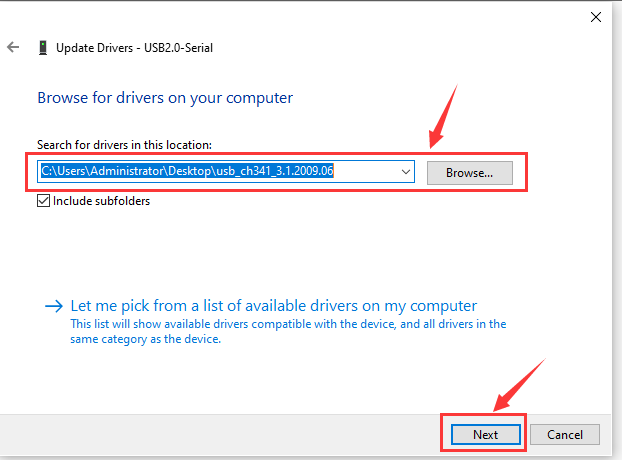
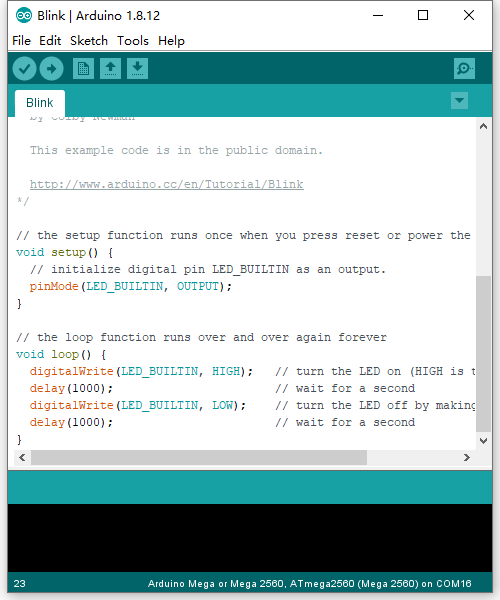

# **KS0502 Keyestudio MEGA PRO development board**

****

 Introduction

The MEGA control board, among the series of MCUs , is the most popular since it
has numerous pins.

However, a substantial number of pins don’t meet the space demand of DIY design.
To tackle this issue, we roll out the Keyestudio MEGA PRO development board. In
fact, its use method is as same as the official mega board, in addition to the
different volume.

Its processor core is ATMEGA2560-16AU. In the meantime, it has 54 digital
input/output pins (of which 15 can be used as PWM outputs), 16 analog inputs, 4
channel serial communication ports, a USB connection, 1 ICSP header, and a reset
button. And all ports are extended by pins with the interval of 2.54mm.

What’s more, you can burn the firmware for ATMEGA2560-16AU through the built-in
ICSP port. The firmware of this chip is burnt well before delivery, therefore,
you don’t need to burn the firmware.

The power can be supplied through USB cable, port 5V , GND（DC 5V）, as well as
Vin GND (DC 7-12V).

  **Specification**

Microcontroller: ATMEGA2560-16AU

USB to serial chip：CH340G

Operating Voltage: 5V

Input Voltage (recommended):DC 7-12V

Digital I/O Pins: 54 (D0-D53)

PWM Digital I/O Pins：15(D2-D13 D44-D46)

Analog Input Pins: 16(A0-A15)

DC Current per I/O Pin: 20 mA

DC Current for 3.3V Pin: 50 mA

Flash Memory: 256 KB of which 8 KB used by bootloader

SRAM: 8 KB

EEPROM: 4 KB

Clock Speed: 16 MHz

LED_BUILTIN:D13

 **Pinout Diagram:**

| 1  | External Power Ports           | External input: DC 7-12V                                                                                                                                                                                                                                                                                                         |
|----|--------------------------------|----------------------------------------------------------------------------------------------------------------------------------------------------------------------------------------------------------------------------------------------------------------------------------------------------------------------------------|
| 2  | Ground                         | GND                                                                                                                                                                                                                                                                                                                              |
| 3  | 5V                             | DC 5V input/output voltage（supply power for control board when inputting 5V）                                                                                                                                                                                                                                                   |
| 4  | 3.3V                           | Provide DC 3.3V output voltage                                                                                                                                                                                                                                                                                                   |
| 5  | AREF                           | Analog reference. Used to set the external reference voltage(0-5V)                                                                                                                                                                                                                                                               |
| 6  | Reset Button Port              | Can be connected to press button, as same as reset button                                                                                                                                                                                                                                                                        |
| 7  | Serial communication port      | The default serial communication port， RX responds to D0（digital port), TX responds to D1（digital port)                                                                                                                                                                                                                       |
| 8  | Digital Ports                  |  Have 54 digital input/output pins (of which 15 can be used as PWM outputs). These pins can be configured as digital input pin to read the logic value (0 or 1). Or used as digital output pin to drive different modules like LED, relay, etc.                                                                                  |
| 9  | Analog Ports                   | 16 analog pins (A0-A15)                                                                                                                                                                                                                                                                                                          |
| 10 | ATMEGA2560 （Microcontroller） | Each board has its own microcontroller,. The MCU of this board is ATMEGA2560-16AU.                                                                                                                                                                                                                                               |
| 11 | ICSP Pin                       | the AVR, an Arduino micro-program header consisting of MOSI, MISO, SCK, RESET, VCC, and GND. It is often called the SPI (serial peripheral interface) and can be considered an "extension" of the output. In fact, slave the output devices to the SPI bus host. When connecting to PC, program the firmware to ATMEGA2560-16AU. |
| 12 | L Indicator                    | When D13 is high level, LED will be on; when it is low level, LED will be off                                                                                                                                                                                                                                                    |
| 13 | ON Indicator                   | LED is on when control board is plugged in power, otherwise, it will be off                                                                                                                                                                                                                                                      |
| 14 | TX Indicator                   |  When Arduino board communicates via serial port and sends the message, TX led will flash                                                                                                                                                                                                                                        |
| 15 | RX Indicator                   | When Arduino board communicates via serial port and receive the message, RX led will flash.                                                                                                                                                                                                                                      |
| 16 | Reset Button                   | Reset your control board                                                                                                                                                                                                                                                                                                         |
| 17 | Micro USB                      | Supply power for control board and upload code                                                                                                                                                                                                                                                                                   |
| 18 | USB to serial chip             | CH340G, transform USB signals of computer to serial signals                                                                                                                                                                                                                                                                      |

  **Specialized Functions of Some Pins:**

Serial Communication Port(4-channel)：Serial（D0 corresponds to RX0, D1 is
equivalent to TX0）, Serial1（D19 corresponds RX1, D18 is equivalent to TX1),
Serial2 (D17 corresponds to RX2, D16 stands for TX2) and Serial3（D15 stands for
RX3, D14 corresponds to TX3）.

RX（D0）and TX（D1）are connected to the USB to serial chip of CH340G

-   **Serial Communication:** D0 (RX0) and D1 (TX1); Serial 1: D19 (RX1) and D18
    (TX1); Serial 2: D17 (RX2) and D16 (TX2); Serial 3: D15 (RX3) and D14 (TX3).

-   **PWM Pins (Pulse-Width Modulation):** D2 to D13, and D44 to D46.

-   **External Interrupts:** D2 (interrupt 0), D3 (interrupt 1), D18 (interrupt
    5), D19 (interrupt 4), D20 (interrupt 3), and D21 (interrupt 2).

-   **SPI communication:** D53 (SS), D52 (SCK), D51 (MOSI), D50 (MISO).

-   **IIC communication:** D20 (SDA); D21 (SCL).

 **4. Windows System**

 **4.1 Download Arduino IDE**

When getting this control board, we need to install Arduino IDE

Enter the website <https://www.arduino.cc/>，and click
\>

You can select the latest version-----1.8.13. Alternatively, the previous
release is your another choice.

In this project, we use 1.8.12 version.

Clickto enter the new page. As
shown below;

The **Windows installer** needs installing manually. Yet , the **Windows zip
file for non admin install**，a zip file of Arduino 1.8.12 version, can be
directly downloaded and installed.

**4.2 Install Driver**

For this part, we need to install the driver of Arduino IDE

First, let’s attach USB cable to computer. The driver can be installed
automatically if the PC system is Windows 10, however, you need to install the
driver manually if the PC system is other version.

The USB to serial chip of control board is CH340G, therefore, we will install
its driver(usb_ch341_3.1.2009.06).

Click Computer----- Properties----- Device Manager, as shown below:

Click and“Update Driver Program”

Jump into the following page and select“Browse my computer for driver software”.

Search the **usb_ch341_3.1.2009.06 folder**

After the driver is installed, you need to click **Close.**

Click Computer----- Properties----- Device Manager, as shown below

**4.3 Arduino IDE Setting**

Clickicon to pen Arduino IDE.

When downloading the sketch to the board, you must select the correct name of
Arduino board that matches the board connected to your computer. As shown below;

Then select the correct COM port (you can see the corresponding COM port after
the driver is successfully installed).

A- Used to verify whether there is any compiling mistakes or not.  
B- Used to upload the sketch to your Arduino board.  
C- Used to create shortcut window of a new sketch.  
D- Used to directly open an example sketch.  
E- Used to save the sketch.  
F- Used to send the serial data received from board to the serial monitor.

 4.4 Start A Program

Open the file to select **Example**, and click **BASIC**\>**BLINK**, as shown
below:

Set the correct **COM port,** and the corresponding board and COM port are shown
on the lower right of IDE.

Clickto start compiling the
program, and check errors.

Clickto upload the program

After the program is uploaded successfully, the onboard LED blinks.
Congratulation, you finish the first program.

 5. MAC System

 5.1 Install Arduino IDE on MAC System

The installation instruction is as same as the chapter 4.1, as shown below:

 5.2 Download the Driver of CH340

<https://fs.keyestudio.com/CH340-MAC>

5.3 How to Install the Driver of CH340

<https://wiki.keyestudio.com/Download_CH340_Driver_on_MAC_System>

5.4 Arduino IDE Setting

The setting method is as same as the chapter 4.3 except from COM port, as shown
below.

 
