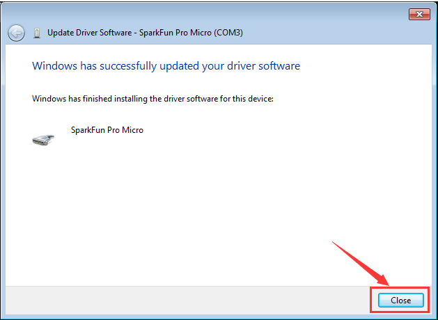
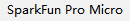

# **keyestudio PRO MICRO 5V 16MHZ Development Board**

****

 Description

The processor core of Keyestudio PRO MICRO development board is ATMEGA32U4-MU,
fully compatible with ARDUINO.

It has 18 digital input/output pins (of which 5 can be used as PWM output), 9
analog input, a 16 MHz crystal oscillator and a micro USB port.

In addition, its working voltage is 5V and we can supply power via micro USB
cable and port RAW GND (DC 7-9V).

To facilitate the physical design, the board is not welded with pin headers. So
you can solder the pin headers by yourself. And the package includes 2pcs yellow
1\*12 2.54 straight pins and 1m black micro USB cable.

 Specification

-   Microcontroller: ATMEGA32U4-MU

-   RAW: DC 7-9V

-   **VCC: 5V at 500mA**

-   Digital I/O Pins:18 (of which 5 provide PWM output)

-   Analog Input Pins:9

-   Maximum current for chip: 200mA

-   Maximum current per pin: 40mA

-   Recommended current per pin: 20mA

-   8-bit Atmel AVR

-   Flash Program Memory: 32kB

-   EEPROM: 1kB

-   Internal SRAM 2.5kB

-   ADC:10-bit

-   PWM:8bit

1.  **Pin Interfaces:**

 Specialized Functions of Pins:

Digital Port：RX（D0）、TX（D1）、D2-D10、D14-D16、A0-A3（D18-D21）

Analog Port：A0-A3、D4（A6）、D6（A7）、D8（A8）、D9（A9）、D10（A10）

**PWM Port (Pulse-Width Modulation):** D3、D5、D6、D9、D10

**External interrupt**: D3(interrupt 0), D2(interrupt 1), D0(interrupt 2),
D1(interrupt 3) and D7(interrupt 4)

**Serial Communication Port**：RX (D0) ,TX (D1)

**SPI Communication Port**：D14 (MISO), D15 (SCLK) and D16 (MOSI)

**I2C Communication Port**：D2 (SDA) and D3（SCL）

RAW：external power DC 7-9V

 Download the Arduino IDE

Enter Arduino IDE official website：https://www.arduino.cc/，

Click

You can download 1.8.13 version

In this project, we use 1.8.12 version

Click  to select the file to be
installed.

You need to install it manually if you
click; however, the file can be
installed directly if you click，

 5.1 Installing Driver

**Windows 10:**

The driver will be automatically installed if you plug control board to your
computer. Then the COM port is show below:

You need to install it manually if your computer is other Windows system.

We will take win7 system as example.

1\. Place the **driver folder** on your desktop.

The driver files are shown below:

2\. Connect board to your PC with Micro USB cable, and open device manager.

Right-click it and yellow exclamation mark appears

4\. Click“Browse.....manually”

5\. Find the“drivers”file，and tap“Next”.

.

Click“install this driver software anyway”

7\. Then click“Close”and check the serial port.

5.2 Set Boards Manager

We need to set board before using it. Firstly we need to add the website of
board manager in the 

Website:
https://raw.githubusercontent.com/sparkfun/Arduino_Boards/master/IDE_Board_Manager/package_sparkfun_index.json

As shown below:

Then restart Arduino IDE.

The board is shown below:

Search **sparkfun** and install the related files.

Click“Close”when the installation is finished.

Then find out  as follows:

**5.3 Arduino IDE Setting**

Clickicon，open Arduino IDE.

To avoid the errors when uploading the program to the board, you need to select
the correct Arduino board that matches the board connected to your computer.

Then come back to the Arduino software, you should click Tools→Board, select the
board. (as shown below)

Then select the correct working frequency

Then select the correct COM port (you can see the corresponding COM port after
the driver is successfully installed).

Before uploading the program to the board, let’s demonstrate the function of
each symbol in the Arduino IDE toolbar.

A- Used to verify whether there is any compiling mistakes or not.

B- Used to upload the sketch to your Arduino board.

C- Used to create shortcut window of a new sketch.

D- Used to directly open an example sketch.

E- Used to save the sketch.

F- Used to send the serial data received from board to the serial monitor.

 5.4 Hello World!

Copy the following code to Arduino IDE.

int val;

int ledpin=13;

void setup()

{

Serial.begin(9600);

pinMode(ledpin,OUTPUT);

}

void loop()

{

val=Serial.read();

if(val=='R')

{

digitalWrite(ledpin,HIGH);

delay(500);

digitalWrite(ledpin,LOW);

delay(500);

Serial.println("Hello World!");

}

}

Set board and COM port, the corresponding board and COM port are shown on the
lower right of IDE.

Clickto start compiling the
program, and check errors.

Clickto upload the program

Tap to open serial monitor, set
baud rate to 9600, input "R" and click“Send”. Then RX indicator flashes and
serial monitor shows "Hello World!", which means "Hello World!" is sent by PRO
MICRO development board.

 Package List

-   **Keyestudio PRO MICRO 5V 16MHZ development board\*1**

-   USB cable \*1

-   Yellow Pin headers \* 2pcs

Resource

<https://fs.keyestudio.com/KS0503>

 
