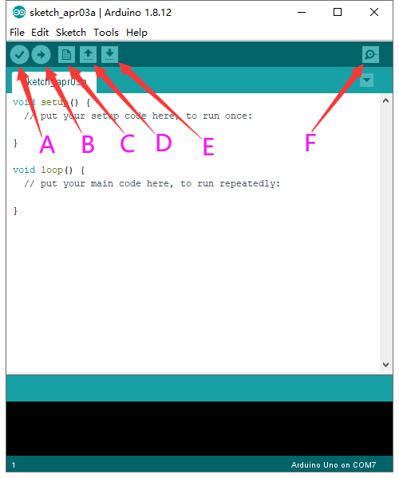

# **Keyestudio 328 PLUS Control Board**

****

## **1.Description**

Doing experiments with electronic products, we often program on the Arduino IDE
development environment with Arduino series microcontrollers.

Keyestudio 328 PLUS control board is fully compatible with Arduino IDE development
environment. It is as same as the Arduino UNO R3 board. Moreover, some
improvements we made highly strengthen its function(as shown below). In order to
wire efficiently, we equip it with a 1m USB cable with type-c interface for you.

****

## **2.Specification**

Microcontroller：ATMEGA328PB

USB to serial chip: CH340C

Working voltage: 5V

External power: DC 6-15V (recommend 9V)

Digital I / O pins: 14 (D0-D13)

PWM channel: 6 (D3 D5 D6 D9 D10 D11)

Analog input channel (ADC): 8 (A0-A7)

Each I / O Port of DC output capability : 10 mA

Output capability of 3.3V port: MAX150 mA

Flash Memory: 32 KB (of which 0.5 KB is used by the bootloader)

SRAM: 2 KB (ATMEGA328PB)

EEPROM: 1 KB (ATMEGA328PB)

Clock speed: 16MHz

On-board LED pin: D13

## **3. Interfaces**

## **4. Specialized Functions of Some Pins:**

Serial communication interface: D0 is RX, D1 is TX

PWM interface (pulse width modulation): D3 D5 D6 D9 D10 D11

External interrupt interface: D2 (interrupt 0) and D3 (interrupt 1)

SPI communication interface: D10 is SS, D11 is MOSI, D12 is MISO, D13 is SCK

IIC communication port: A4 is SDA, A5 is SCL

## **5. Install Arduino IDE and Driver**

**5.1 Download the Arduino IDE**

When getting this control board, we need to install Arduino IDE.

Enter the website
<https://www.arduino.cc/>，clickand

Download the version you want and the latest one is available for downloading
too.

Alternatively, you could select previous release.

In this project, we use 1.8.12 version

Click to view the below page

Click  to download an installer
of Arduino 1.8.12 version，which needs to be installed manually. When you
tap，a zip file of Arduino 1.8.12
version will be directly downloaded, and you only need to unzip it to finish the
installation.

Click icon to download Arduino
IDE.

**5.2Installing Driver**

1.  **Windows system**

Download CH340 driver：

<https://sparks.gogo.co.nz/ch340.html>

Next, let’s install Arduino driver.

For different operating system, there may be slight difference in installation
method. Below is an example in WIN 7.

When you connect Arduino Uno to your computer the first time, right click
“Computer” —\> “Properties”—\> “Device manager”, you can see “USB2.0-Serial”.

Click “USB2.0-Serial”, select “Update Driver software”.

In this page, click “Browse my computer for driver software”.

Find the “usb_ch341_3.1.2009.06” file,Click “Next”.

Installation completed; click “Close”.

After driver is installed, go to “Device manager” again. Right click “Computer”
—\> “Properties”—\> “Device manager”, you can see CH340 device as below figure
shows, also the Com port info.

**2.MAC system**

Download CH340 driver：

https://sparks.gogo.co.nz/ch340.html

1.  Click V1.5 CH340 MaxOS Driver package

1.  After the download, seen as below:

1.  click installation package and tap Continue

1.  Click Install

1.  Input your user password and click Install Software

1.  Tap Continue Installation

1.  Wait to install

1.  Click Restart after the installation is finished

**5.3 Arduino IDE Setting**

Clickicon，open Arduino IDE.

To avoid the errors when uploading the program to the board, you need to select
the correct Arduino board that matches the board connected to your computer.

Then come back to the Arduino software, you should click Tools→Board, to select
the board. (as shown below)

Then select the correct COM port (you can see the corresponding COM port after
the driver is successfully installed)

Before uploading the program to the board, let’s demonstrate the function of
each symbol in the Arduino IDE toolbar.

A- Used to verify whether there is any compiling mistakes or not.

B- Used to upload the sketch to your Arduino board.

C- Used to create shortcut window of a new sketch.

D- Used to directly open an example sketch.

E- Used to save the sketch.

F- Used to send the serial data received from board to the serial monitor.

**5.4Start First Program**

Open the file to select Example, and choose BLINK from BASIC, as shown below:

Set board and COM port, the corresponding board and COM port are shown on the
lower right of IDE.

Clickto start compiling the
program, check errors.

Clickto upload the program,
upload successfully.

Upload the program successfully, the onboard LED lights on for 1s, lights off
for 1s. Congratulation, you finish the first program.

## **6.Troubleshooting：**

1.If test code can’t be uploaded,
click

However, if clicking  (verifying
test code) doesn’t work, there is something wrong with the test code or Arduino
IDE.

2.If test code can be verified but not be uploaded, check the correct
development board or COM port you choose.

3.If you can’t select the correct COM port, just check if the driver of the
development board is installed successfully.(refer to 5.2)

4.Since unstable power supply from USB, you can change different USB ports if
the development board can’t be recognized.

5.When uploading test code, TXRX of the development board is not allowed to be
used(fail to upload test code).

If the Bluetooth module is used, upload test code then install the BT module
